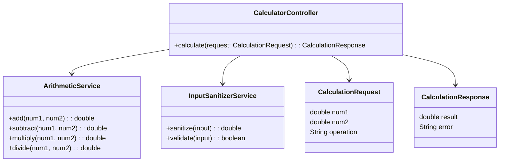
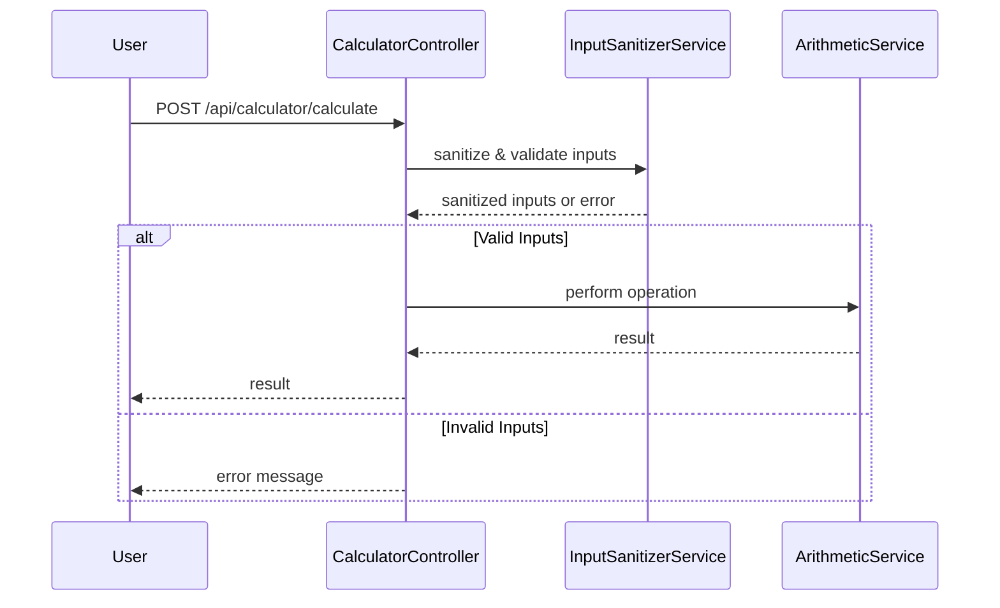

# For User Story Number [1]

1. Objective
The objective is to provide users with a calculator that can perform basic arithmetic operations (addition, subtraction, multiplication, division) on two numeric inputs. The result should be displayed clearly and the UI must be intuitive and responsive. Division by zero must be handled gracefully.

2. API Model
	2.1 Common Components/Services
	- InputSanitizerService (to sanitize and validate user input)
	- ArithmeticService (to perform arithmetic operations)

	2.2 API Details
| Operation | REST Method | Type | URL | Request | Response |
|-----------|-------------|------|-----|---------|----------|
| Calculate | POST | Success | /api/calculator/calculate | { "num1": 5, "num2": 2, "operation": "add" } | { "result": 7 } |
| Calculate | POST | Failure | /api/calculator/calculate | { "num1": 5, "num2": 0, "operation": "divide" } | { "error": "Division by zero is not allowed." } |
| Calculate | POST | Failure | /api/calculator/calculate | { "num1": "", "num2": 2, "operation": "add" } | { "error": "Input fields cannot be empty." } |

	2.3 Exceptions
| Exception | Description |
|-----------|-------------|
| InvalidInputException | Thrown when input is not numeric or is empty |
| DivisionByZeroException | Thrown when division by zero is attempted |

3 Functional Design
	3.1 Class Diagram


	3.2 UML Sequence Diagram


	3.3 Components
| Component Name | Description | Existing/New |
|----------------|-------------|--------------|
| CalculatorController | Handles API requests for calculation | New |
| ArithmeticService | Performs arithmetic operations | New |
| InputSanitizerService | Validates and sanitizes user input | New |
| CalculationRequest | DTO for incoming calculation requests | New |
| CalculationResponse | DTO for outgoing responses | New |

	3.4 Service Layer Logic and Validations
| FieldName | Validation | Error Message | ClassUsed |
|-----------|------------|--------------|-----------|
| num1 | Must be numeric and not empty | "Input fields cannot be empty or non-numeric." | InputSanitizerService |
| num2 | Must be numeric and not empty | "Input fields cannot be empty or non-numeric." | InputSanitizerService |
| operation | Must be one of add, subtract, multiply, divide | "Invalid operation selected." | CalculatorController |
| num2 (for divide) | Must not be zero | "Division by zero is not allowed." | ArithmeticService |

4 Integrations
| SystemToBeIntegrated | IntegratedFor | IntegrationType |
|----------------------|---------------|-----------------|
| None | N/A | N/A |

5 DB Details
	5.1 ER Model
```mermaid
erDiagram
    -- No persistent entities required for this user story --
```
	5.2 DB Validations
- Not applicable; no database involved.

6 Non-Functional Requirements
	6.1 Performance
	- Calculation response time must be < 1 second.
	- Lightweight service, no backend persistence.
	6.2 Security
		6.2.1 Authentication
		- Not required for basic calculator.
		6.2.2 Authorization
		- Not required for basic calculator.
	6.3 Logging
		6.3.1 Application Logging
		- Log calculation requests at INFO level.
		- Log errors (invalid input, division by zero) at ERROR level.
		6.3.2 Audit Log
		- Not required for this user story.

7 Dependencies
- None (self-contained logic, no external systems).

8 Assumptions
- All calculations are performed client-side or in a stateless backend.
- No user authentication/authorization is required for basic arithmetic.
- No persistence of calculation history for this user story.
