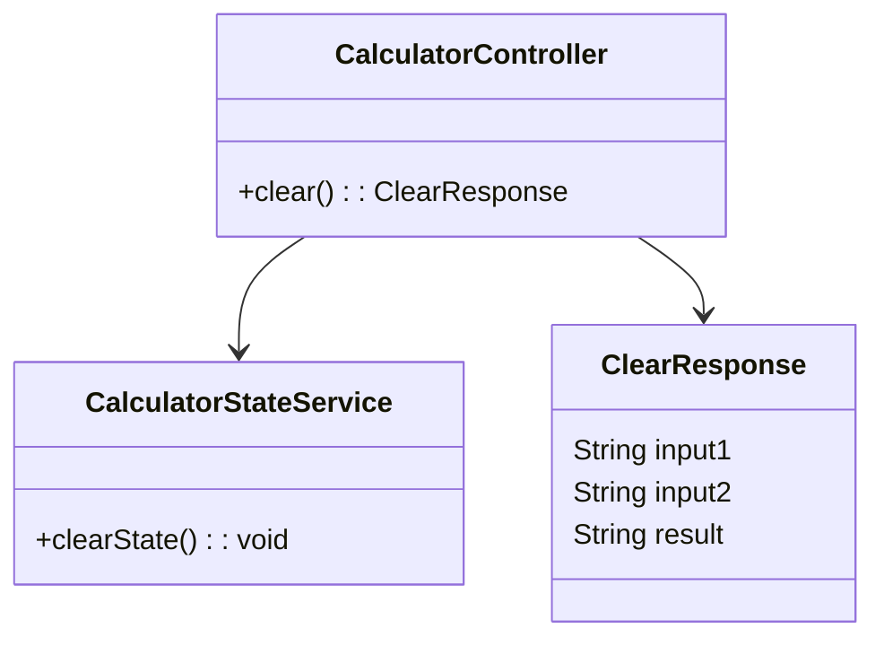
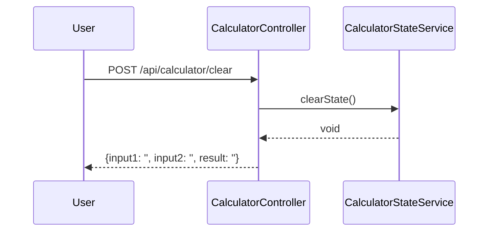

# For User Story Number [2]

1. Objective
Enable users to quickly clear all calculator input fields and the result display with a single action. This ensures a seamless and efficient user experience for starting new calculations. The clear operation must work at any stage of input or result.

2. API Model
	2.1 Common Components/Services
	- CalculatorStateService (manages calculator state)

	2.2 API Details
| Operation | REST Method | Type | URL | Request | Response |
|-----------|-------------|------|-----|---------|----------|
| Clear | POST | Success | /api/calculator/clear | {} | { "input1": "", "input2": "", "result": "" } |

	2.3 Exceptions
| Exception | Description |
|-----------|-------------|
| None | Clear operation is always successful |

3 Functional Design
	3.1 Class Diagram


	3.2 UML Sequence Diagram


	3.3 Components
| Component Name | Description | Existing/New |
|----------------|-------------|--------------|
| CalculatorController | Handles API requests for clear action | New |
| CalculatorStateService | Manages and clears calculator state | New |
| ClearResponse | DTO for clear response | New |

	3.4 Service Layer Logic and Validations
| FieldName | Validation | Error Message | ClassUsed |
|-----------|------------|--------------|-----------|
| input1 | After clear, must be empty | N/A | CalculatorStateService |
| input2 | After clear, must be empty | N/A | CalculatorStateService |
| result | After clear, must be empty | N/A | CalculatorStateService |

4 Integrations
| SystemToBeIntegrated | IntegratedFor | IntegrationType |
|----------------------|---------------|-----------------|
| None | N/A | N/A |

5 DB Details
	5.1 ER Model
```mermaid
erDiagram
    -- No persistent entities required for this user story --
```
	5.2 DB Validations
- Not applicable; no database involved.

6 Non-Functional Requirements
	6.1 Performance
	- Clear action must complete instantly (<0.5s).
	6.2 Security
		6.2.1 Authentication
		- Not required for clear operation.
		6.2.2 Authorization
		- Not required for clear operation.
	6.3 Logging
		6.3.1 Application Logging
		- Log clear actions at INFO level.
		6.3.2 Audit Log
		- Not required for this user story.

7 Dependencies
- None (self-contained logic, no external systems).

8 Assumptions
- No backend persistence is required; clear operation resets local state only.
- No user authentication/authorization is required for clear operation.
