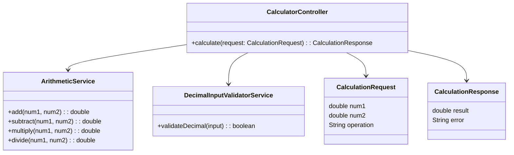
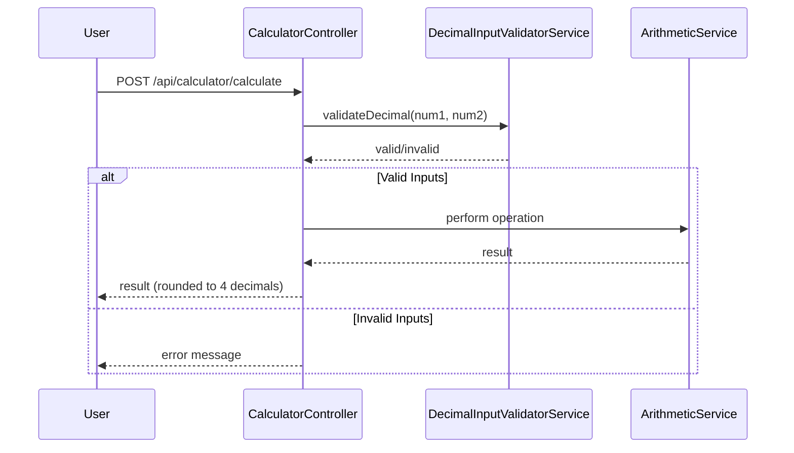

# For User Story Number [3]

1. Objective
Enable users to input and calculate decimal (floating-point) numbers for all arithmetic operations. Ensure the results are displayed with up to 4 decimal places and input validation prevents invalid decimal entries. This enhances calculation precision and usability.

2. API Model
	2.1 Common Components/Services
	- DecimalInputValidatorService (validates decimal input)
	- ArithmeticService (performs arithmetic operations with decimals)

	2.2 API Details
| Operation | REST Method | Type | URL | Request | Response |
|-----------|-------------|------|-----|---------|----------|
| Calculate | POST | Success | /api/calculator/calculate | { "num1": 3.1415, "num2": 2.5, "operation": "multiply" } | { "result": 7.8538 } |
| Calculate | POST | Failure | /api/calculator/calculate | { "num1": "3..14", "num2": 2, "operation": "add" } | { "error": "Invalid decimal input." } |

	2.3 Exceptions
| Exception | Description |
|-----------|-------------|
| InvalidDecimalInputException | Thrown when input has multiple decimal points or is not a valid float |

3 Functional Design
	3.1 Class Diagram


	3.2 UML Sequence Diagram


	3.3 Components
| Component Name | Description | Existing/New |
|----------------|-------------|--------------|
| CalculatorController | Handles API requests for calculation | Existing |
| ArithmeticService | Performs arithmetic operations | Existing |
| DecimalInputValidatorService | Validates decimal input and formatting | New |
| CalculationRequest | DTO for incoming calculation requests | Existing |
| CalculationResponse | DTO for outgoing responses | Existing |

	3.4 Service Layer Logic and Validations
| FieldName | Validation | Error Message | ClassUsed |
|-----------|------------|--------------|-----------|
| num1 | Only one decimal point allowed, must be valid float | "Invalid decimal input." | DecimalInputValidatorService |
| num2 | Only one decimal point allowed, must be valid float | "Invalid decimal input." | DecimalInputValidatorService |
| result | Rounded to 4 decimal places | N/A | ArithmeticService |

4 Integrations
| SystemToBeIntegrated | IntegratedFor | IntegrationType |
|----------------------|---------------|-----------------|
| None | N/A | N/A |

5 DB Details
	5.1 ER Model
```mermaid
erDiagram
    -- No persistent entities required for this user story --
```
	5.2 DB Validations
- Not applicable; no database involved.

6 Non-Functional Requirements
	6.1 Performance
	- Calculation and rendering must remain <1s even with decimals.
	6.2 Security
		6.2.1 Authentication
		- Not required for decimal calculations.
		6.2.2 Authorization
		- Not required for decimal calculations.
	6.3 Logging
		6.3.1 Application Logging
		- Log calculation requests at INFO level.
		- Log invalid decimal input at ERROR level.
		6.3.2 Audit Log
		- Not required for this user story.

7 Dependencies
- None (self-contained logic, no external systems).

8 Assumptions
- All calculations are performed client-side or in a stateless backend.
- No user authentication/authorization is required for decimal calculations.
- No persistence of calculation history for this user story.
