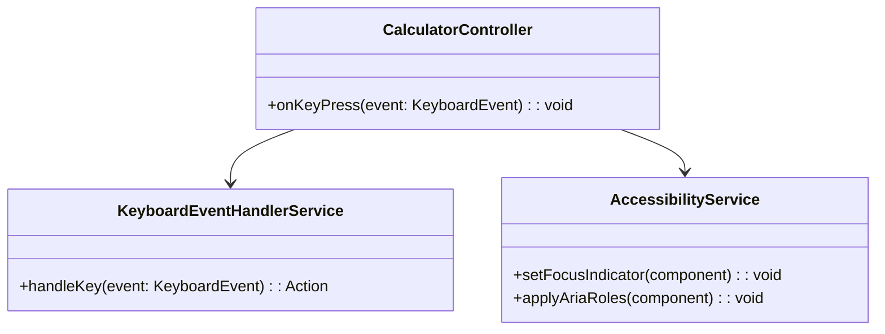
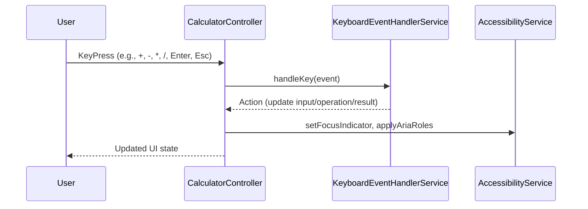

# For User Story Number [4]

1. Objective
Enable users to interact with the calculator using keyboard input for numbers, decimal point, operations, Enter (equals), and Esc (clear). This feature improves accessibility, speed, and efficiency for keyboard users. The system must ensure accessibility and support for all major browsers.

2. API Model
	2.1 Common Components/Services
	- KeyboardEventHandlerService (maps keyboard events to calculator actions)
	- AccessibilityService (manages focus indicators and ARIA roles)

	2.2 API Details
| Operation | REST Method | Type | URL | Request | Response |
|-----------|-------------|------|-----|---------|----------|
| Keyboard Input | N/A (event-driven) | Success | N/A | { "key": "+" } | { "operation": "add" } |
| Keyboard Input | N/A (event-driven) | Success | N/A | { "key": "Enter" } | { "result": 7 } |
| Keyboard Input | N/A (event-driven) | Success | N/A | { "key": "Esc" } | { "input1": "", "input2": "", "result": "" } |

	2.3 Exceptions
| Exception | Description |
|-----------|-------------|
| InvalidKeyException | Thrown when an unsupported key is pressed |

3 Functional Design
	3.1 Class Diagram


	3.2 UML Sequence Diagram


	3.3 Components
| Component Name | Description | Existing/New |
|----------------|-------------|--------------|
| CalculatorController | Handles keyboard events and updates state | Existing |
| KeyboardEventHandlerService | Maps keyboard events to calculator actions | New |
| AccessibilityService | Manages focus indicators and ARIA roles | New |

	3.4 Service Layer Logic and Validations
| FieldName | Validation | Error Message | ClassUsed |
|-----------|------------|--------------|-----------|
| key | Only valid keys accepted (0-9, ., +, -, *, /, Enter, Esc) | "Invalid key pressed." | KeyboardEventHandlerService |
| browser | Keyboard shortcuts must work in all supported browsers | N/A | KeyboardEventHandlerService |
| input | No input lost or misinterpreted during fast typing | N/A | KeyboardEventHandlerService |

4 Integrations
| SystemToBeIntegrated | IntegratedFor | IntegrationType |
|----------------------|---------------|-----------------|
| None | N/A | N/A |

5 DB Details
	5.1 ER Model
```mermaid
erDiagram
    -- No persistent entities required for this user story --
```
	5.2 DB Validations
- Not applicable; no database involved.

6 Non-Functional Requirements
	6.1 Performance
	- Keyboard response time <100ms.
	6.2 Security
		6.2.1 Authentication
		- Not required for keyboard input.
		6.2.2 Authorization
		- Not required for keyboard input.
	6.3 Logging
		6.3.1 Application Logging
		- Log invalid key events at WARN level.
		6.3.2 Audit Log
		- Not required for this user story.

7 Dependencies
- None (self-contained logic, no external systems).

8 Assumptions
- All keyboard event handling is performed client-side.
- No user authentication/authorization is required for keyboard input.
- No persistence of calculation history for this user story.
