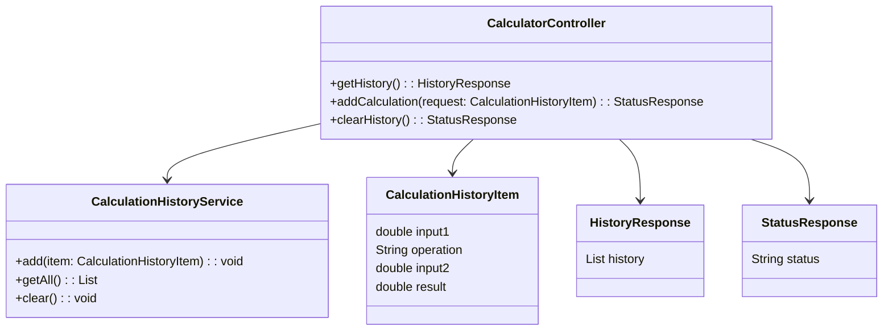
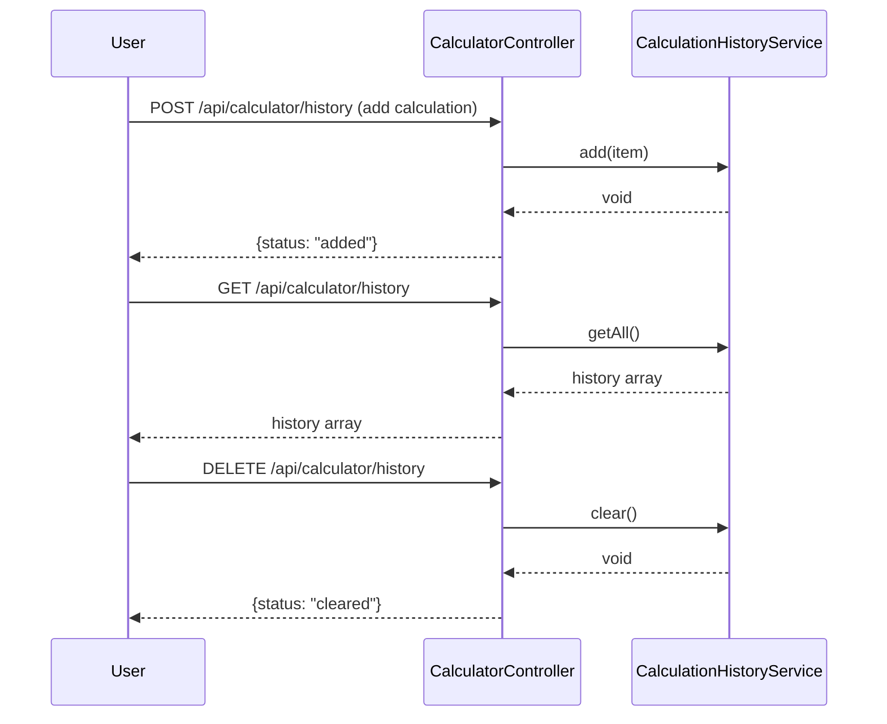

# For User Story Number [5]

1. Objective
Allow users to view a history of their recent calculations (inputs, operation, result) within the calculator interface. The history should display at least the last 10 calculations and be clearable on demand. This feature improves usability by letting users refer back to previous results.

2. API Model
	2.1 Common Components/Services
	- CalculationHistoryService (manages calculation history in memory)

	2.2 API Details
| Operation | REST Method | Type | URL | Request | Response |
|-----------|-------------|------|-----|---------|----------|
| Get History | GET | Success | /api/calculator/history |  | { "history": [ {"input1": 1, "operation": "+", "input2": 2, "result": 3 }, ... ] } |
| Add Calculation | POST | Success | /api/calculator/history | { "input1": 1, "operation": "+", "input2": 2, "result": 3 } | { "status": "added" } |
| Clear History | DELETE | Success | /api/calculator/history |  | { "status": "cleared" } |

	2.3 Exceptions
| Exception | Description |
|-----------|-------------|
| None | All operations are in-memory and expected to succeed |

3 Functional Design
	3.1 Class Diagram


	3.2 UML Sequence Diagram


	3.3 Components
| Component Name | Description | Existing/New |
|----------------|-------------|--------------|
| CalculatorController | Handles API requests for history operations | New |
| CalculationHistoryService | Manages calculation history in memory | New |
| CalculationHistoryItem | DTO for calculation history entry | New |
| HistoryResponse | DTO for returning history array | New |
| StatusResponse | DTO for status messages | New |

	3.4 Service Layer Logic and Validations
| FieldName | Validation | Error Message | ClassUsed |
|-----------|------------|--------------|-----------|
| history | No duplicate entries | N/A | CalculationHistoryService |
| history | Maximum 10 items (remove oldest if exceeded) | N/A | CalculationHistoryService |
| history | Clearing removes all entries | N/A | CalculationHistoryService |

4 Integrations
| SystemToBeIntegrated | IntegratedFor | IntegrationType |
|----------------------|---------------|-----------------|
| None | N/A | N/A |

5 DB Details
	5.1 ER Model
```mermaid
erDiagram
    -- No persistent entities required for this user story --
```
	5.2 DB Validations
- Not applicable; no database involved.

6 Non-Functional Requirements
	6.1 Performance
	- History updates instantly (<0.5s).
	- All operations are in-memory, ensuring high speed.
	6.2 Security
		6.2.1 Authentication
		- Not required for calculation history.
		6.2.2 Authorization
		- Not required for calculation history.
	6.3 Logging
		6.3.1 Application Logging
		- Log history add/clear actions at INFO level.
		6.3.2 Audit Log
		- Not required for this user story.

7 Dependencies
- None (self-contained logic, no external systems).

8 Assumptions
- Calculation history is stored in client memory and persists only for the session.
- No user authentication/authorization is required for history feature.
