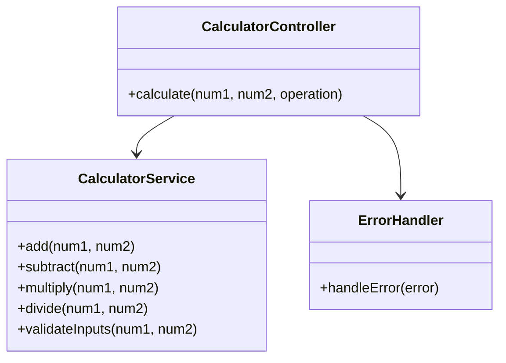
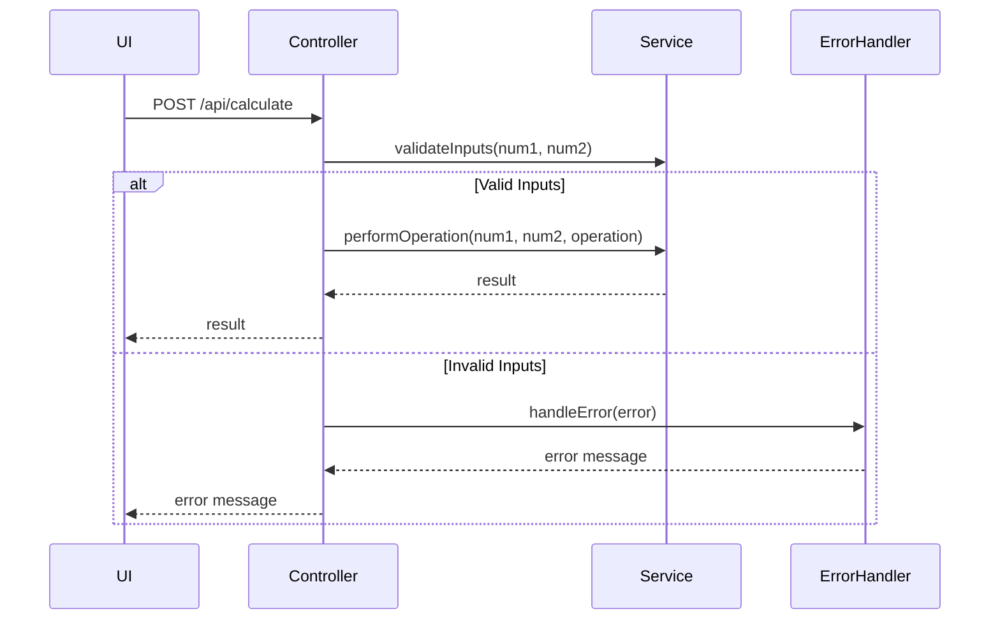
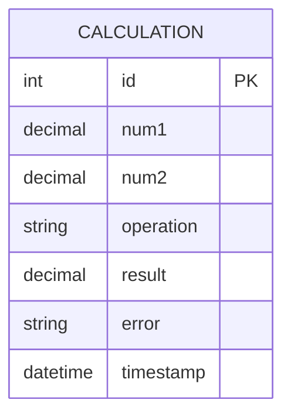

# For User Story Number [1]
1. Objective
This requirement enables users to perform basic arithmetic operations (addition, subtraction, multiplication, division) on two numbers. It supports both integer and decimal values and provides immediate feedback for invalid operations such as division by zero. The goal is to offer a fast, reliable, and user-friendly calculator for simple math problems.

2. API Model
	2.1 Common Components/Services
	- Input validation service
	- Arithmetic operation service
	- Error handling component

	2.2 API Details
| Operation   | REST Method | Type           | URL                | Request (JSON)                    | Response (JSON)                  |
|-------------|-------------|----------------|--------------------|-----------------------------------|----------------------------------|
| Calculate   | POST        | Success/Failure| /api/calculate     | {"num1": 5, "num2": 2, "operation": "add"} | {"result": 7.0, "error": null}  |
| Calculate   | POST        | Failure        | /api/calculate     | {"num1": 5, "num2": 0, "operation": "divide"} | {"result": null, "error": "Division by zero is not allowed."} |

	2.3 Exceptions
| Exception Type         | Description                                   |
|-----------------------|-----------------------------------------------|
| InvalidInputException | Non-numeric input detected                    |
| DivisionByZeroException| Division by zero attempted                    |
| OperationNotSupportedException | Invalid operation requested           |

3 Functional Design
	3.1 Class Diagram

	3.2 UML Sequence Diagram

	3.3 Components
| Component Name      | Description                                              | Existing/New |
|--------------------|----------------------------------------------------------|--------------|
| CalculatorController| Handles API requests and responses                       | New          |
| CalculatorService  | Performs arithmetic operations and validations           | New          |
| ErrorHandler       | Manages error messages and exception handling             | New          |

	3.4 Service Layer Logic and Validations
| FieldName | Validation                        | Error Message                       | ClassUsed           |
|-----------|-----------------------------------|-------------------------------------|---------------------|
| num1      | Must be numeric                   | "Input must be a number"            | CalculatorService   |
| num2      | Must be numeric                   | "Input must be a number"            | CalculatorService   |
| num2      | Cannot be zero for division       | "Division by zero is not allowed."  | CalculatorService   |
| result    | Round to two decimal places       | N/A                                 | CalculatorService   |

4 Integrations
| SystemToBeIntegrated | IntegratedFor           | IntegrationType |
|---------------------|-------------------------|-----------------|
| None                | N/A                     | N/A             |

5 DB Details
	5.1 ER Model

	5.2 DB Validations
- Ensure num1 and num2 are numeric
- Operation must be one of [add, subtract, multiply, divide]

6 Non-Functional Requirements
	6.1 Performance
	- Calculation result displayed in <100ms
	- No unnecessary API/database calls
	6.2 Security
		6.2.1 Authentication
		- If backend API is exposed, use JWT-based authentication
		6.2.2 Authorization
		- Only authenticated users can access calculation API (if backend)
	6.3 Logging
		6.3.1 Application Logging
		- Log each calculation request at INFO
		- Log errors at ERROR
		- Log invalid input attempts at WARN
		6.3.2 Audit Log
		- Log calculation events with timestamp and user ID (if available)

7 Dependencies
- ReactJS frontend
- Node.js backend (optional, if API is used)

8 Assumptions
- All calculations are performed client-side unless backend API is required
- No external integrations needed
- User is authenticated if backend API is exposed
