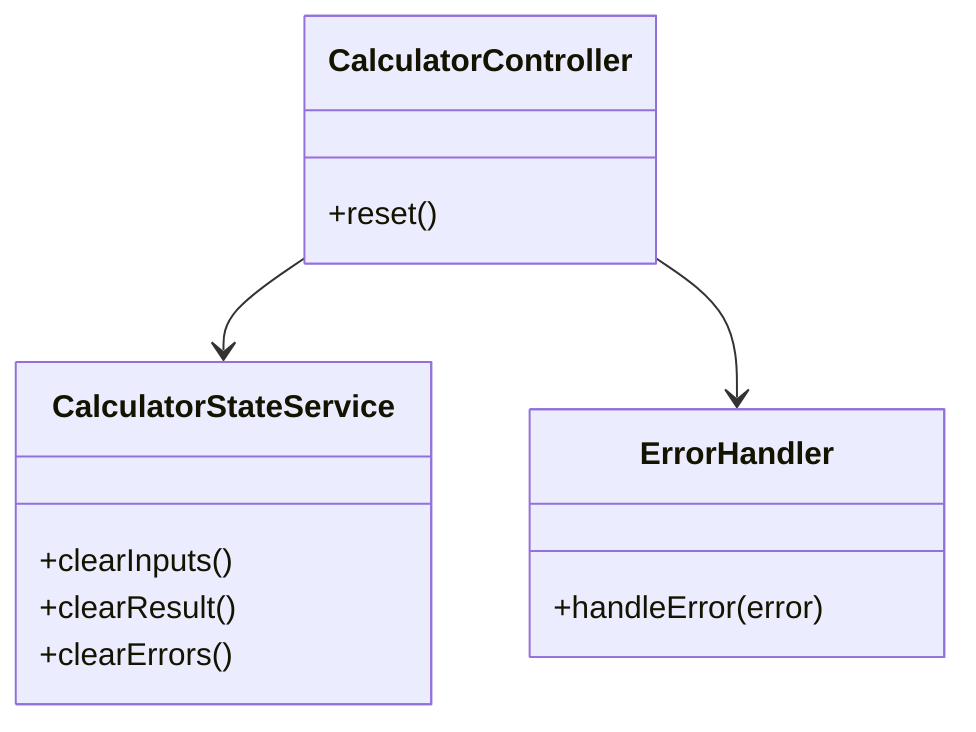
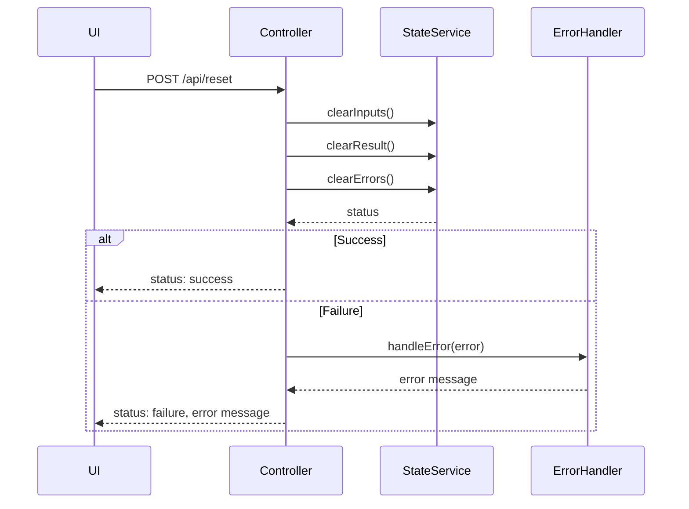
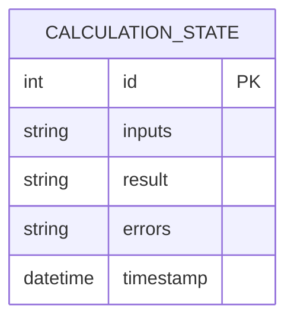

# For User Story Number [2]
1. Objective
This requirement enables users to clear or reset the calculator interface with a single click, allowing them to start new calculations efficiently. It ensures that all input fields, result displays, and error messages are reset to their default states. The goal is to provide a seamless workflow for consecutive calculations without the need to refresh the page.

2. API Model
	2.1 Common Components/Services
	- UI State Management Service
	- Error Handling Component

	2.2 API Details
| Operation   | REST Method | Type           | URL                | Request (JSON)                    | Response (JSON)                  |
|-------------|-------------|----------------|--------------------|-----------------------------------|----------------------------------|
| Reset       | POST        | Success        | /api/reset         | {}                                | {"status": "success"}           |
| Reset       | POST        | Failure        | /api/reset         | {}                                | {"status": "failure", "error": "Unable to reset calculator."} |

	2.3 Exceptions
| Exception Type         | Description                                   |
|-----------------------|-----------------------------------------------|
| ResetFailedException  | Failed to reset calculator state              |

3 Functional Design
	3.1 Class Diagram

	3.2 UML Sequence Diagram

	3.3 Components
| Component Name           | Description                                              | Existing/New |
|-------------------------|----------------------------------------------------------|--------------|
| CalculatorController    | Handles reset requests and responses                      | New          |
| CalculatorStateService  | Manages clearing of UI state, inputs, results, errors     | New          |
| ErrorHandler            | Manages error messages and exception handling             | New          |

	3.4 Service Layer Logic and Validations
| FieldName | Validation                        | Error Message                       | ClassUsed               |
|-----------|-----------------------------------|-------------------------------------|-------------------------|
| inputs    | Must reset to default/empty        | "Unable to reset input fields"      | CalculatorStateService  |
| result    | Must reset to default/empty        | "Unable to reset result display"    | CalculatorStateService  |
| errors    | Must reset to default/empty        | "Unable to clear error messages"    | CalculatorStateService  |

4 Integrations
| SystemToBeIntegrated | IntegratedFor           | IntegrationType |
|---------------------|-------------------------|-----------------|
| None                | N/A                     | N/A             |

5 DB Details
	5.1 ER Model

	5.2 DB Validations
- Ensure all fields are cleared/reset

6 Non-Functional Requirements
	6.1 Performance
	- Reset action completes in <50ms
	6.2 Security
		6.2.1 Authentication
		- Not applicable (client-side only)
		6.2.2 Authorization
		- Not applicable
	6.3 Logging
		6.3.1 Application Logging
		- Log each reset request at INFO
		- Log errors at ERROR
		6.3.2 Audit Log
		- Log reset events with timestamp and user ID (if available)

7 Dependencies
- ReactJS frontend

8 Assumptions
- All reset actions are performed client-side
- No backend or external integrations needed
