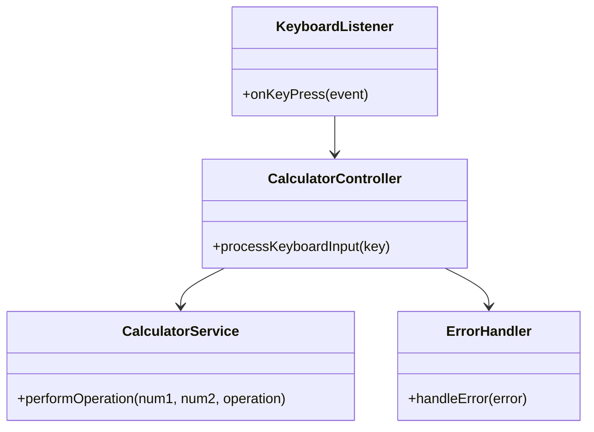
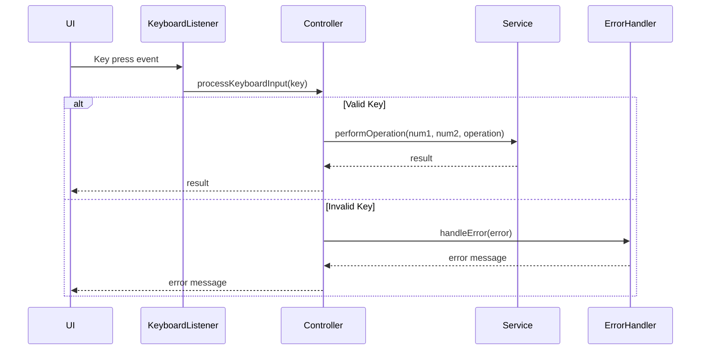
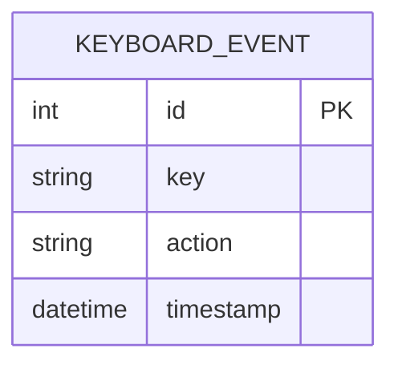

# For User Story Number [3]
1. Objective
This requirement enables users to interact with the calculator using their keyboard, allowing for faster and more efficient input of numbers and operations. It supports keyboard shortcuts for operations, calculation, and clearing the calculator, improving accessibility and usability for power users. The goal is to provide a seamless and accessible experience for all users.

2. API Model
	2.1 Common Components/Services
	- Keyboard Event Listener Service
	- Calculator Operation Service
	- Error Handling Component

	2.2 API Details
| Operation   | REST Method | Type           | URL                | Request (JSON)                    | Response (JSON)                  |
|-------------|-------------|----------------|--------------------|-----------------------------------|----------------------------------|
| KeyboardInput| POST       | Success/Failure| /api/keyboard      | {"key": "1"}                     | {"status": "accepted"}          |
| KeyboardInput| POST       | Failure        | /api/keyboard      | {"key": "@"}                     | {"status": "ignored"}           |

	2.3 Exceptions
| Exception Type         | Description                                   |
|-----------------------|-----------------------------------------------|
| InvalidKeyException   | Invalid key press detected                    |
| KeyboardMappingException | Error mapping key to operation             |

3 Functional Design
	3.1 Class Diagram

	3.2 UML Sequence Diagram

	3.3 Components
| Component Name           | Description                                              | Existing/New |
|-------------------------|----------------------------------------------------------|--------------|
| KeyboardListener        | Listens for keyboard events and maps them to actions      | New          |
| CalculatorController    | Handles keyboard input and delegates to service           | New          |
| CalculatorService       | Performs calculator operations                           | Existing     |
| ErrorHandler            | Manages error messages and exception handling             | Existing     |

	3.4 Service Layer Logic and Validations
| FieldName | Validation                        | Error Message                       | ClassUsed           |
|-----------|-----------------------------------|-------------------------------------|---------------------|
| key       | Must be valid number or operation  | "Invalid key pressed"               | KeyboardListener    |
| key       | Must map to supported operation    | "Unsupported operation key"         | KeyboardListener    |
| key       | Enter triggers calculation         | "Calculation failed"                | CalculatorController|
| key       | Escape triggers reset              | "Reset failed"                      | CalculatorController|

4 Integrations
| SystemToBeIntegrated | IntegratedFor           | IntegrationType |
|---------------------|-------------------------|-----------------|
| None                | N/A                     | N/A             |

5 DB Details
	5.1 ER Model

	5.2 DB Validations
- Ensure only supported keys are logged

6 Non-Functional Requirements
	6.1 Performance
	- Keyboard input processed in real time (<10ms)
	6.2 Security
		6.2.1 Authentication
		- Not applicable (client-side only)
		6.2.2 Authorization
		- Not applicable
	6.3 Logging
		6.3.1 Application Logging
		- Log each keyboard event at DEBUG
		- Log errors at ERROR
		6.3.2 Audit Log
		- Log keyboard shortcut usage with timestamp and user ID (if available)

7 Dependencies
- ReactJS frontend

8 Assumptions
- All keyboard handling is performed client-side
- No backend or external integrations needed
