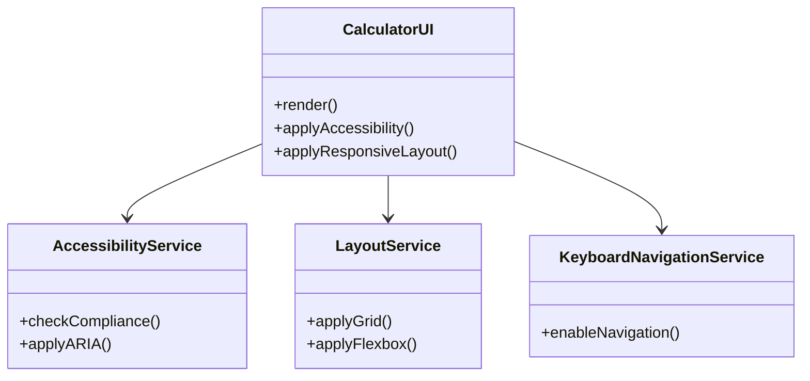
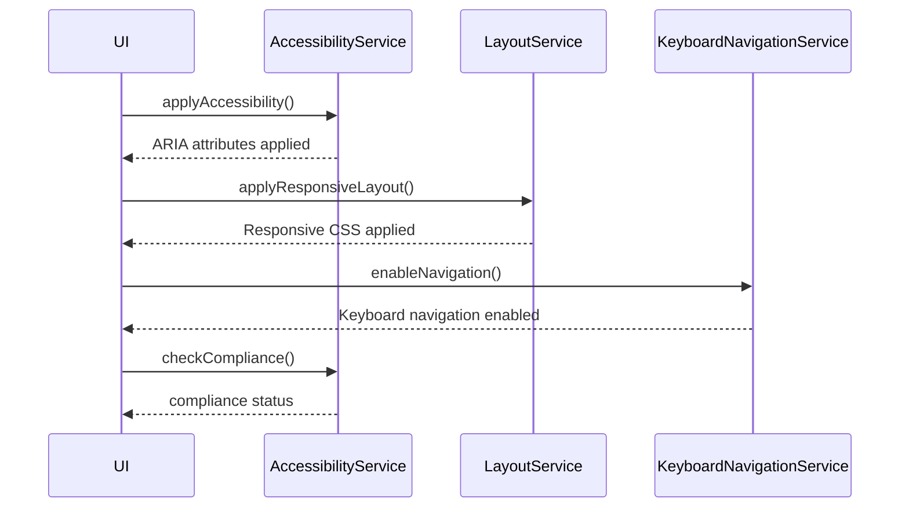
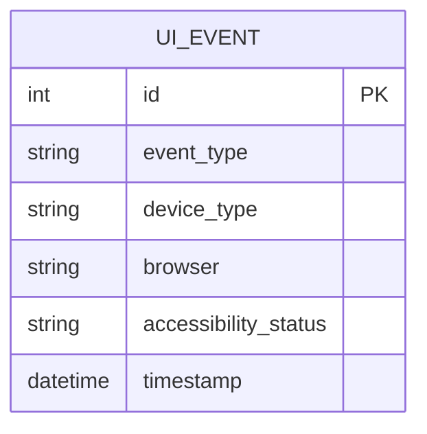

# For User Story Number [4]
1. Objective
This requirement ensures that the calculator interface is user-friendly, visually appealing, and accessible to all users, including those with disabilities. The UI must be responsive to different screen sizes and comply with WCAG 2.1 AA accessibility standards. The goal is to provide an intuitive and inclusive experience for users on any device.

2. API Model
	2.1 Common Components/Services
	- Accessibility Service (ARIA, semantic HTML)
	- Responsive Layout Service (CSS Grid/Flexbox)
	- Keyboard Navigation Service

	2.2 API Details
| Operation   | REST Method | Type           | URL                | Request (JSON)                    | Response (JSON)                  |
|-------------|-------------|----------------|--------------------|-----------------------------------|----------------------------------|
| RenderUI    | GET         | Success        | /api/ui            | {}                                | {"status": "rendered"}          |
| AccessibilityCheck| GET   | Success/Failure| /api/accessibility | {}                                | {"status": "passed"} or {"status": "failed", "errors": ["Low contrast"]} |

	2.3 Exceptions
| Exception Type         | Description                                   |
|-----------------------|-----------------------------------------------|
| AccessibilityException| UI failed accessibility compliance            |
| RenderException       | UI failed to render properly                  |

3 Functional Design
	3.1 Class Diagram

	3.2 UML Sequence Diagram

	3.3 Components
| Component Name               | Description                                              | Existing/New |
|-----------------------------|----------------------------------------------------------|--------------|
| CalculatorUI                 | Main UI component for calculator                         | New          |
| AccessibilityService         | Ensures accessibility compliance (ARIA, semantic HTML)   | New          |
| LayoutService                | Manages responsive layout (CSS Grid/Flexbox)             | New          |
| KeyboardNavigationService    | Enables keyboard navigation across UI elements           | New          |

	3.4 Service Layer Logic and Validations
| FieldName        | Validation                        | Error Message                       | ClassUsed                   |
|------------------|-----------------------------------|-------------------------------------|-----------------------------|
| UI Elements      | Must be reachable via keyboard     | "Element not accessible via keyboard"| KeyboardNavigationService   |
| UI Elements      | Must meet color contrast standards | "Low color contrast"                | AccessibilityService        |
| UI Elements      | Must have ARIA labels              | "Missing ARIA label"                | AccessibilityService        |

4 Integrations
| SystemToBeIntegrated | IntegratedFor           | IntegrationType |
|---------------------|-------------------------|-----------------|
| Accessibility Tools | Accessibility testing   | API             |
| Analytics Service   | Track device/browser usage| API             |

5 DB Details
	5.1 ER Model

	5.2 DB Validations
- Ensure accessibility status is logged for each UI event

6 Non-Functional Requirements
	6.1 Performance
	- UI loads and renders in <1 second
	- Responsive design adapts instantly to screen size changes
	6.2 Security
		6.2.1 Authentication
		- Not applicable (client-side only)
		6.2.2 Authorization
		- Not applicable
	6.3 Logging
		6.3.1 Application Logging
		- Log UI render events at INFO
		- Log accessibility errors at ERROR
		6.3.2 Audit Log
		- Log device/browser usage and accessibility compliance

7 Dependencies
- ReactJS frontend
- CSS3 (Flexbox/Grid)
- Accessibility testing tools (axe, Lighthouse)
- Analytics service

8 Assumptions
- All UI logic is performed client-side
- Accessibility compliance is enforced at the UI layer
- No backend or external integrations needed except analytics/accessibility tools
