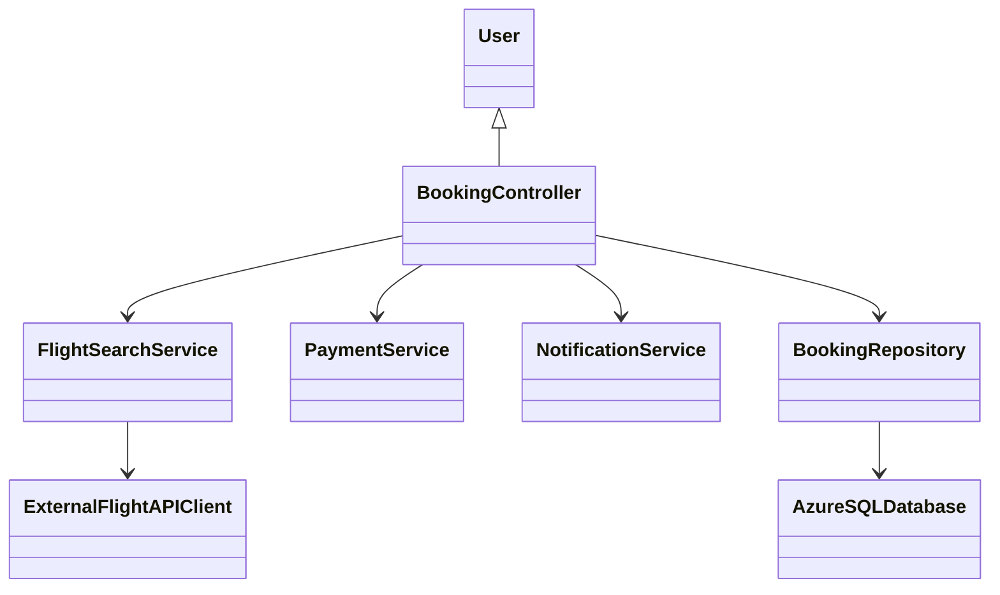
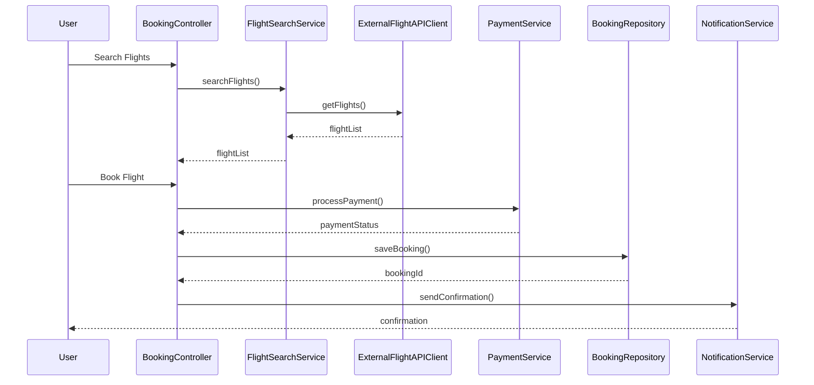

# For User Story Number [1]

1. Objective
This requirement enables travelers to search, compare, and book air transport tickets online, providing a seamless and convenient booking experience. The system ensures real-time flight availability, secure payment processing, and instant confirmation notifications. It aims to streamline travel planning and purchasing for users.

2. API Model
2.1 Common Components/Services
- User Authentication Service (OAuth2)
- Payment Gateway Service (PCI DSS compliant)
- Flight Search Service (integrated with external APIs)
- Notification Service (Email, In-app)

2.2 API Details
| Operation   | REST Method | Type      | URL                       | Request (JSON)                                                                 | Response (JSON)                                                               |
|------------|-------------|-----------|---------------------------|--------------------------------------------------------------------------------|-------------------------------------------------------------------------------|
| Search     | GET         | Success   | /api/flights/search       | {"destination": "NYC", "date": "2025-10-01", "passengers": 2}            | [{"flightId": "F123", "price": 350, "duration": "3h", "airline": "Delta"}] |
| Book       | POST        | Success   | /api/flights/book         | {"flightId": "F123", "userId": "U001", "paymentInfo": {...}}             | {"bookingId": "B456", "status": "CONFIRMED", "confirmation": {...}}        |
| Book       | POST        | Failure   | /api/flights/book         | {"flightId": "F123", "userId": "U001", "paymentInfo": {...}}             | {"error": "Payment failed"}                                                  |
| Confirm    | GET         | Success   | /api/flights/confirm/{id} | N/A                                                                            | {"bookingId": "B456", "status": "CONFIRMED", "details": {...}}            |

2.3 Exceptions
- InvalidInputException: Thrown when destination or date is missing/invalid.
- PaymentProcessingException: Thrown when payment fails or is declined.
- SeatUnavailableException: Thrown when selected seat is no longer available.
- ExternalAPIException: Thrown when flight API integration fails.

3 Functional Design
3.1 Class Diagram


3.2 UML Sequence Diagram


3.3 Components
| Component Name           | Description                                         | Existing/New |
|-------------------------|-----------------------------------------------------|--------------|
| BookingController       | Handles booking requests and orchestrates flow       | New          |
| FlightSearchService     | Searches flights using external APIs                 | New          |
| ExternalFlightAPIClient | Connects to third-party flight APIs                 | New          |
| PaymentService          | Processes payments securely                         | Existing     |
| BookingRepository       | Persists booking data in Azure SQL                  | Existing     |
| NotificationService     | Sends confirmation notifications                    | Existing     |

3.4 Service Layer Logic and Validations
| FieldName        | Validation                                  | Error Message                | ClassUsed               |
|------------------|---------------------------------------------|------------------------------|-------------------------|
| destination      | Not empty, valid airport code                | "Invalid destination"        | BookingController       |
| date             | Not empty, valid date format, future date    | "Invalid date"               | BookingController       |
| paymentInfo      | Valid card details, PCI DSS compliant        | "Invalid payment info"       | PaymentService          |
| flightId         | Seat availability check                      | "Seat not available"         | FlightSearchService     |

4 Integrations
| SystemToBeIntegrated | IntegratedFor         | IntegrationType |
|----------------------|----------------------|-----------------|
| Amadeus/Sabre APIs   | Real-time flight data | API             |
| Payment Gateway      | Payment processing    | API             |
| Email Service        | Confirmation emails   | API             |
| Notification Service | In-app notifications  | API             |

5 DB Details
5.1 ER Model
```mermaid
erDiagram
    USER ||--o{ BOOKING : makes
    BOOKING ||--|{ FLIGHT : contains
    BOOKING }|..|{ PAYMENT : processes
    FLIGHT ||--o{ AIRLINE : operated_by
    BOOKING {
        bookingId PK
        userId FK
        flightId FK
        status
        totalPrice
        bookingDate
    }
    FLIGHT {
        flightId PK
        airlineId FK
        destination
        departureDate
        price
        duration
        seatsAvailable
    }
    PAYMENT {
        paymentId PK
        bookingId FK
        amount
        paymentStatus
        paymentDate
    }
    USER {
        userId PK
        name
        email
    }
    AIRLINE {
        airlineId PK
        name
    }
```

5.2 DB Validations
- Ensure bookingId, flightId, userId are unique and foreign keys are valid.
- Check seatsAvailable > 0 before confirming booking.

6 Non-Functional Requirements
6.1 Performance
- Flight search results must be returned within 2 seconds.
- Use caching for frequently searched routes.

6.2 Security
6.2.1 Authentication
- OAuth2 authentication for all booking APIs.
- Integration with IAM for user identity management.
6.2.2 Authorization
- Role-based access for booking management (user/admin).

6.3 Logging
6.3.1 Application Logging
- DEBUG: API request/response payloads (excluding sensitive info)
- INFO: Successful bookings, payments
- ERROR: Payment failures, API errors
- WARN: Slow response times, seat unavailability
6.3.2 Audit Log
- Log booking creation, payment transactions, and confirmation events

7 Dependencies
- External flight APIs (Amadeus, Sabre)
- Payment gateway provider
- Email/notification service
- Azure SQL Database

8 Assumptions
- All flight data is available via integrated APIs.
- Payment gateway is PCI DSS compliant.
- Email and notification services are reliable and scalable.