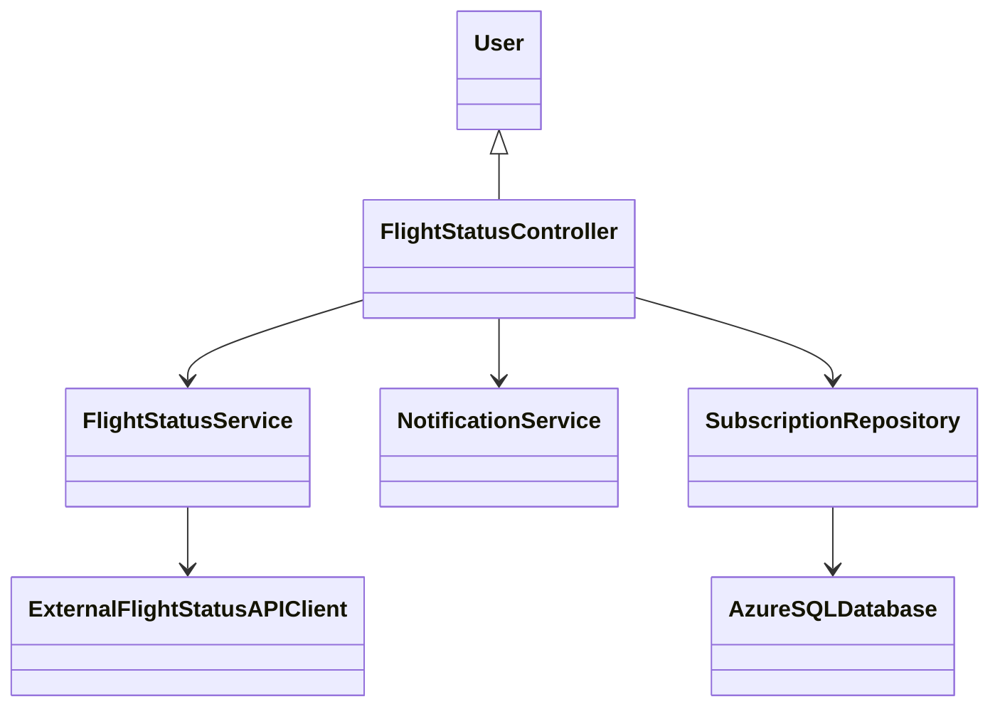
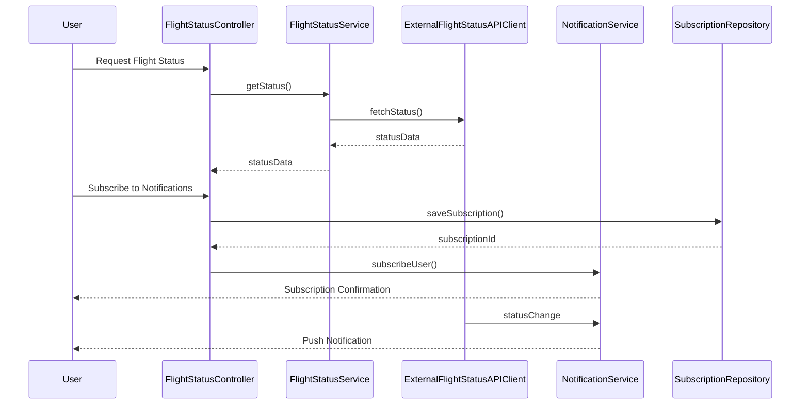

# For User Story Number [2]

1. Objective
This requirement enables travelers to track the real-time status of their flights, including updates on delays, gate changes, and cancellations. The system provides live notifications and access to gate and terminal information, ensuring users remain informed and can adjust their travel plans as needed. It enhances user experience by delivering timely and relevant flight information.

2. API Model
2.1 Common Components/Services
- User Authentication Service
- Notification Service (Azure Notification Hub)
- Flight Status Service (integrated with external APIs)

2.2 API Details
| Operation   | REST Method | Type      | URL                               | Request (JSON)                                               | Response (JSON)                                                                |
|------------|-------------|-----------|-----------------------------------|--------------------------------------------------------------|--------------------------------------------------------------------------------|
| Status     | GET         | Success   | /api/flights/status               | {"flightNumber": "DL123", "bookingRef": "BR789"}          | {"status": "On Time", "gate": "A12", "terminal": "1", "departure": "10:00"} |
| Subscribe  | POST        | Success   | /api/flights/subscribe            | {"userId": "U001", "flightNumber": "DL123"}                | {"subscriptionId": "S001", "status": "SUBSCRIBED"}                            |
| Notify     | POST        | Success   | /api/flights/notify               | {"userId": "U001", "flightNumber": "DL123", "change": "Delayed"} | {"notificationId": "N001", "status": "SENT"}                                 |
| Status     | GET         | Failure   | /api/flights/status               | {"flightNumber": "DL123", "bookingRef": "BR789"}          | {"error": "Flight not found"}                                                 |

2.3 Exceptions
- InvalidFlightReferenceException: Thrown when flight number or booking reference is invalid.
- NotificationDeliveryException: Thrown when notification cannot be sent.
- ExternalAPIException: Thrown when flight status API integration fails.

3 Functional Design
3.1 Class Diagram


3.2 UML Sequence Diagram


3.3 Components
| Component Name                | Description                                         | Existing/New |
|------------------------------|-----------------------------------------------------|--------------|
| FlightStatusController        | Handles flight status requests and notifications    | New          |
| FlightStatusService           | Retrieves flight status from external APIs          | New          |
| ExternalFlightStatusAPIClient | Connects to third-party flight status APIs          | New          |
| NotificationService           | Manages push/email notifications                    | Existing     |
| SubscriptionRepository        | Persists notification subscriptions                 | Existing     |

3.4 Service Layer Logic and Validations
| FieldName      | Validation                                 | Error Message                | ClassUsed                   |
|---------------|--------------------------------------------|------------------------------|-----------------------------|
| flightNumber   | Not empty, valid format                    | "Invalid flight number"      | FlightStatusController      |
| bookingRef     | Not empty, valid reference                 | "Invalid booking reference"  | FlightStatusController      |
| userId         | Valid user authentication                  | "Unauthorized access"        | NotificationService         |
| statusData     | Data accuracy from external API            | "Status unavailable"         | FlightStatusService         |

4 Integrations
| SystemToBeIntegrated      | IntegratedFor         | IntegrationType |
|--------------------------|----------------------|-----------------|
| FlightAware/OpenSky APIs  | Real-time flight data | API             |
| Azure Notification Hub    | Push notifications    | API             |
| Email Service             | Email notifications   | API             |

5 DB Details
5.1 ER Model
```mermaid
erDiagram
    USER ||--o{ SUBSCRIPTION : subscribes
    SUBSCRIPTION ||--|{ FLIGHT : tracks
    FLIGHT {
        flightId PK
        flightNumber
        airlineId FK
        departure
        arrival
        status
        gate
        terminal
    }
    SUBSCRIPTION {
        subscriptionId PK
        userId FK
        flightId FK
        status
    }
    USER {
        userId PK
        name
        email
    }
```

5.2 DB Validations
- Ensure subscriptionId, flightId, userId are unique and foreign keys are valid.
- Validate active subscription for notification delivery.

6 Non-Functional Requirements
6.1 Performance
- Flight status updates must be delivered within 5 seconds of change.
- Use event-driven notifications for real-time updates.

6.2 Security
6.2.1 Authentication
- User authentication required for accessing flight status.
6.2.2 Authorization
- Only authorized users can view their flight status and receive notifications.

6.3 Logging
6.3.1 Application Logging
- DEBUG: API request/response payloads (excluding sensitive info)
- INFO: Status updates, notification deliveries
- ERROR: API failures, notification errors
- WARN: Delayed status updates
6.3.2 Audit Log
- Log subscription creation, status changes, and notification events

7 Dependencies
- External flight status APIs (FlightAware, OpenSky)
- Azure Notification Hub
- Email service
- Azure SQL Database

8 Assumptions
- Flight status APIs provide accurate and timely data.
- Notification service is reliable and scalable.
- User contact information is up-to-date.