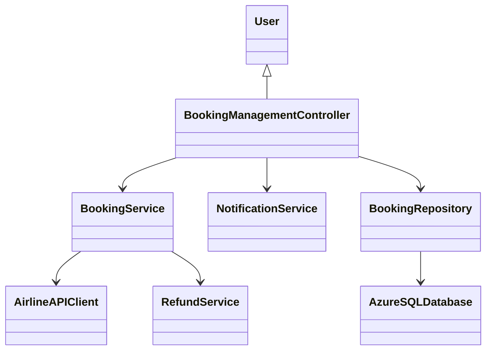
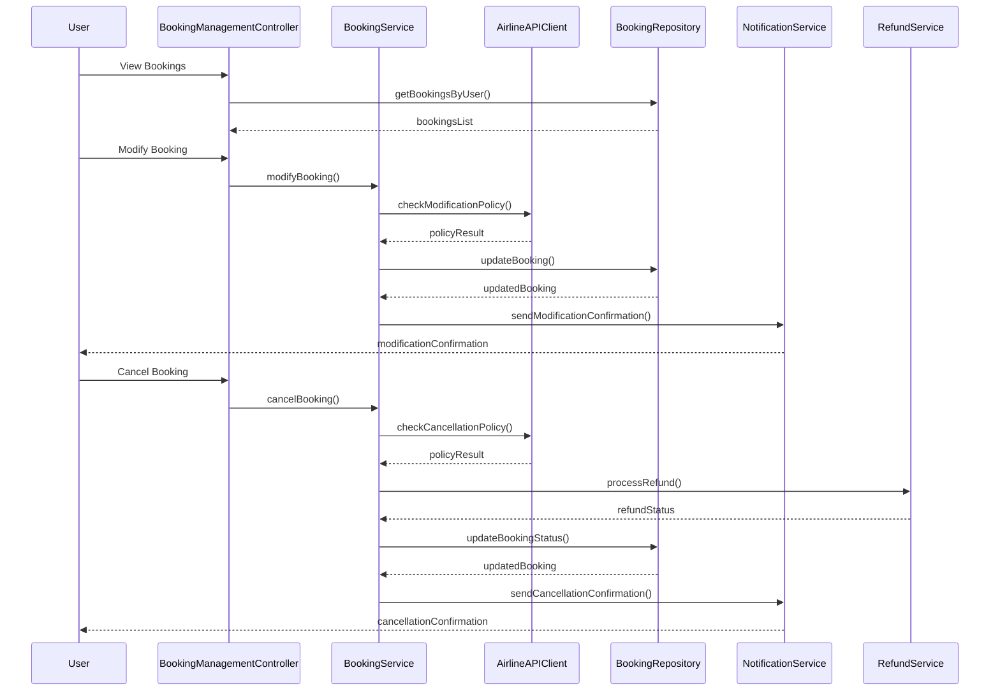

# For User Story Number [3]

1. Objective
This requirement enables travelers to manage their air transport bookings, allowing them to view, modify, or cancel reservations easily. The system provides access to booking history, supports modifications according to airline policies, and ensures clear confirmation for all actions. It streamlines the booking management process for users and supports compliance with airline rules.

2. API Model
2.1 Common Components/Services
- User Authentication Service
- Booking Management Service
- Notification Service (Email, In-app)
- Refund Processing Service

2.2 API Details
| Operation   | REST Method | Type      | URL                               | Request (JSON)                                                        | Response (JSON)                                                                |
|------------|-------------|-----------|-----------------------------------|------------------------------------------------------------------------|--------------------------------------------------------------------------------|
| View       | GET         | Success   | /api/bookings/user/{userId}       | N/A                                                                    | [{"bookingId": "B456", "flightId": "F123", "status": "CONFIRMED"}]         |
| Modify     | PUT         | Success   | /api/bookings/{bookingId}/modify  | {"seat": "12A", "date": "2025-10-02"}                              | {"bookingId": "B456", "status": "MODIFIED", "details": {...}}                |
| Cancel     | DELETE      | Success   | /api/bookings/{bookingId}/cancel  | N/A                                                                    | {"bookingId": "B456", "status": "CANCELLED", "refund": {...}}                |
| Modify     | PUT         | Failure   | /api/bookings/{bookingId}/modify  | {"seat": "12A", "date": "2025-10-02"}                              | {"error": "Modification not allowed by airline policy"}                        |
| Cancel     | DELETE      | Failure   | /api/bookings/{bookingId}/cancel  | N/A                                                                    | {"error": "Cancellation not allowed"}                                         |

2.3 Exceptions
- UnauthorizedAccessException: Thrown when user authentication fails.
- ModificationNotAllowedException: Thrown when airline rules prevent modification.
- CancellationNotAllowedException: Thrown when cancellation is restricted.
- RefundProcessingException: Thrown when refund cannot be processed.

3 Functional Design
3.1 Class Diagram


3.2 UML Sequence Diagram


3.3 Components
| Component Name                | Description                                         | Existing/New |
|------------------------------|-----------------------------------------------------|--------------|
| BookingManagementController   | Handles booking management requests                 | New          |
| BookingService                | Implements booking modification/cancellation logic  | New          |
| AirlineAPIClient              | Connects to airline APIs for policy checks          | New          |
| BookingRepository             | Persists booking data in Azure SQL                  | Existing     |
| NotificationService           | Sends confirmation notifications                    | Existing     |
| RefundService                 | Processes refunds for cancellations                 | Existing     |

3.4 Service Layer Logic and Validations
| FieldName        | Validation                                  | Error Message                | ClassUsed               |
|------------------|---------------------------------------------|------------------------------|-------------------------|
| userId           | User authentication required                 | "Unauthorized access"        | BookingManagementController |
| bookingId        | Valid booking reference                      | "Booking not found"          | BookingRepository       |
| seat/date        | Modification allowed by airline policy       | "Modification not allowed"    | BookingService          |
| cancellation     | Cancellation allowed by airline policy       | "Cancellation not allowed"    | BookingService          |
| refund           | Refund policy compliance                     | "Refund not applicable"       | RefundService           |

4 Integrations
| SystemToBeIntegrated      | IntegratedFor         | IntegrationType |
|--------------------------|----------------------|-----------------|
| Airline Booking APIs      | Modification/cancellation policy | API             |
| Email Service             | Confirmation emails   | API             |
| Notification Service      | In-app notifications  | API             |
| Refund Processing Service | Refunds               | API             |

5 DB Details
5.1 ER Model
```mermaid
erDiagram
    USER ||--o{ BOOKING : manages
    BOOKING ||--|{ FLIGHT : contains
    BOOKING }|..|{ REFUND : processes
    FLIGHT {
        flightId PK
        airlineId FK
        destination
        departureDate
        price
        duration
        seatsAvailable
    }
    BOOKING {
        bookingId PK
        userId FK
        flightId FK
        status
        seat
        bookingDate
        modificationDate
        cancellationDate
    }
    REFUND {
        refundId PK
        bookingId FK
        amount
        refundStatus
        refundDate
    }
    USER {
        userId PK
        name
        email
    }
    AIRLINE {
        airlineId PK
        name
    }
```

5.2 DB Validations
- Ensure bookingId, flightId, userId are unique and foreign keys are valid.
- Check airline policy before allowing modification/cancellation.
- Validate refund eligibility before processing.

6 Non-Functional Requirements
6.1 Performance
- Booking updates must be processed within 3 seconds.
- Use asynchronous processing for refunds.

6.2 Security
6.2.1 Authentication
- User authentication required for all booking management APIs.
6.2.2 Authorization
- Role-based access for booking management (user/admin).

6.3 Logging
6.3.1 Application Logging
- DEBUG: API request/response payloads (excluding sensitive info)
- INFO: Successful modifications, cancellations, refunds
- ERROR: Policy violations, refund failures
- WARN: Slow booking updates
6.3.2 Audit Log
- Log booking modifications, cancellations, and refund transactions

7 Dependencies
- Airline booking APIs
- Refund processing service
- Email/notification service
- Azure SQL Database

8 Assumptions
- Airline APIs provide accurate and timely policy data.
- Refund processing service is reliable and scalable.
- User contact information is up-to-date.