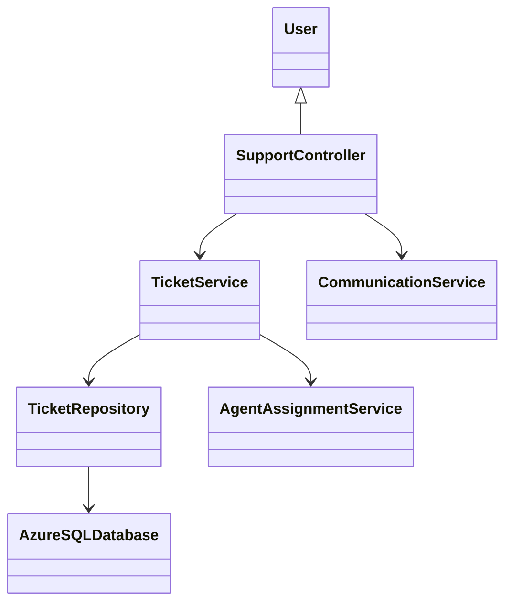
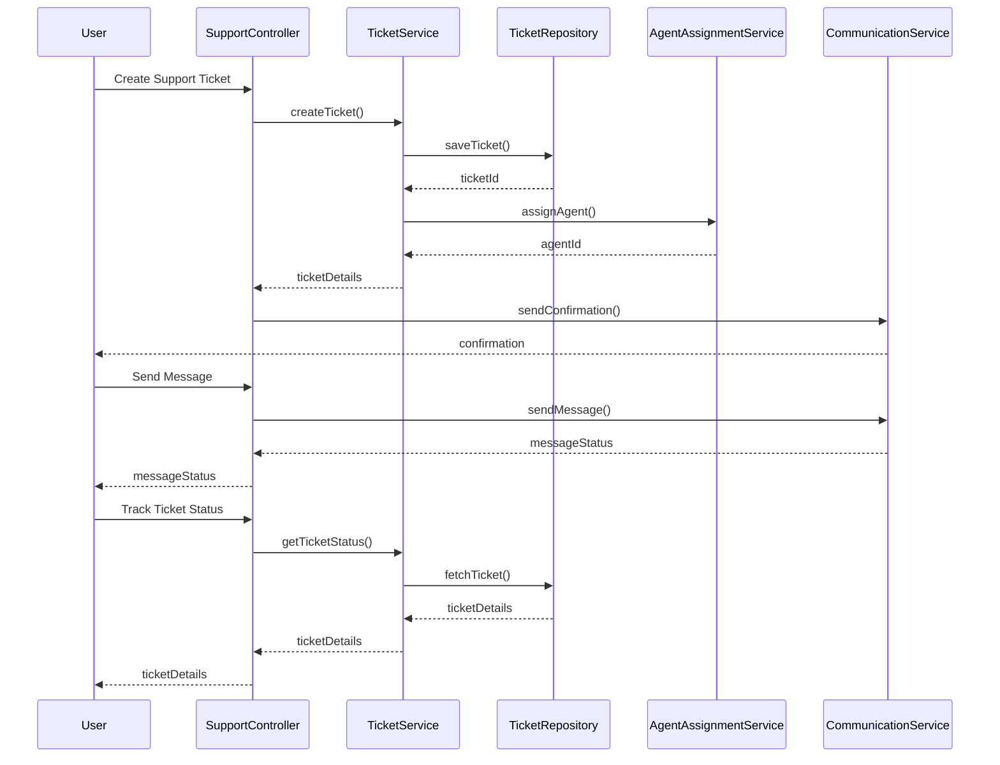

# For User Story Number [4]

1. Objective
This requirement enables travelers to access customer support for air transport issues, including bookings, flight status, cancellations, and refunds. The system allows users to initiate support requests, communicate with support agents via chat or email, and track the status of their tickets. It ensures efficient problem resolution and transparent communication for users.

2. API Model
2.1 Common Components/Services
- User Authentication Service
- Support Ticket Management Service (Azure Service Bus)
- Communication Service (Chat, Email)
- Ticket Tracking Service

2.2 API Details
| Operation   | REST Method | Type      | URL                                 | Request (JSON)                                                      | Response (JSON)                                                                |
|------------|-------------|-----------|-------------------------------------|---------------------------------------------------------------------|--------------------------------------------------------------------------------|
| Create     | POST        | Success   | /api/support/tickets                | {"userId": "U001", "issue": "Booking failed"}                  | {"ticketId": "T789", "status": "OPEN", "agent": "A123"}                      |
| Track      | GET         | Success   | /api/support/tickets/{ticketId}     | N/A                                                                 | {"ticketId": "T789", "status": "IN_PROGRESS", "messages": [...] }             |
| Communicate| POST        | Success   | /api/support/tickets/{ticketId}/chat| {"userId": "U001", "message": "Need update"}                   | {"chatId": "C001", "status": "SENT"}                                         |
| Create     | POST        | Failure   | /api/support/tickets                | {"userId": "U001", "issue": "Booking failed"}                  | {"error": "Support request failed"}                                            |
| Track      | GET         | Failure   | /api/support/tickets/{ticketId}     | N/A                                                                 | {"error": "Ticket not found"}                                                   |

2.3 Exceptions
- UnauthorizedAccessException: Thrown when user authentication fails.
- TicketCreationException: Thrown when support request cannot be logged.
- TicketNotFoundException: Thrown when ticket ID is invalid.
- CommunicationException: Thrown when chat/email cannot be delivered.

3 Functional Design
3.1 Class Diagram


3.2 UML Sequence Diagram


3.3 Components
| Component Name                | Description                                         | Existing/New |
|------------------------------|-----------------------------------------------------|--------------|
| SupportController             | Handles support requests and communication          | New          |
| TicketService                 | Manages ticket creation, assignment, and tracking   | New          |
| TicketRepository              | Persists ticket data in Azure SQL                   | Existing     |
| AgentAssignmentService        | Assigns support tickets to agents                   | New          |
| CommunicationService          | Manages chat/email communication                    | Existing     |

3.4 Service Layer Logic and Validations
| FieldName        | Validation                                  | Error Message                | ClassUsed               |
|------------------|---------------------------------------------|------------------------------|-------------------------|
| userId           | User authentication required                 | "Unauthorized access"        | SupportController       |
| issue            | Not empty, valid issue description           | "Issue description required" | TicketService           |
| ticketId         | Valid ticket reference                       | "Ticket not found"           | TicketRepository        |
| message          | Not empty, valid message content             | "Message required"           | CommunicationService    |

4 Integrations
| SystemToBeIntegrated      | IntegratedFor         | IntegrationType |
|--------------------------|----------------------|-----------------|
| Zendesk/Freshdesk        | Ticket management     | API             |
| Email Service            | Confirmation emails   | API             |
| Chat Service             | Chat communication    | API             |
| Azure Service Bus        | Ticket assignment     | API             |

5 DB Details
5.1 ER Model
```mermaid
erDiagram
    USER ||--o{ SUPPORT_TICKET : raises
    SUPPORT_TICKET ||--|{ AGENT : assigned_to
    SUPPORT_TICKET ||--o{ MESSAGE : contains
    USER {
        userId PK
        name
        email
    }
    SUPPORT_TICKET {
        ticketId PK
        userId FK
        agentId FK
        issue
        status
        createdDate
        closedDate
    }
    AGENT {
        agentId PK
        name
        email
    }
    MESSAGE {
        messageId PK
        ticketId FK
        senderId FK
        content
        sentDate
    }
```

5.2 DB Validations
- Ensure ticketId, userId, agentId are unique and foreign keys are valid.
- All support requests must be assigned a ticket number.
- Validate message content before saving.

6 Non-Functional Requirements
6.1 Performance
- Support ticket creation must occur within 2 seconds.
- Use asynchronous messaging for chat/email delivery.

6.2 Security
6.2.1 Authentication
- User authentication required for all support APIs.
6.2.2 Authorization
- Only authorized users can view and communicate on their tickets.

6.3 Logging
6.3.1 Application Logging
- DEBUG: API request/response payloads (excluding sensitive info)
- INFO: Ticket creation, assignment, resolution
- ERROR: Ticket creation failures, communication errors
- WARN: Unresolved tickets
6.3.2 Audit Log
- Log ticket creation, assignment, communication, and closure events

7 Dependencies
- Third-party support platforms (Zendesk, Freshdesk)
- Email/chat service
- Azure Service Bus
- Azure SQL Database

8 Assumptions
- Support platforms provide reliable ticket management APIs.
- Communication services are available 24/7.
- User contact information is up-to-date.