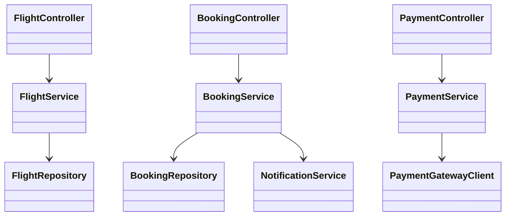
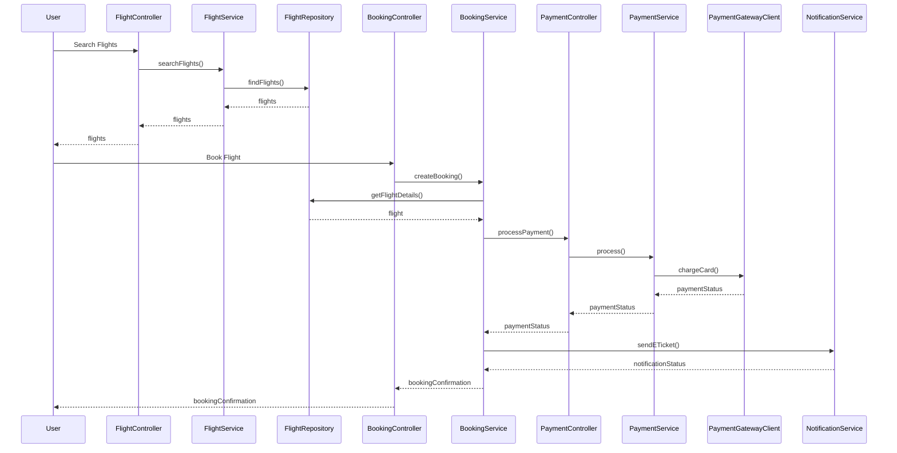
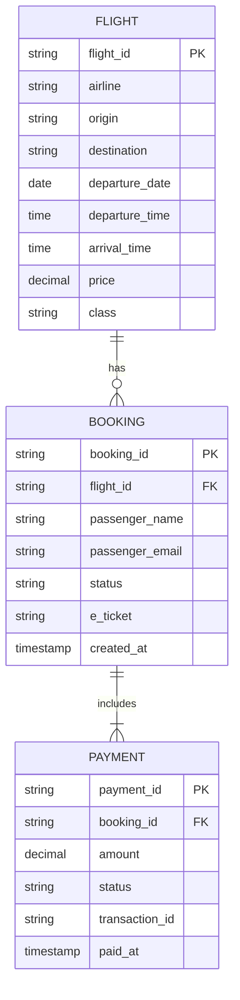

# For User Story Number [1]

1. Objective
The objective is to enable travelers to search, compare, and book air transport tickets online. The system should provide a seamless and secure booking experience, including payment and e-ticket confirmation. The goal is to ensure convenience, security, and reliability for end users.

2. API Model
  2.1 Common Components/Services
    - Authentication Service (OAuth2)
    - Payment Service (Stripe/PayPal integration)
    - Flight Search Service (integration with Amadeus/Sabre APIs)
    - Notification Service (Email for e-ticket)
    - Booking Service

  2.2 API Details
| Operation | REST Method | Type | URL | Request | Response |
|-----------|-------------|------|-----|---------|----------|
| Search Flights | GET | Success/Failure | /api/flights/search | { "origin": "JFK", "destination": "LAX", "date": "2025-10-01", "class": "Economy" } | { "flights": [ { "flightId": "F123", "airline": "AA", "price": 250.00, "departure": "10:00", "arrival": "13:00" } ] } |
| Book Flight | POST | Success/Failure | /api/bookings | { "flightId": "F123", "passenger": { "name": "John Doe", "email": "john@example.com" }, "payment": { "cardNumber": "****", "expiry": "12/27" } } | { "bookingId": "B456", "status": "CONFIRMED", "eTicket": "ETK123" } |
| Payment Processing | POST | Success/Failure | /api/payments | { "bookingId": "B456", "amount": 250.00, "paymentMethod": "stripe" } | { "paymentStatus": "SUCCESS", "transactionId": "T789" } |
| Get Booking Confirmation | GET | Success/Failure | /api/bookings/{bookingId} | N/A | { "bookingId": "B456", "status": "CONFIRMED", "eTicket": "ETK123" } |

  2.3 Exceptions
| API | Exception | Description |
|-----|-----------|-------------|
| Search Flights | InvalidAirportCodeException | Origin or destination code invalid |
| Book Flight | PaymentFailedException | Payment gateway failure |
| Book Flight | FlightUnavailableException | Flight no longer available |
| Payment Processing | PaymentValidationException | Invalid payment details |
| Get Booking Confirmation | BookingNotFoundException | Booking ID not found |

3 Functional Design
  3.1 Class Diagram

  3.2 UML Sequence Diagram

  3.3 Components
| Component Name | Description | Existing/New |
|----------------|-------------|--------------|
| FlightController | REST controller for flight search | New |
| BookingController | REST controller for bookings | New |
| PaymentController | REST controller for payments | New |
| FlightService | Handles flight search logic | New |
| BookingService | Handles booking creation and confirmation | New |
| PaymentService | Handles payment processing | New |
| NotificationService | Sends e-ticket and notifications | New |
| FlightRepository | Data access for flights | New |
| BookingRepository | Data access for bookings | New |
| PaymentGatewayClient | Integrates with payment gateway | New |

  3.4 Service Layer Logic and Validations
| FieldName | Validation | Error Message | ClassUsed |
|-----------|-----------|--------------|-----------|
| origin | Not empty, valid airport code | Invalid origin airport code | FlightService |
| destination | Not empty, valid airport code | Invalid destination airport code | FlightService |
| date | Not in past | Travel date cannot be in the past | FlightService |
| payment.cardNumber | Valid card number | Invalid payment details | PaymentService |
| payment.expiry | Valid expiry date | Invalid payment details | PaymentService |

4 Integrations
| SystemToBeIntegrated | IntegratedFor | IntegrationType |
|----------------------|--------------|-----------------|
| Amadeus/Sabre APIs | Flight search and availability | API |
| Stripe/PayPal | Payment processing | API |
| Email Service (SendGrid) | E-ticket notification | API |

5 DB Details
  5.1 ER Model

  5.2 DB Validations
    - Unique constraint on booking_id, payment_id, flight_id
    - Foreign key constraints between booking and flight, payment and booking
    - Not null constraints on mandatory fields

6 Non-Functional Requirements
  6.1 Performance
    - API response time < 2 seconds for search and booking
    - Booking confirmation within 5 seconds of payment
    - Caching frequently searched routes at API layer

  6.2 Security
    6.2.1 Authentication
      - OAuth2 for user authentication
      - HTTPS for all endpoints
    6.2.2 Authorization
      - Only authenticated users can book flights
      - Role-based access for admin operations

  6.3 Logging
    6.3.1 Application Logging
      - DEBUG: API request/response payloads (excluding sensitive data)
      - INFO: Successful bookings, payments
      - ERROR: Failed payments, booking errors
      - WARN: Potential fraud or suspicious activity
    6.3.2 Audit Log
      - All booking and payment events logged with timestamp, user, and action

7 Dependencies
    - Third-party flight APIs (Amadeus/Sabre)
    - Payment gateways (Stripe/PayPal)
    - Email service provider (SendGrid)

8 Assumptions
    - All users have valid email addresses for e-ticket delivery
    - Third-party APIs are available and reliable
    - Payment gateway is PCI DSS compliant
