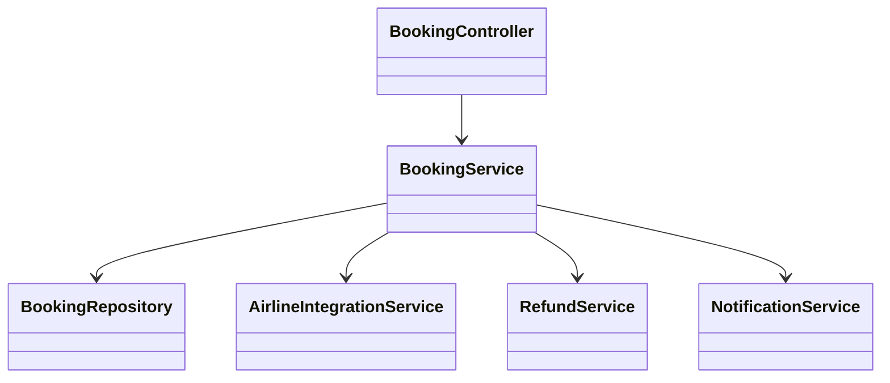
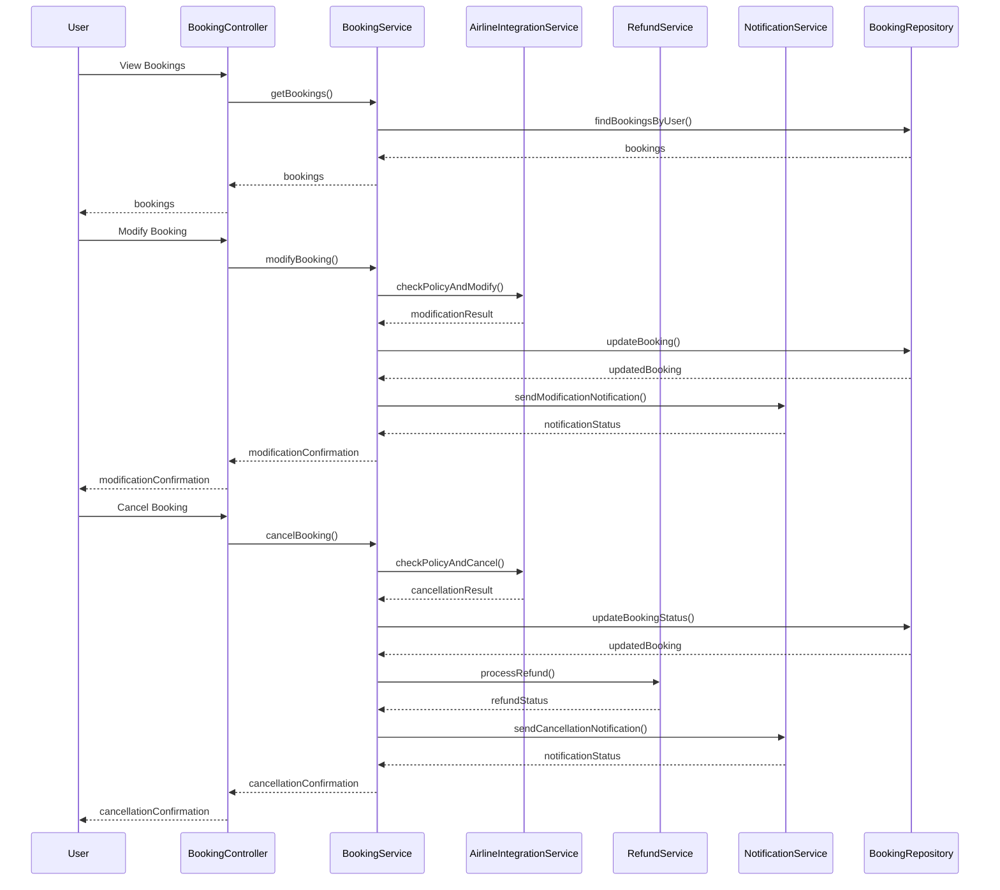
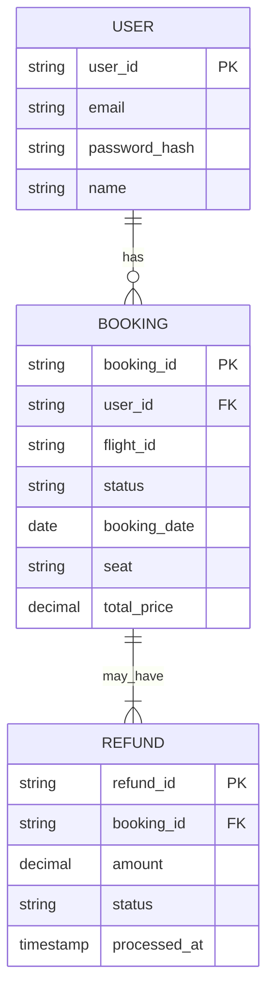

# For User Story Number [2]

1. Objective
The objective is to provide travelers with the ability to manage their air transport bookings online. This includes viewing, modifying, or canceling reservations as per airline policies. The system ensures secure access, real-time updates, and compliance with fare and refund rules.

2. API Model
  2.1 Common Components/Services
    - Authentication Service (OAuth2)
    - Booking Management Service
    - Airline Integration Service
    - Refund Calculation Service
    - Notification Service (for confirmations and status)

  2.2 API Details
| Operation | REST Method | Type | URL | Request | Response |
|-----------|-------------|------|-----|---------|----------|
| Get Bookings | GET | Success/Failure | /api/bookings | { "userId": "U123" } | { "bookings": [ { "bookingId": "B456", "flightId": "F123", "status": "CONFIRMED" } ] } |
| Modify Booking | PUT | Success/Failure | /api/bookings/{bookingId} | { "newDate": "2025-10-05", "seat": "12A" } | { "bookingId": "B456", "status": "MODIFIED", "fees": 50.00 } |
| Cancel Booking | DELETE | Success/Failure | /api/bookings/{bookingId} | N/A | { "bookingId": "B456", "status": "CANCELLED", "refund": 200.00 } |
| Get Booking History | GET | Success/Failure | /api/bookings/history | { "userId": "U123" } | { "history": [ { "bookingId": "B123", "status": "CANCELLED" } ] } |

  2.3 Exceptions
| API | Exception | Description |
|-----|-----------|-------------|
| Get Bookings | AuthenticationException | User not authenticated |
| Modify Booking | ModificationNotAllowedException | Changes not permitted by airline policy |
| Cancel Booking | CancellationNotAllowedException | Cancellation not permitted by airline policy |
| Cancel Booking | RefundProcessingException | Refund could not be processed |

3 Functional Design
  3.1 Class Diagram

  3.2 UML Sequence Diagram

  3.3 Components
| Component Name | Description | Existing/New |
|----------------|-------------|--------------|
| BookingController | REST controller for booking management | New |
| BookingService | Handles booking retrieval, modification, and cancellation | New |
| AirlineIntegrationService | Integrates with airline APIs for booking changes | New |
| RefundService | Calculates and processes refunds | New |
| NotificationService | Sends notifications for modifications/cancellations | New |
| BookingRepository | Data access for bookings | New |

  3.4 Service Layer Logic and Validations
| FieldName | Validation | Error Message | ClassUsed |
|-----------|-----------|--------------|-----------|
| userId | Authenticated user | User not authenticated | BookingService |
| bookingId | Exists and belongs to user | Booking not found | BookingService |
| modification | Allowed by airline policy | Modification not allowed | AirlineIntegrationService |
| cancellation | Allowed by airline policy | Cancellation not allowed | AirlineIntegrationService |
| refund | Valid payment method | Refund could not be processed | RefundService |

4 Integrations
| SystemToBeIntegrated | IntegratedFor | IntegrationType |
|----------------------|--------------|-----------------|
| Airline APIs | Booking modification/cancellation | API |
| Payment Gateway | Refund processing | API |
| Email/SMS Service | Notification for changes/cancellations | API |

5 DB Details
  5.1 ER Model

  5.2 DB Validations
    - Unique constraint on booking_id, refund_id
    - Foreign key constraints between booking and user, refund and booking
    - Not null constraints on mandatory fields

6 Non-Functional Requirements
  6.1 Performance
    - Real-time reflection of booking changes
    - API response time < 2 seconds

  6.2 Security
    6.2.1 Authentication
      - OAuth2 for user authentication
      - HTTPS for all endpoints
    6.2.2 Authorization
      - Only authenticated users can modify/cancel their bookings

  6.3 Logging
    6.3.1 Application Logging
      - DEBUG: API request/response payloads (excluding sensitive data)
      - INFO: Successful modifications, cancellations, refunds
      - ERROR: Failed modifications, cancellations, refunds
      - WARN: Unauthorized modification/cancellation attempts
    6.3.2 Audit Log
      - All booking changes and cancellations logged with timestamp, user, and action

7 Dependencies
    - Airline APIs for booking management
    - Payment gateway for refunds
    - Email/SMS service provider

8 Assumptions
    - Airline APIs are available and reliable
    - Refunds are processed as per airline and payment gateway policies
    - Users have valid contact information for notifications
