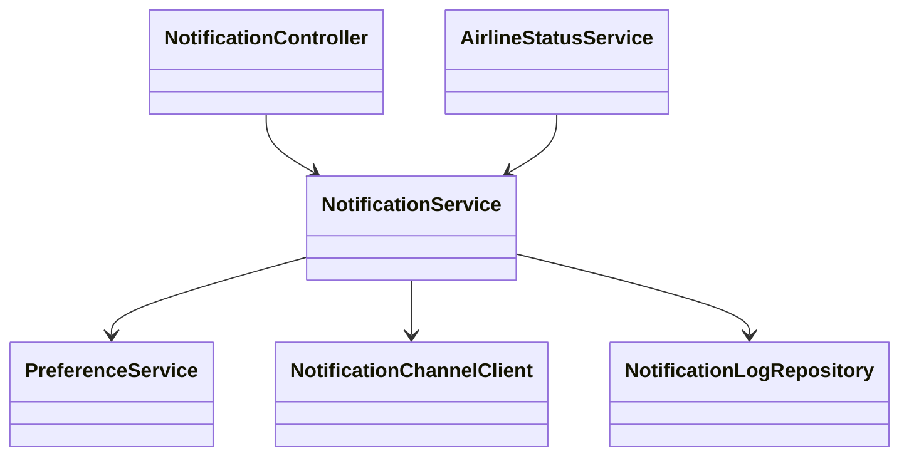
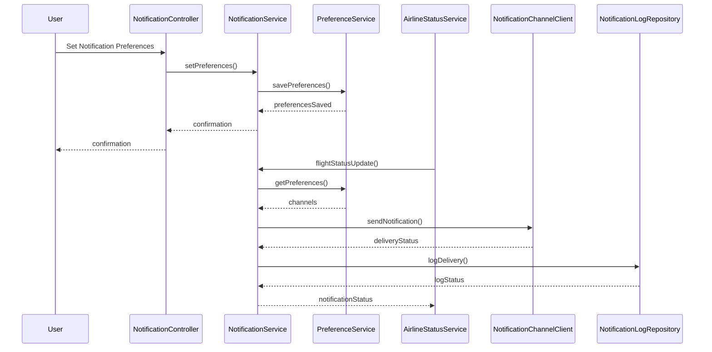
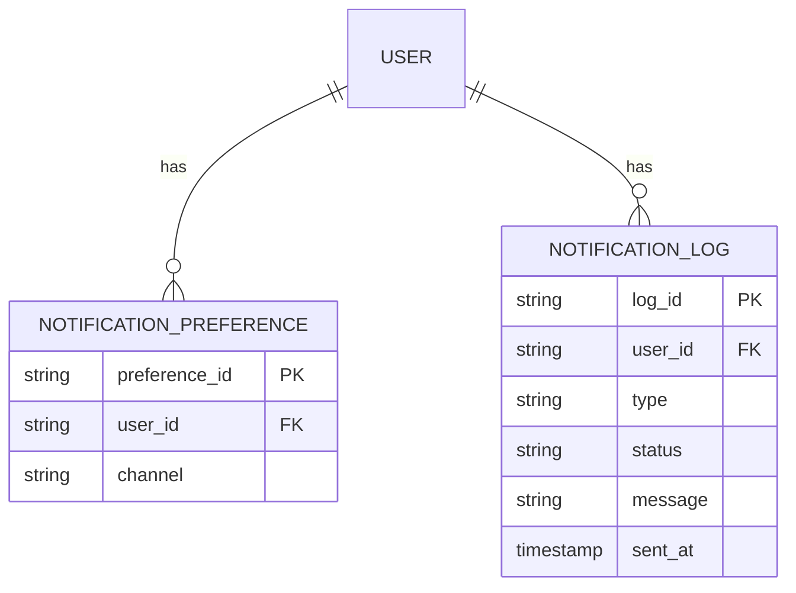

# For User Story Number [3]

1. Objective
The objective is to provide travelers with real-time notifications about their flight status, including delays, cancellations, gate changes, and boarding reminders. The system should respect user notification preferences and ensure timely, accurate delivery of alerts. This enhances traveler experience and reduces uncertainty during travel.

2. API Model
  2.1 Common Components/Services
    - Notification Preference Service
    - Notification Engine
    - Airline Status Feed Integration Service
    - Audit Logging Service

  2.2 API Details
| Operation | REST Method | Type | URL | Request | Response |
|-----------|-------------|------|-----|---------|----------|
| Set Notification Preferences | POST | Success/Failure | /api/notifications/preferences | { "userId": "U123", "channels": ["email", "sms"] } | { "status": "SAVED" } |
| Get Notification Preferences | GET | Success/Failure | /api/notifications/preferences | { "userId": "U123" } | { "channels": ["email", "sms"] } |
| Receive Flight Status Update | POST | Success/Failure | /api/airline/status | { "flightId": "F123", "status": "DELAYED", "details": "30 min" } | { "notificationStatus": "SENT" } |
| Notification Delivery Log | GET | Success/Failure | /api/notifications/logs | { "userId": "U123" } | { "logs": [ { "type": "email", "status": "DELIVERED", "timestamp": "..." } ] } |

  2.3 Exceptions
| API | Exception | Description |
|-----|-----------|-------------|
| Set Notification Preferences | InvalidChannelException | Unsupported notification channel |
| Receive Flight Status Update | NotificationDeliveryException | Failed to deliver notification |
| Notification Delivery Log | LogNotFoundException | No logs found for user |

3 Functional Design
  3.1 Class Diagram

  3.2 UML Sequence Diagram

  3.3 Components
| Component Name | Description | Existing/New |
|----------------|-------------|--------------|
| NotificationController | REST controller for notification management | New |
| NotificationService | Handles notification logic and delivery | New |
| PreferenceService | Manages user notification preferences | New |
| AirlineStatusService | Integrates with airline status feeds | New |
| NotificationChannelClient | Sends notifications via email/SMS/app | New |
| NotificationLogRepository | Stores notification delivery logs | New |

  3.4 Service Layer Logic and Validations
| FieldName | Validation | Error Message | ClassUsed |
|-----------|-----------|--------------|-----------|
| userId | Exists and authenticated | User not authenticated | PreferenceService |
| channels | Supported channel (email, sms, app) | Invalid notification channel | PreferenceService |
| notification | Accurate and up-to-date | Notification data invalid | NotificationService |
| delivery | Logged for audit | Notification delivery not logged | NotificationLogRepository |

4 Integrations
| SystemToBeIntegrated | IntegratedFor | IntegrationType |
|----------------------|--------------|-----------------|
| Airline APIs | Real-time flight status updates | API |
| Twilio | SMS notification delivery | API |
| SendGrid | Email notification delivery | API |
| App Notification Service | In-app notification delivery | API |

5 DB Details
  5.1 ER Model

  5.2 DB Validations
    - Unique constraint on preference_id, log_id
    - Foreign key constraints between notification preference/log and user
    - Not null constraints on mandatory fields

6 Non-Functional Requirements
  6.1 Performance
    - Notification delivery within 1 minute of status change
    - High throughput for real-time updates

  6.2 Security
    6.2.1 Authentication
      - User authentication for managing preferences
      - HTTPS for all endpoints
    6.2.2 Authorization
      - Only users can manage their own preferences/logs

  6.3 Logging
    6.3.1 Application Logging
      - DEBUG: Notification request/response payloads (excluding sensitive data)
      - INFO: Successful notification deliveries
      - ERROR: Failed notification deliveries
      - WARN: Delayed notifications
    6.3.2 Audit Log
      - All notification deliveries logged with timestamp, user, and channel

7 Dependencies
    - Airline APIs for status updates
    - Twilio, SendGrid, App notification service

8 Assumptions
    - User contact information is up to date
    - Airline APIs provide timely and accurate updates
    - Notification channels are reliable
