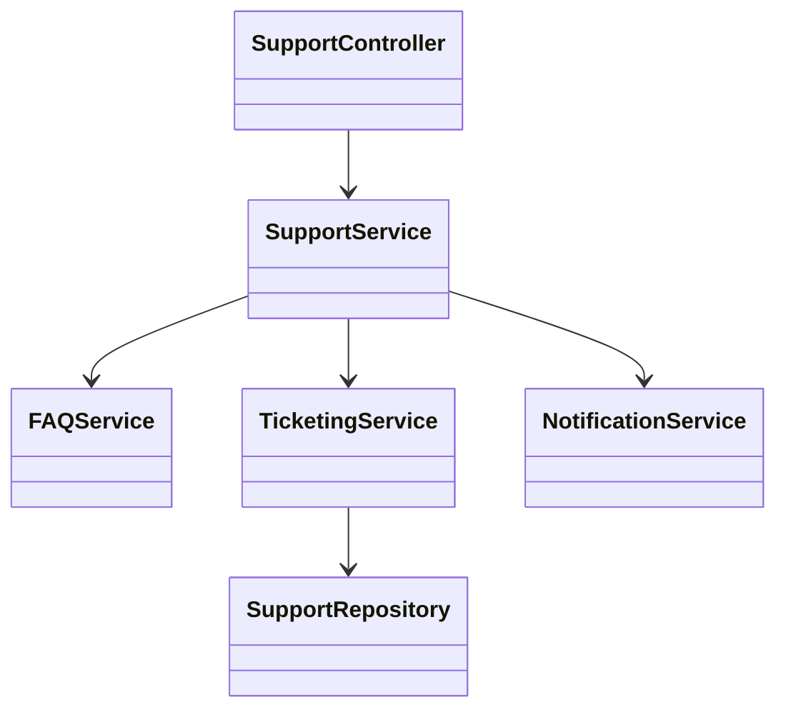
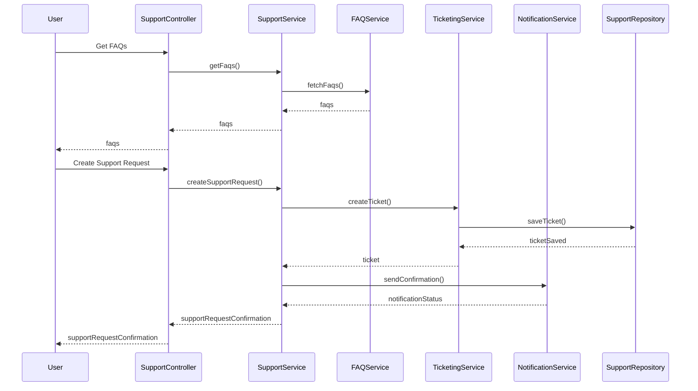
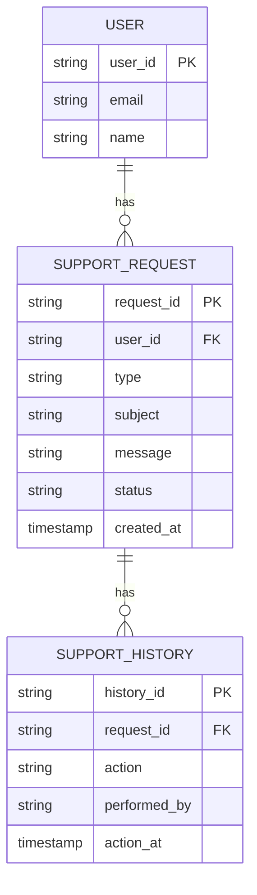

# For User Story Number [4]

1. Objective
The objective is to provide travelers with access to customer support for air transport bookings through multiple channels (chat, email, phone). The system should offer a help center with FAQs, track support requests, and ensure timely and quality responses. This improves user satisfaction and helps resolve booking-related issues efficiently.

2. API Model
  2.1 Common Components/Services
    - Authentication Service
    - Support Ticketing Service
    - FAQ/Help Center Service
    - Notification Service (for confirmations and updates)
    - Support Channel Integration Service (Zendesk/Freshdesk)

  2.2 API Details
| Operation | REST Method | Type | URL | Request | Response |
|-----------|-------------|------|-----|---------|----------|
| Get FAQs | GET | Success/Failure | /api/support/faqs | N/A | { "faqs": [ { "question": "How to cancel a booking?", "answer": "..." } ] } |
| Create Support Request | POST | Success/Failure | /api/support/requests | { "userId": "U123", "type": "chat", "subject": "Refund", "message": "Need refund" } | { "requestId": "SR789", "status": "OPEN" } |
| Get Support Requests | GET | Success/Failure | /api/support/requests | { "userId": "U123" } | { "requests": [ { "requestId": "SR789", "status": "OPEN", "subject": "Refund" } ] } |
| Get Support Request Status | GET | Success/Failure | /api/support/requests/{requestId} | N/A | { "requestId": "SR789", "status": "RESOLVED", "history": [ ... ] } |

  2.3 Exceptions
| API | Exception | Description |
|-----|-----------|-------------|
| Create Support Request | SupportRequestValidationException | Invalid or missing request details |
| Get Support Requests | AuthenticationException | User not authenticated |
| Get Support Request Status | SupportRequestNotFoundException | Request ID not found |

3 Functional Design
  3.1 Class Diagram

  3.2 UML Sequence Diagram

  3.3 Components
| Component Name | Description | Existing/New |
|----------------|-------------|--------------|
| SupportController | REST controller for support operations | New |
| SupportService | Handles support logic and orchestration | New |
| FAQService | Manages FAQs and help center articles | New |
| TicketingService | Manages support tickets and requests | New |
| NotificationService | Sends confirmations and updates | New |
| SupportRepository | Data access for support tickets | New |

  3.4 Service Layer Logic and Validations
| FieldName | Validation | Error Message | ClassUsed |
|-----------|-----------|--------------|-----------|
| userId | Exists and authenticated | User not authenticated | SupportService |
| type | Valid support channel (chat, email, phone) | Invalid support channel | SupportService |
| subject | Not empty | Subject is required | SupportService |
| message | Not empty | Message is required | SupportService |
| requestId | Exists | Support request not found | TicketingService |

4 Integrations
| SystemToBeIntegrated | IntegratedFor | IntegrationType |
|----------------------|--------------|-----------------|
| Zendesk/Freshdesk | Support ticket management | API |
| Email/SMS Service | Notification for support updates | API |

5 DB Details
  5.1 ER Model

  5.2 DB Validations
    - Unique constraint on request_id, history_id
    - Foreign key constraints between support request/history and user
    - Not null constraints on mandatory fields

6 Non-Functional Requirements
  6.1 Performance
    - 24/7 support availability
    - SLA: < 5 minutes for chat, < 24 hours for email

  6.2 Security
    6.2.1 Authentication
      - User authentication for support access
      - HTTPS for all endpoints
    6.2.2 Authorization
      - Only users can view and manage their own support requests

  6.3 Logging
    6.3.1 Application Logging
      - DEBUG: Support request/response payloads (excluding sensitive data)
      - INFO: Support request creation, updates, resolutions
      - ERROR: Failed support request processing
      - WARN: SLA breaches
    6.3.2 Audit Log
      - All support interactions logged with timestamp, user, and action

7 Dependencies
    - Zendesk/Freshdesk for ticket management
    - Email/SMS service provider for notifications

8 Assumptions
    - Support platform APIs are available and reliable
    - Users have valid contact information for notifications
    - Support team is staffed for 24/7 coverage
