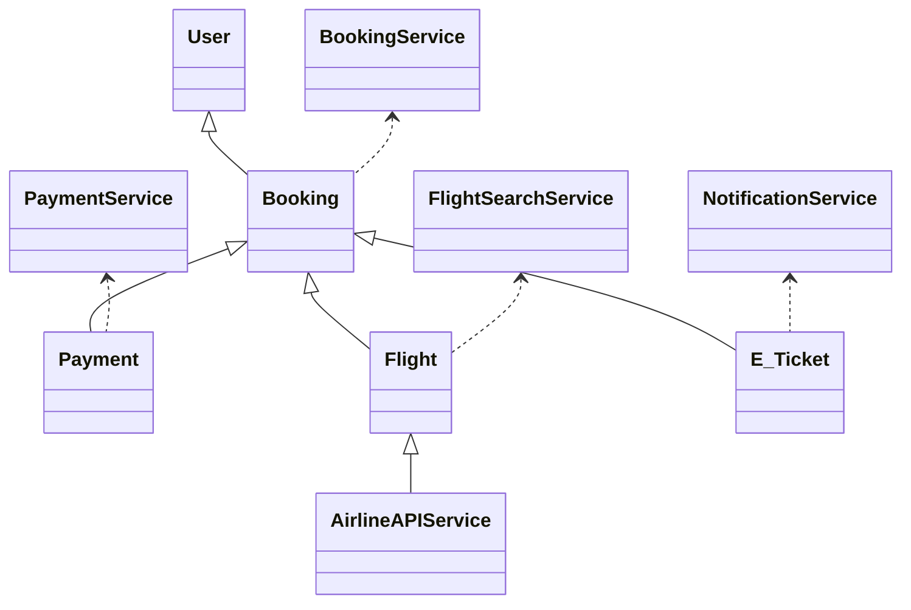
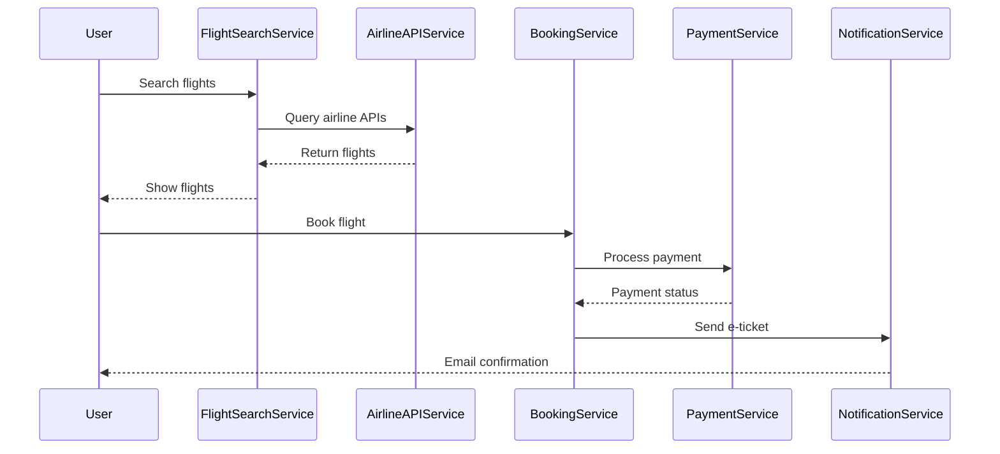
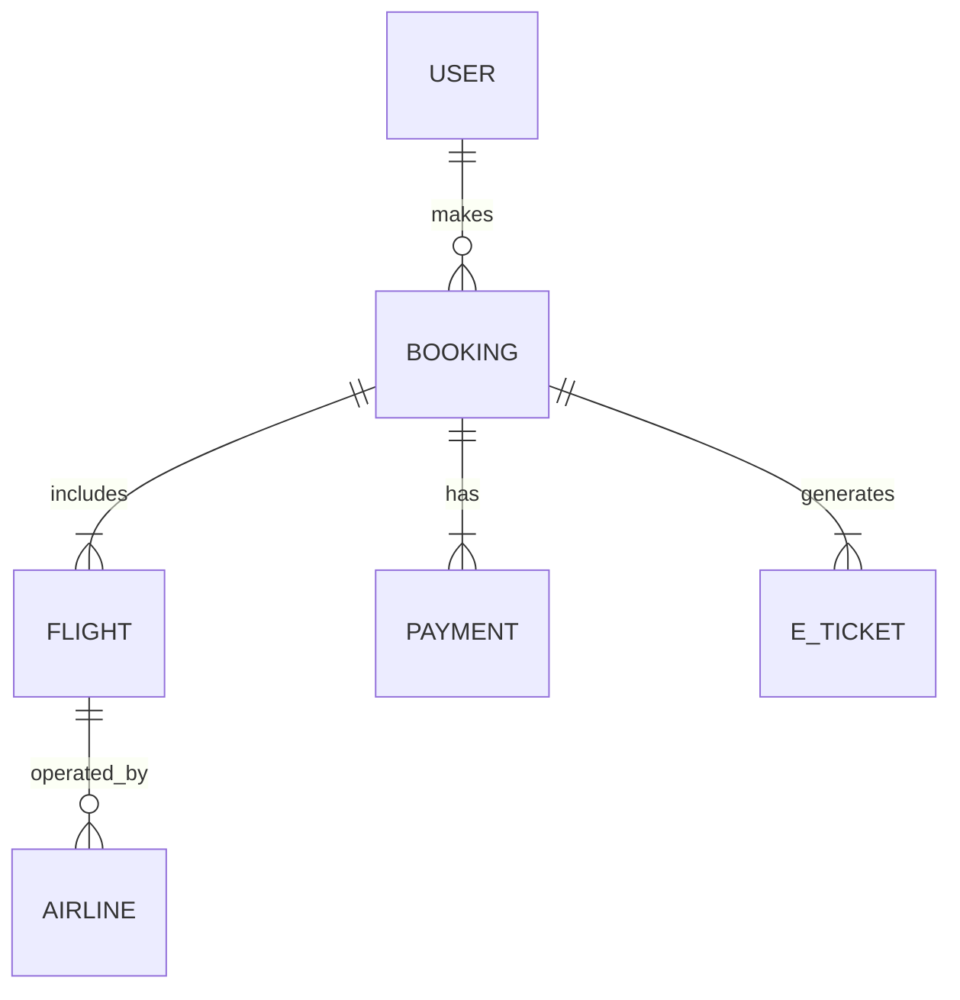

# For User Story Number [1]

1. Objective
The objective is to enable travelers to search, compare, and book air transport tickets online with real-time availability and pricing, and receive booking confirmation and e-ticket via email. The system ensures a seamless booking experience, secure payment processing, and reliable communication of booking details. It integrates with airline APIs and payment gateways to provide a robust and scalable solution.

2. API Model
2.1 Common Components/Services
- User Authentication Service (Spring Security)
- Flight Search Service
- Booking Service
- Payment Service
- Email Notification Service
- Airline API Integration Service

2.2 API Details
| Operation | REST Method | Type | URL | Request | Response |
|-----------|------------|------|-----|---------|----------|
| Search Flights | GET | Success/Failure | /api/flights/search | {"origin": "JFK", "destination": "LAX", "date": "2025-10-01"} | {"flights": [{"flightId": "AA123", "price": 350, "departure": "10:00", "arrival": "13:00"}]} |
| Book Flight | POST | Success/Failure | /api/bookings | {"flightId": "AA123", "userId": "u1", "passengerInfo": {...}, "paymentInfo": {...}} | {"bookingId": "B123", "status": "CONFIRMED", "eTicket": "<PDF_URL>"} |
| Payment Processing | POST | Success/Failure | /api/payments | {"bookingId": "B123", "paymentInfo": {...}} | {"paymentId": "P456", "status": "SUCCESS"} |
| Send Confirmation Email | POST | Success/Failure | /api/notifications/email | {"bookingId": "B123", "email": "user@email.com"} | {"status": "SENT"} |

2.3 Exceptions
| API | Exception | Description |
|-----|-----------|-------------|
| Search Flights | FlightNotFoundException | No flights found for given criteria |
| Book Flight | InvalidPaymentException | Payment failed/invalid details |
| Book Flight | ValidationException | Missing/invalid booking details |
| Payment Processing | PaymentGatewayException | Payment gateway error |
| Send Confirmation Email | EmailSendException | Email could not be sent |

3 Functional Design
3.1 Class Diagram

3.2 UML Sequence Diagram

3.3 Components
| Component Name | Description | Existing/New |
|----------------|-------------|--------------|
| FlightSearchService | Handles flight search logic | New |
| AirlineAPIService | Integrates with airline APIs | New |
| BookingService | Manages booking creation and validation | New |
| PaymentService | Handles payment processing | New |
| NotificationService | Sends booking confirmation emails | New |
| UserAuthenticationService | Manages user authentication | Existing |

3.4 Service Layer Logic and Validations
| FieldName | Validation | Error Message | ClassUsed |
|-----------|-----------|--------------|-----------|
| origin | Not empty | "Origin cannot be empty" | FlightSearchService |
| destination | Not empty | "Destination cannot be empty" | FlightSearchService |
| date | Must be future date | "Date must be in the future" | FlightSearchService |
| paymentInfo | Valid payment details | "Invalid payment information" | PaymentService |

4 Integrations
| SystemToBeIntegrated | IntegratedFor | IntegrationType |
|----------------------|---------------|-----------------|
| Airline APIs | Real-time flight data | API |
| Payment Gateway | Payment processing | API |
| Email Service | Send e-ticket/confirmation | API |

5 DB Details
5.1 ER Model

5.2 DB Validations
- Booking must reference a valid user and flight.
- Payment must reference a valid booking.
- E_Ticket must reference a valid booking.

6 Non-Functional Requirements
6.1 Performance
- Support 1000+ concurrent users
- Horizontal scaling via load balancer
- Caching of frequent flight search results at API layer (e.g., Redis)

6.2 Security
    6.2.1 Authentication
    - OAuth2/JWT for user authentication
    - HTTPS for all endpoints
    6.2.2 Authorization
    - Role-based access for booking and payment APIs

6.3 Logging
    6.3.1 Application Logging
    - DEBUG: API request/response payloads
    - INFO: Successful bookings, payments
    - ERROR: Failed payments, booking errors
    - WARN: API latency issues
    6.3.2 Audit Log
    - Log all booking and payment transactions with user and timestamp

7 Dependencies
- Airline APIs (REST/JSON)
- Payment Gateway (PCI DSS compliant)
- Email Service Provider

8 Assumptions
- All airline APIs provide real-time data
- Payment gateway is always available
- Email addresses provided by users are valid
