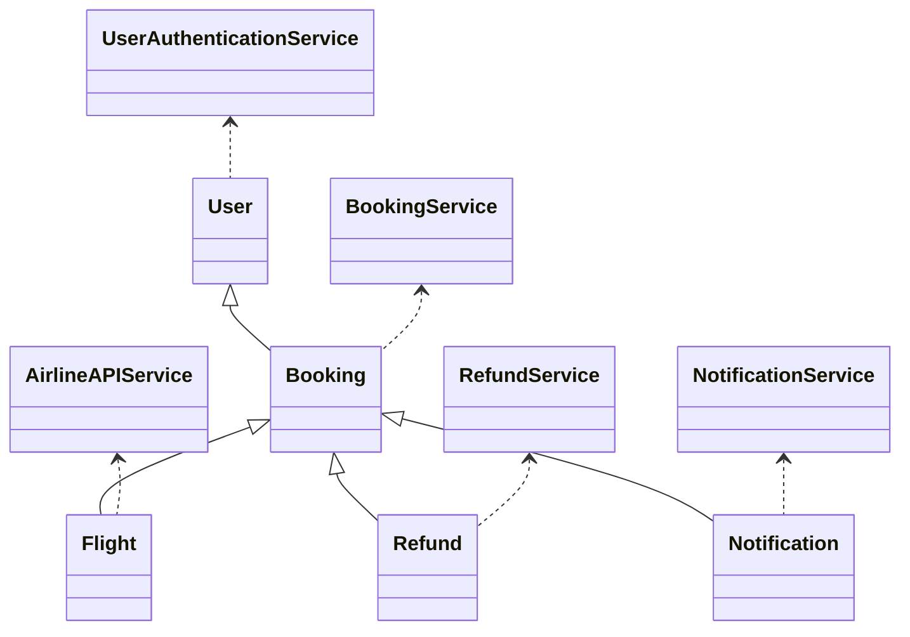
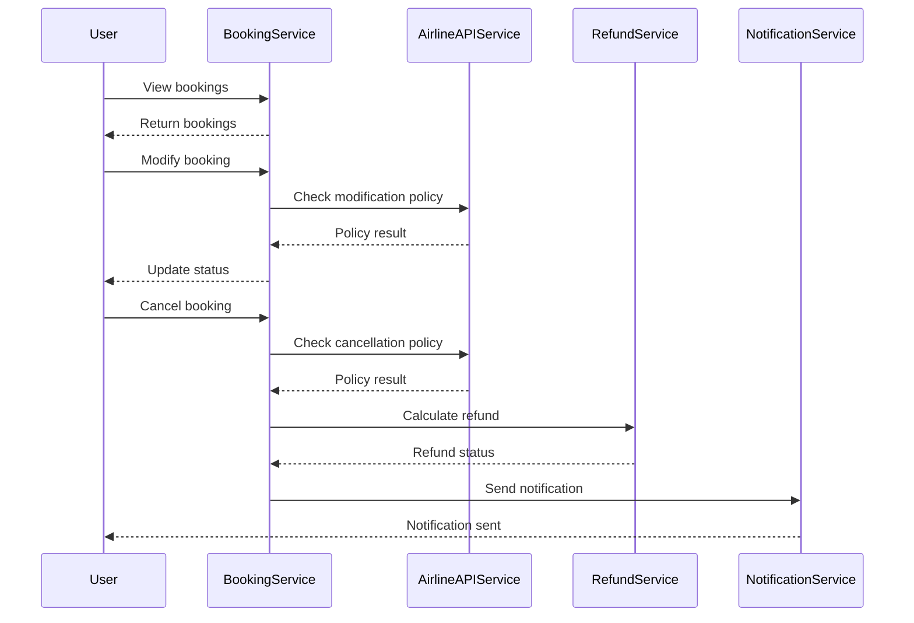
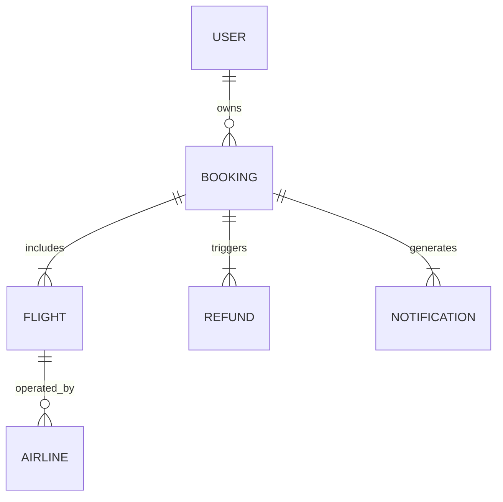

# For User Story Number [2]

1. Objective
The objective is to enable travelers to view, manage, modify, and cancel their air transport bookings online. The system provides secure access to booking data, processes changes and cancellations in real time, and communicates refund status and policy information to users. It ensures compliance with airline policies, secure authentication, and efficient notification of booking updates.

2. API Model
2.1 Common Components/Services
- User Authentication Service (Spring Security/OAuth2)
- Booking Management Service
- Airline API Integration Service
- Payment/Refund Service
- Notification Service

2.2 API Details
| Operation | REST Method | Type | URL | Request | Response |
|-----------|------------|------|-----|---------|----------|
| View Bookings | GET | Success/Failure | /api/bookings | {"userId": "u1"} | {"bookings": [{"bookingId": "B123", "flightId": "AA123", "status": "CONFIRMED"}]} |
| Modify Booking | PUT | Success/Failure | /api/bookings/{bookingId} | {"bookingId": "B123", "newDate": "2025-10-02", "passengerInfo": {...}} | {"bookingId": "B123", "status": "UPDATED"} |
| Cancel Booking | DELETE | Success/Failure | /api/bookings/{bookingId} | {"bookingId": "B123"} | {"bookingId": "B123", "status": "CANCELLED", "refundStatus": "INITIATED"} |
| Refund Processing | POST | Success/Failure | /api/refunds | {"bookingId": "B123"} | {"refundId": "R789", "status": "SUCCESS"} |
| Send Notification | POST | Success/Failure | /api/notifications | {"bookingId": "B123", "type": "CANCELLATION", "userId": "u1"} | {"status": "SENT"} |

2.3 Exceptions
| API | Exception | Description |
|-----|-----------|-------------|
| View Bookings | UnauthorizedAccessException | User not authenticated |
| Modify Booking | ModificationNotAllowedException | Modification not allowed by airline policy |
| Cancel Booking | CancellationNotAllowedException | Cancellation not allowed by airline policy |
| Refund Processing | RefundCalculationException | Error calculating refund |
| Send Notification | NotificationSendException | Notification could not be sent |

3 Functional Design
3.1 Class Diagram

3.2 UML Sequence Diagram

3.3 Components
| Component Name | Description | Existing/New |
|----------------|-------------|--------------|
| BookingService | Handles booking management | New |
| AirlineAPIService | Integrates with airline APIs | New |
| RefundService | Handles refund calculations and processing | New |
| NotificationService | Sends notifications for booking changes | New |
| UserAuthenticationService | Manages user authentication | Existing |

3.4 Service Layer Logic and Validations
| FieldName | Validation | Error Message | ClassUsed |
|-----------|-----------|--------------|-----------|
| userId | Authenticated user | "User must be authenticated" | UserAuthenticationService |
| bookingId | Valid booking reference | "Invalid booking ID" | BookingService |
| newDate | Allowed by airline policy | "Modification not allowed" | BookingService |
| cancellation | Allowed by airline policy | "Cancellation not allowed" | BookingService |

4 Integrations
| SystemToBeIntegrated | IntegratedFor | IntegrationType |
|----------------------|---------------|-----------------|
| Airline APIs | Booking management, policy checks | API |
| Payment Gateway | Refund processing | API |
| Notification Service | Send booking change notifications | API |

5 DB Details
5.1 ER Model

5.2 DB Validations
- Booking must reference a valid user and flight.
- Refund must reference a valid booking.
- Notification must reference a valid booking.

6 Non-Functional Requirements
6.1 Performance
- Changes/cancellations processed within 5 seconds
- System available 24/7
- Efficient DB indexing for booking queries

6.2 Security
    6.2.1 Authentication
    - OAuth2 for user authentication
    - HTTPS for all endpoints
    6.2.2 Authorization
    - Only booking owner can modify/cancel

6.3 Logging
    6.3.1 Application Logging
    - DEBUG: API request/response payloads
    - INFO: Successful modifications, cancellations
    - ERROR: Failed modifications, refund errors
    - WARN: Policy violations
    6.3.2 Audit Log
    - Log all booking changes and cancellations with user and timestamp

7 Dependencies
- Airline APIs (REST/JSON)
- Payment Gateway (PCI DSS compliant)
- Notification Service Provider

8 Assumptions
- Airline APIs provide up-to-date policy information
- Refunds are processed instantly by payment gateway
- Users are properly authenticated
