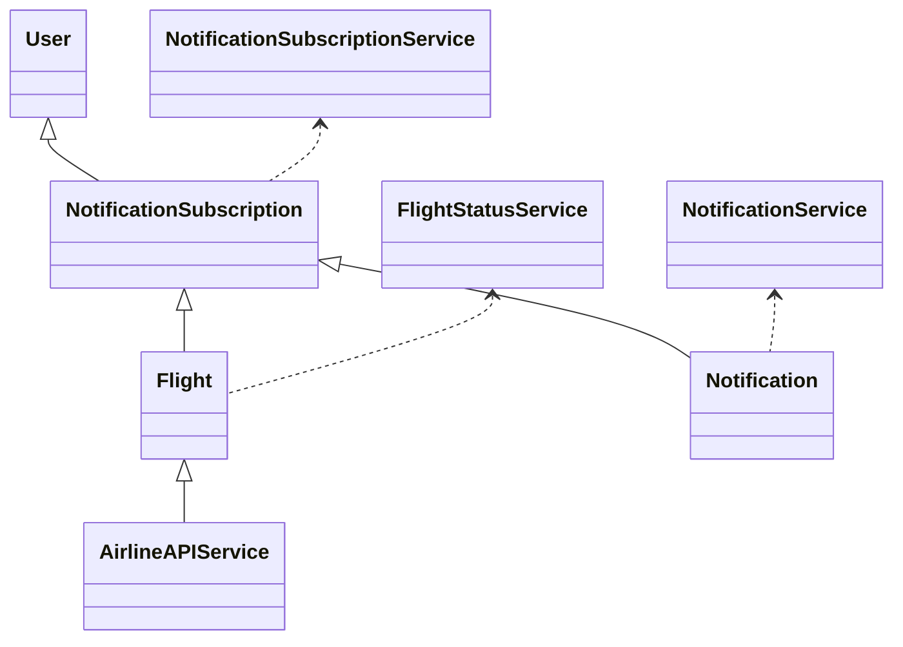
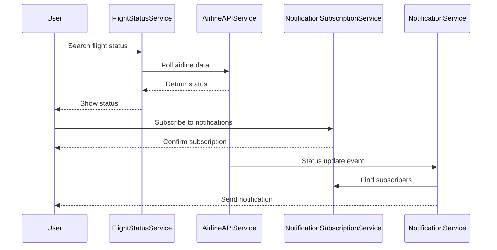
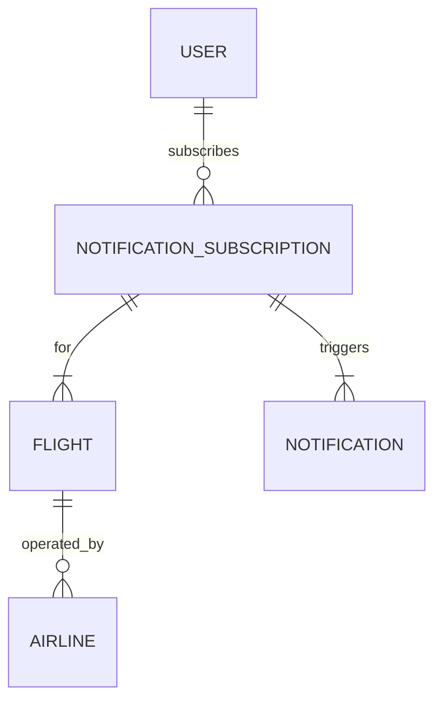

# For User Story Number [3]

1. Objective
The objective is to provide travelers with real-time flight status updates and notifications for delays, gate changes, or cancellations. The system allows users to search flight status, subscribe to notifications, and ensures timely delivery of alerts via email, SMS, or push. It integrates with airline data feeds and notification services to deliver a reliable and scalable solution.

2. API Model
2.1 Common Components/Services
- User Authentication Service (Spring Security)
- Flight Status Service
- Notification Subscription Service
- Notification Delivery Service
- Airline Real-Time Data Integration Service

2.2 API Details
| Operation | REST Method | Type | URL | Request | Response |
|-----------|------------|------|-----|---------|----------|
| Search Flight Status | GET | Success/Failure | /api/flights/status | {"flightNumber": "AA123", "date": "2025-10-01"} | {"flightNumber": "AA123", "status": "DELAYED", "gate": "A12", "departure": "10:30"} |
| Subscribe Notification | POST | Success/Failure | /api/notifications/subscribe | {"userId": "u1", "flightNumber": "AA123", "date": "2025-10-01", "preferences": ["EMAIL", "SMS"]} | {"subscriptionId": "S123", "status": "SUBSCRIBED"} |
| Send Notification | POST | Success/Failure | /api/notifications/send | {"subscriptionId": "S123", "message": "Flight AA123 delayed"} | {"status": "SENT"} |

2.3 Exceptions
| API | Exception | Description |
|-----|-----------|-------------|
| Search Flight Status | FlightNotFoundException | Flight not found or invalid date |
| Subscribe Notification | InvalidPreferenceException | Notification preference not confirmed |
| Send Notification | NotificationSendException | Notification could not be sent |

3 Functional Design
3.1 Class Diagram

3.2 UML Sequence Diagram

3.3 Components
| Component Name | Description | Existing/New |
|----------------|-------------|--------------|
| FlightStatusService | Handles flight status queries | New |
| AirlineAPIService | Integrates with airline real-time data | New |
| NotificationSubscriptionService | Manages user notification subscriptions | New |
| NotificationService | Delivers notifications via email/SMS/push | New |
| UserAuthenticationService | Manages user authentication | Existing |

3.4 Service Layer Logic and Validations
| FieldName | Validation | Error Message | ClassUsed |
|-----------|-----------|--------------|-----------|
| flightNumber | Valid flight number | "Invalid flight number" | FlightStatusService |
| date | Valid date | "Invalid date" | FlightStatusService |
| preferences | Confirmed by user | "Notification preference not confirmed" | NotificationSubscriptionService |
| subscription | Subscribed flight only | "Not subscribed for this flight" | NotificationService |

4 Integrations
| SystemToBeIntegrated | IntegratedFor | IntegrationType |
|----------------------|---------------|-----------------|
| Airline Real-Time Data APIs | Flight status updates | API |
| Notification Service Providers (Twilio, Firebase) | Email/SMS/Push notifications | API |

5 DB Details
5.1 ER Model

5.2 DB Validations
- NotificationSubscription must reference a valid user and flight.
- Notification must reference a valid subscription.

6 Non-Functional Requirements
6.1 Performance
- Status updates reflected within 2 minutes of airline data change
- Notifications delivered within 30 seconds
- High concurrency support during peak travel times

6.2 Security
    6.2.1 Authentication
    - OAuth2/JWT for user authentication
    - HTTPS for all endpoints
    6.2.2 Authorization
    - Only subscribed users receive notifications

6.3 Logging
    6.3.1 Application Logging
    - DEBUG: API request/response payloads
    - INFO: Successful notifications sent
    - ERROR: Notification delivery failures
    - WARN: Data feed latency
    6.3.2 Audit Log
    - Log all notification events with user, flight, and timestamp

7 Dependencies
- Airline Real-Time Data APIs
- Notification Service Providers (Twilio, Firebase)

8 Assumptions
- Airline APIs provide timely status updates
- Notification service providers are available and reliable
- User preferences are securely stored
