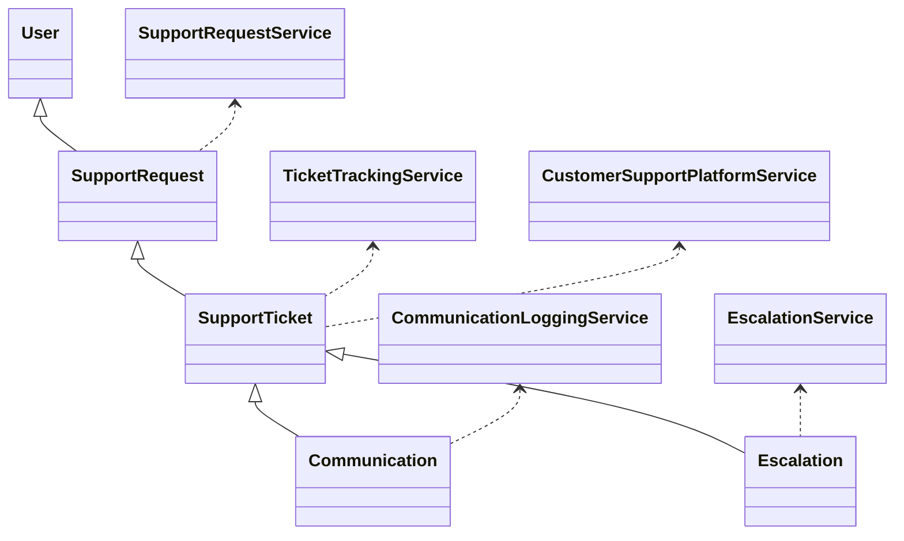
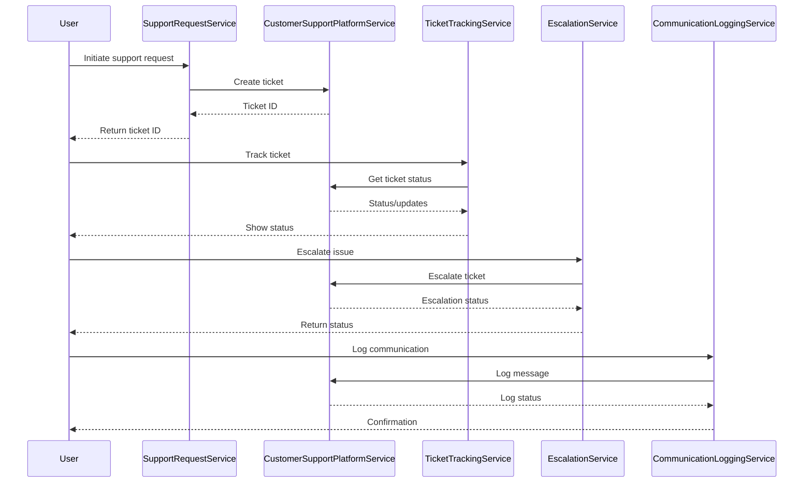
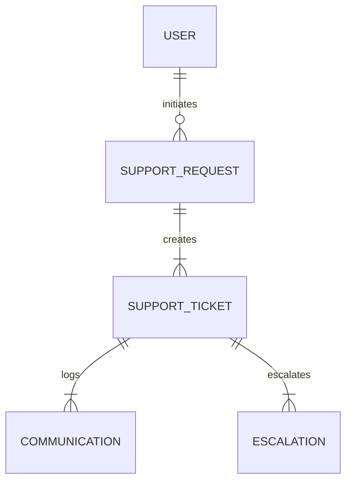

# For User Story Number [4]

1. Objective
The objective is to provide travelers with efficient access to customer support for booking, cancellation, refund, or travel-related issues via chat, email, or phone. The system enables ticket tracking, prioritization, and escalation of critical issues, ensuring timely and auditable resolution of support requests. It integrates with customer support platforms and maintains secure, logged communications.

2. API Model
2.1 Common Components/Services
- User Authentication Service (Spring Security)
- Support Request Service
- Ticket Tracking Service
- Escalation Service
- Communication Logging Service
- Customer Support Platform Integration Service

2.2 API Details
| Operation | REST Method | Type | URL | Request | Response |
|-----------|------------|------|-----|---------|----------|
| Initiate Support Request | POST | Success/Failure | /api/support/requests | {"userId": "u1", "contact": "user@email.com", "bookingId": "B123", "issueType": "REFUND", "message": "Need refund"} | {"ticketId": "T123", "status": "OPEN"} |
| Track Support Ticket | GET | Success/Failure | /api/support/tickets/{ticketId} | {"ticketId": "T123"} | {"ticketId": "T123", "status": "IN_PROGRESS", "updates": [{"timestamp": "2025-10-01T12:00:00Z", "message": "Assigned to agent"}]} |
| Escalate Issue | POST | Success/Failure | /api/support/escalate | {"ticketId": "T123", "reason": "Critical issue"} | {"ticketId": "T123", "status": "ESCALATED"} |
| Log Communication | POST | Success/Failure | /api/support/communications | {"ticketId": "T123", "channel": "CHAT", "message": "User replied"} | {"status": "LOGGED"} |

2.3 Exceptions
| API | Exception | Description |
|-----|-----------|-------------|
| Initiate Support Request | ValidationException | Missing user/contact/booking details |
| Track Support Ticket | TicketNotFoundException | Ticket not found |
| Escalate Issue | EscalationNotAllowedException | Escalation not allowed by business rules |
| Log Communication | CommunicationLogException | Communication could not be logged |

3 Functional Design
3.1 Class Diagram

3.2 UML Sequence Diagram

3.3 Components
| Component Name | Description | Existing/New |
|----------------|-------------|--------------|
| SupportRequestService | Handles support request initiation | New |
| TicketTrackingService | Manages ticket status and updates | New |
| EscalationService | Handles issue escalation | New |
| CommunicationLoggingService | Logs all communications | New |
| CustomerSupportPlatformService | Integrates with Zendesk/Freshdesk | New |
| UserAuthenticationService | Manages user authentication | Existing |

3.4 Service Layer Logic and Validations
| FieldName | Validation | Error Message | ClassUsed |
|-----------|-----------|--------------|-----------|
| userId | Not empty | "User ID required" | SupportRequestService |
| contact | Valid email/phone | "Contact details required" | SupportRequestService |
| bookingId | Valid booking reference | "Invalid booking ID" | SupportRequestService |
| issueType | Valid issue type | "Invalid issue type" | SupportRequestService |
| escalation | Allowed by business rules | "Escalation not allowed" | EscalationService |

4 Integrations
| SystemToBeIntegrated | IntegratedFor | IntegrationType |
|----------------------|---------------|-----------------|
| Customer Support Platform (Zendesk, Freshdesk) | Ticket management, escalation, logging | API |
| Chat SDK/WebSocket | Real-time chat support | API |

5 DB Details
5.1 ER Model

5.2 DB Validations
- SupportRequest must reference a valid user and booking.
- Communication must reference a valid ticket.
- Escalation must reference a valid ticket and follow business rules.

6 Non-Functional Requirements
6.1 Performance
- Chat response time under 2 minutes
- Email response time under 1 hour
- 24/7 system availability

6.2 Security
    6.2.1 Authentication
    - OAuth2/JWT for user authentication
    - HTTPS for all endpoints
    6.2.2 Authorization
    - Only ticket owner or authorized support agents can access/update tickets

6.3 Logging
    6.3.1 Application Logging
    - DEBUG: API request/response payloads
    - INFO: Ticket creation, updates, escalations
    - ERROR: Failed ticket creation, escalation errors
    - WARN: SLA violations
    6.3.2 Audit Log
    - Log all support interactions, escalations, and communications with user, ticket, and timestamp

7 Dependencies
- Customer Support Platform (Zendesk, Freshdesk)
- Chat SDK/WebSocket provider

8 Assumptions
- Support platform APIs are available and reliable
- Users provide valid contact and booking details
- Escalation rules are predefined and up to date
