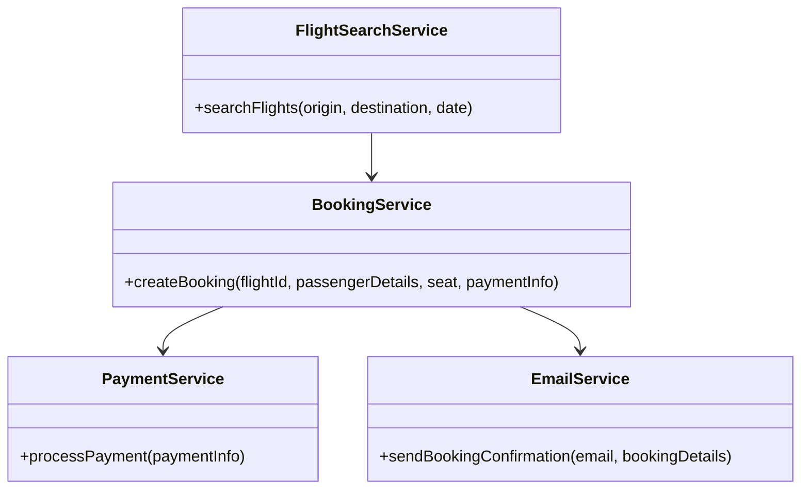
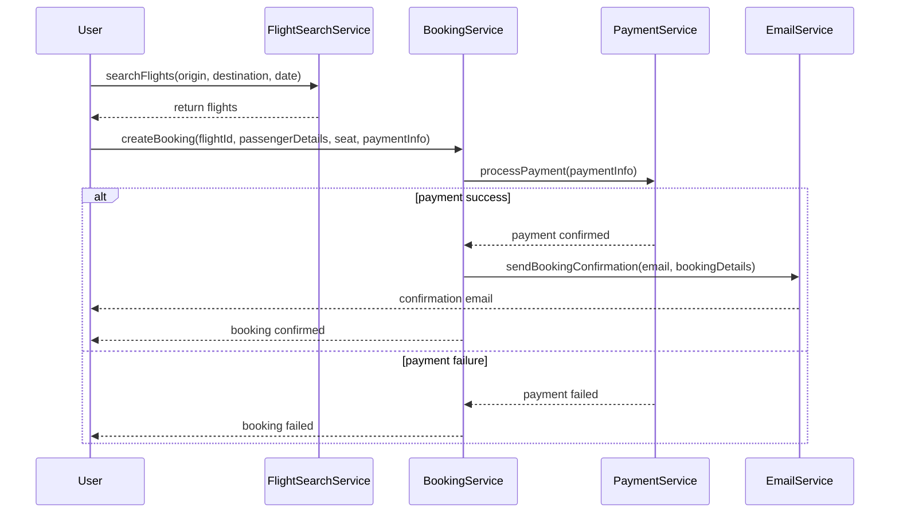

# For User Story Number [1]

1. Objective
The objective is to enable passengers to search for flights, select options, and book air transport tickets online. The system will provide real-time flight availability and pricing, allow secure entry of passenger details, seat selection, and payment. Booking confirmation will be delivered instantly via email and on-screen.

2. API Model
  2.1 Common Components/Services
    - Flight Search Service (Existing)
    - Payment Gateway Integration (Existing)
    - Email Notification Service (Existing)
    - Booking Management Service (New)

  2.2 API Details
| Operation        | REST Method | Type    | URL                        | Request (Sample JSON)                                 | Response (Sample JSON)                                 |
|------------------|-------------|---------|----------------------------|-------------------------------------------------------|--------------------------------------------------------|
| Search Flights   | GET         | Success | /api/flights/search        | {"origin":"JFK","destination":"LAX","date":"2025-10-01"} | [{"flightId":1,"price":350,"availableSeats":5}, ...] |
| Book Ticket      | POST        | Success | /api/bookings              | {"flightId":1,"passengerDetails":{...},"seat":"12A","paymentInfo":{...}} | {"bookingId":123,"status":"CONFIRMED","emailSent":true} |
| Payment Failure  | POST        | Failure | /api/bookings              | {"flightId":1,"passengerDetails":{...},"seat":"12A","paymentInfo":{...}} | {"error":"Payment failed","status":"FAILED"}           |

  2.3 Exceptions
| API             | Exception Type       | Description                                 |
|-----------------|---------------------|---------------------------------------------|
| Search Flights  | FlightNotFound      | No flights available for criteria           |
| Book Ticket     | ValidationException | Missing/invalid passenger or payment details|
| Book Ticket     | PaymentException    | Payment declined or failed                  |
| Book Ticket     | SeatUnavailable     | Selected seat no longer available           |

3 Functional Design
  3.1 Class Diagram


  3.2 UML Sequence Diagram


  3.3 Components
| Component Name         | Description                                         | Existing/New |
|-----------------------|-----------------------------------------------------|--------------|
| FlightSearchService   | Handles flight search and availability               | Existing     |
| BookingService        | Manages booking creation and seat reservation        | New          |
| PaymentService        | Integrates with payment gateway for processing       | Existing     |
| EmailService          | Sends booking confirmation emails                    | Existing     |

  3.4 Service Layer Logic and Validations
| FieldName         | Validation                              | Error Message                  | ClassUsed           |
|-------------------|-----------------------------------------|-------------------------------|---------------------|
| passengerDetails  | Mandatory fields not empty               | Missing passenger details      | BookingService      |
| paymentInfo       | Valid payment details                    | Invalid payment information    | PaymentService      |
| flightId/seat     | Flight and seat available                | Flight/seat unavailable        | BookingService      |

4 Integrations
| SystemToBeIntegrated | IntegratedFor           | IntegrationType |
|----------------------|------------------------|-----------------|
| Airline API          | Flight data/availability| API             |
| Payment Gateway      | Payment processing      | API             |
| Email Service        | Booking confirmation    | API             |

5 DB Details
  5.1 ER Model
```mermaid
erDiagram
    BOOKINGS ||--o{ PASSENGERS : contains
    BOOKINGS ||--o{ PAYMENTS : has
    BOOKINGS ||--o{ FLIGHTS : reserves
    FLIGHTS ||--o{ SEATS : includes
    PASSENGERS {
      id PK
      name
      email
      phone
      documentType
      documentNumber
    }
    BOOKINGS {
      id PK
      flightId FK
      passengerId FK
      seat
      status
      createdAt
    }
    PAYMENTS {
      id PK
      bookingId FK
      amount
      status
      paymentMethod
      transactionId
      createdAt
    }
    FLIGHTS {
      id PK
      origin
      destination
      departureTime
      arrivalTime
      price
      airline
    }
    SEATS {
      id PK
      flightId FK
      seatNumber
      isAvailable
    }
```

  5.2 DB Validations
- Ensure booking references are unique.
- Foreign key constraints for flightId, passengerId, bookingId.
- Payment status must be CONFIRMED before booking status is CONFIRMED.

6 Non-Functional Requirements
  6.1 Performance
    - Must handle 500 concurrent users.
    - Search queries respond within 2 seconds.
    - Caching for flight search results at API layer.
  6.2 Security
    6.2.1 Authentication
      - Secure HTTPS endpoints.
      - OAuth2/JWT for user authentication.
    6.2.2 Authorization
      - Role-based access for booking management.
  6.3 Logging
    6.3.1 Application Logging
      - DEBUG: API requests/responses (without sensitive data)
      - INFO: Successful bookings, payments
      - ERROR: Failed payments, booking errors
      - WARN: Flight availability issues
    6.3.2 Audit Log
      - Audit log for all booking and payment events with timestamp, userId, action

7 Dependencies
- Airline APIs for flight data
- Payment gateway (Stripe)
- Email service (SendGrid)

8 Assumptions
- All airline APIs provide real-time data
- Payment gateway is PCI DSS compliant
- Email service is reliable and supports bulk notifications
