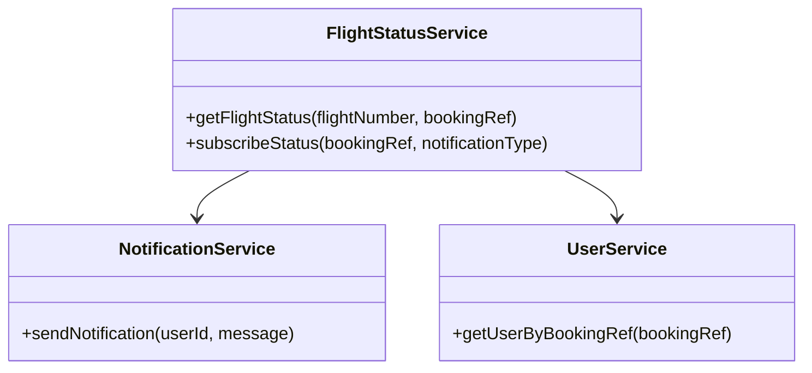
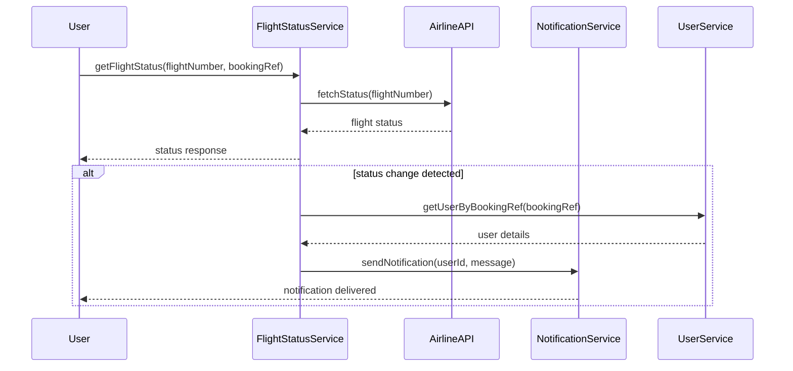

# For User Story Number [2]

1. Objective
Enable passengers to track the real-time status of their booked flights, including updates on delays, gate changes, and cancellations. Provide instant notifications for any changes affecting the passenger's itinerary. Ensure the system delivers accurate, timely, and secure information.

2. API Model
  2.1 Common Components/Services
    - Flight Status Service (New)
    - Notification Service (Existing)
    - User Management Service (Existing)

  2.2 API Details
| Operation         | REST Method | Type    | URL                              | Request (Sample JSON)                        | Response (Sample JSON)                                 |
|-------------------|-------------|---------|----------------------------------|------------------------------------------------|--------------------------------------------------------|
| Get Flight Status | GET         | Success | /api/flights/status              | {"flightNumber":"AA123","bookingRef":"XYZ789"} | {"flightNumber":"AA123","status":"DELAYED","gate":"B12","departureTime":"14:30"} |
| Subscribe Status  | POST        | Success | /api/flights/subscribeStatus     | {"bookingRef":"XYZ789","notificationType":"EMAIL"} | {"subscriptionId":456,"status":"SUBSCRIBED"}          |
| Notification      | POST        | Failure | /api/notifications/send          | {"userId":123,"message":"Flight delayed"}         | {"error":"Notification failed","status":"FAILED"}    |

  2.3 Exceptions
| API                | Exception Type       | Description                                 |
|--------------------|---------------------|---------------------------------------------|
| Get Flight Status  | FlightNotFound      | Flight number or booking reference invalid  |
| Get Flight Status  | APIException        | Airline API unavailable                     |
| Subscribe Status   | ValidationException | Invalid notification type or booking ref    |
| Notification       | NotificationException| Failed to deliver notification              |

3 Functional Design
  3.1 Class Diagram


  3.2 UML Sequence Diagram


  3.3 Components
| Component Name         | Description                                         | Existing/New |
|-----------------------|-----------------------------------------------------|--------------|
| FlightStatusService   | Handles flight status retrieval and subscription     | New          |
| NotificationService   | Sends notifications via email/SMS/app                | Existing     |
| UserService           | Manages user data and booking references             | Existing     |
| AirlineAPI            | External API for flight status                       | Existing     |

  3.4 Service Layer Logic and Validations
| FieldName         | Validation                              | Error Message                  | ClassUsed           |
|-------------------|-----------------------------------------|-------------------------------|---------------------|
| flightNumber      | Must match existing flight               | Invalid flight number          | FlightStatusService |
| bookingRef        | Must match user booking                  | Invalid booking reference      | UserService         |
| notificationType  | Must be EMAIL/SMS/PUSH                   | Invalid notification type      | NotificationService |

4 Integrations
| SystemToBeIntegrated | IntegratedFor           | IntegrationType |
|----------------------|------------------------|-----------------|
| Airline Status API   | Real-time flight status | API             |
| Notification Service | Email/SMS/Push alerts  | API             |

5 DB Details
  5.1 ER Model
```mermaid
erDiagram
    USERS ||--o{ BOOKINGS : has
    BOOKINGS ||--o{ FLIGHTS : contains
    BOOKINGS ||--o{ STATUS_SUBSCRIPTIONS : subscribes
    FLIGHTS {
      id PK
      flightNumber
      origin
      destination
      departureTime
      arrivalTime
      airline
    }
    BOOKINGS {
      id PK
      userId FK
      flightId FK
      bookingRef
      createdAt
    }
    STATUS_SUBSCRIPTIONS {
      id PK
      bookingId FK
      notificationType
      subscriptionTime
    }
    USERS {
      id PK
      name
      email
      phone
    }
```

  5.2 DB Validations
- Booking reference must be unique per user.
- Foreign key constraints for userId, flightId, bookingId.
- Notification type must be valid (EMAIL/SMS/PUSH).

6 Non-Functional Requirements
  6.1 Performance
    - Status updates reflected within 1 minute.
    - Notifications delivered within 30 seconds.
    - Caching for frequent flight status queries.
  6.2 Security
    6.2.1 Authentication
      - Secure HTTPS endpoints.
      - OAuth2/JWT for user authentication.
    6.2.2 Authorization
      - Only users with valid booking references can subscribe/view status.
  6.3 Logging
    6.3.1 Application Logging
      - DEBUG: API requests/responses (excluding sensitive data)
      - INFO: Status changes, notification deliveries
      - ERROR: API failures, notification errors
      - WARN: Delayed status updates
    6.3.2 Audit Log
      - Audit log for all status changes and notifications with timestamp, userId, flightNumber

7 Dependencies
- Airline status APIs
- Notification service (Twilio, SendGrid)

8 Assumptions
- Airline APIs provide real-time status
- Notification service is reliable and supports bulk delivery
- Booking references are unique and securely mapped to users
