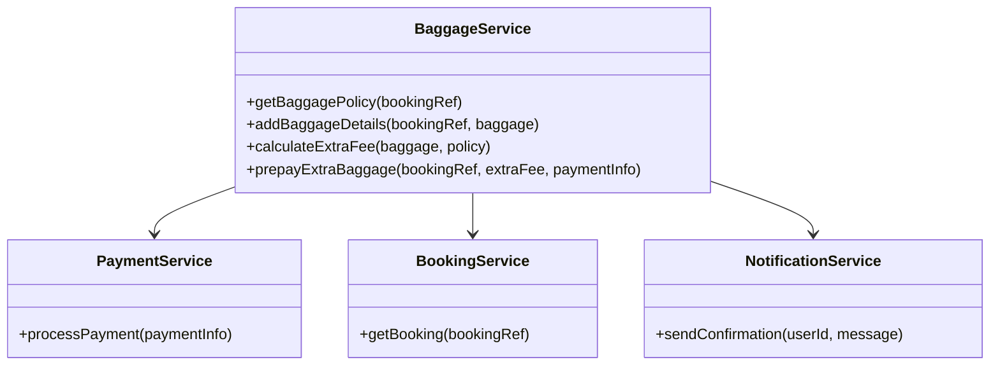
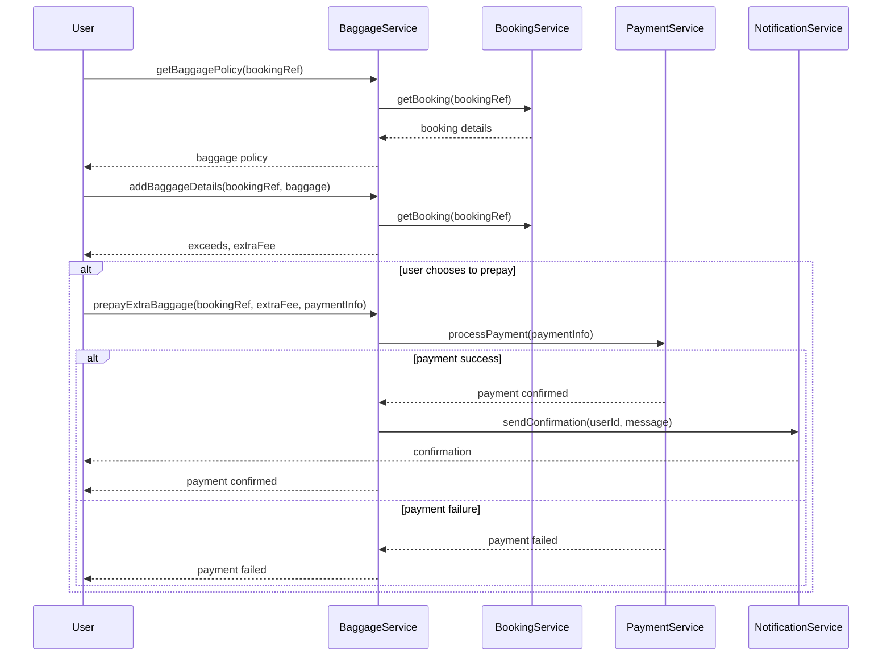

# For User Story Number [3]

1. Objective
Enable passengers to manage their baggage information online, view baggage allowance, add baggage details, and prepay for excess baggage if needed. Provide real-time fee calculation and clear guidelines to ensure compliance with airline policies. Ensure secure linkage of baggage details to bookings and instant confirmation of payments.

2. API Model
  2.1 Common Components/Services
    - Baggage Management Service (New)
    - Payment Gateway Integration (Existing)
    - Booking Management Service (Existing)
    - Notification Service (Existing)

  2.2 API Details
| Operation           | REST Method | Type    | URL                                 | Request (Sample JSON)                                      | Response (Sample JSON)                                   |
|---------------------|-------------|---------|-------------------------------------|------------------------------------------------------------|----------------------------------------------------------|
| Get Baggage Policy  | GET         | Success | /api/baggage/policy                 | {"bookingRef":"XYZ789"}                                   | {"allowance":20,"unit":"kg","extraFeePerKg":25}        |
| Add Baggage Details | POST        | Success | /api/baggage/add                    | {"bookingRef":"XYZ789","baggage":[{"weight":25,"dimensions":"60x40x30"}]} | {"exceeds":true,"extraFee":125}                          |
| Prepay Extra Baggage| POST        | Success | /api/baggage/prepay                 | {"bookingRef":"XYZ789","extraFee":125,"paymentInfo":{...}} | {"paymentStatus":"CONFIRMED","confirmationId":789}      |
| Payment Failure     | POST        | Failure | /api/baggage/prepay                 | {"bookingRef":"XYZ789","extraFee":125,"paymentInfo":{...}} | {"error":"Payment failed","status":"FAILED"}           |

  2.3 Exceptions
| API                  | Exception Type       | Description                                 |
|----------------------|---------------------|---------------------------------------------|
| Get Baggage Policy   | PolicyNotFound      | No baggage policy for booking               |
| Add Baggage Details  | ValidationException | Invalid baggage details                     |
| Add Baggage Details  | PolicyViolation     | Baggage exceeds airline limits              |
| Prepay Extra Baggage | PaymentException    | Payment declined or failed                  |

3 Functional Design
  3.1 Class Diagram


  3.2 UML Sequence Diagram


  3.3 Components
| Component Name         | Description                                         | Existing/New |
|-----------------------|-----------------------------------------------------|--------------|
| BaggageService        | Manages baggage policy, details, fee calculation    | New          |
| PaymentService        | Integrates with payment gateway for processing       | Existing     |
| BookingService        | Manages bookings and links to baggage                | Existing     |
| NotificationService   | Sends payment and baggage confirmations              | Existing     |

  3.4 Service Layer Logic and Validations
| FieldName         | Validation                              | Error Message                  | ClassUsed           |
|-------------------|-----------------------------------------|-------------------------------|---------------------|
| baggage.weight    | Must not exceed airline policy           | Baggage exceeds allowed weight | BaggageService      |
| baggage.dimensions| Must not exceed airline policy           | Baggage exceeds allowed size   | BaggageService      |
| paymentInfo       | Valid payment details                    | Invalid payment information    | PaymentService      |
| bookingRef        | Must match existing booking              | Invalid booking reference      | BookingService      |

4 Integrations
| SystemToBeIntegrated | IntegratedFor           | IntegrationType |
|----------------------|------------------------|-----------------|
| Airline Baggage API  | Baggage policy/rules   | API             |
| Payment Gateway      | Payment processing      | API             |
| Notification Service | Confirmation messages   | API             |

5 DB Details
  5.1 ER Model
```mermaid
erDiagram
    BOOKINGS ||--o{ BAGGAGE : has
    BAGGAGE ||--o{ PAYMENTS : prepay
    BOOKINGS {
      id PK
      bookingRef
      userId FK
      flightId FK
      createdAt
    }
    BAGGAGE {
      id PK
      bookingId FK
      weight
      dimensions
      exceedsPolicy
      extraFee
      createdAt
    }
    PAYMENTS {
      id PK
      baggageId FK
      amount
      status
      paymentMethod
      transactionId
      createdAt
    }
```

  5.2 DB Validations
- Baggage must be linked to a valid booking.
- Baggage weight/dimensions must comply with airline policy.
- Payment status must be CONFIRMED before extra baggage is accepted.

6 Non-Functional Requirements
  6.1 Performance
    - Fee calculation must be instant (<1s).
    - System must support 99.9% uptime.
    - Caching for baggage policy data.
  6.2 Security
    6.2.1 Authentication
      - Secure HTTPS endpoints.
      - OAuth2/JWT for user authentication.
    6.2.2 Authorization
      - Only users with valid bookings can manage baggage.
  6.3 Logging
    6.3.1 Application Logging
      - DEBUG: API requests/responses (excluding sensitive data)
      - INFO: Baggage additions, payments
      - ERROR: Payment failures, policy violations
      - WARN: Excess baggage attempts
    6.3.2 Audit Log
      - Audit log for all baggage and payment transactions with timestamp, userId, bookingRef

7 Dependencies
- Airline baggage APIs
- Payment gateway
- Notification service

8 Assumptions
- Airline APIs provide accurate baggage policy data
- Payment gateway is PCI DSS compliant
- Notification service is reliable
