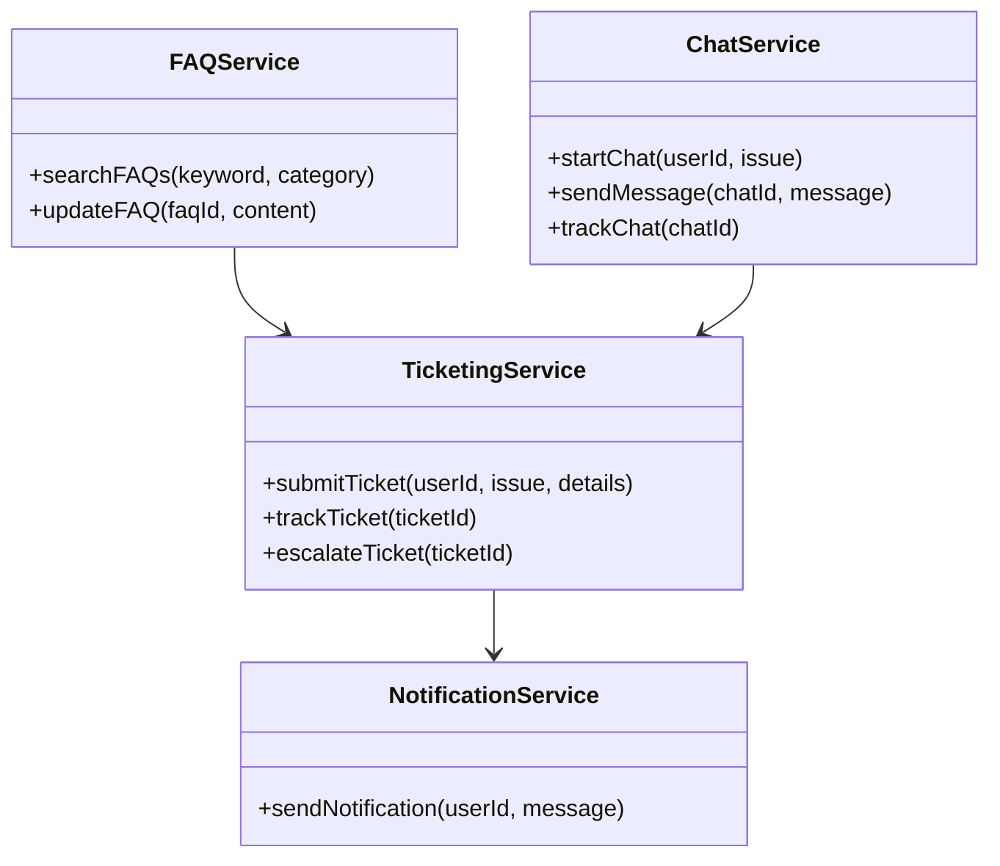
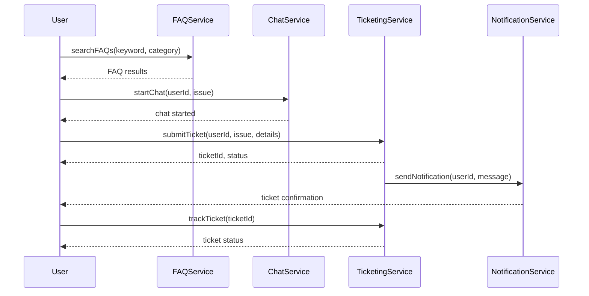

# For User Story Number [4]

1. Objective
Provide passengers with online access to customer support and FAQs, enabling them to resolve issues or obtain information without waiting in line. Offer search and browse capabilities for FAQs, live chat with support agents, and a support ticketing system with real-time tracking. Ensure automated responses for common queries and efficient escalation for unresolved tickets.

2. API Model
  2.1 Common Components/Services
    - FAQ Management Service (New)
    - Chat Service (New)
    - Ticketing Service (New)
    - User Management Service (Existing)
    - Notification Service (Existing)

  2.2 API Details
| Operation           | REST Method | Type    | URL                                 | Request (Sample JSON)                                      | Response (Sample JSON)                                   |
|---------------------|-------------|---------|-------------------------------------|------------------------------------------------------------|----------------------------------------------------------|
| Search FAQs         | GET         | Success | /api/faqs/search                    | {"keyword":"baggage","category":"general"}               | [{"faqId":1,"question":"What is baggage allowance?","answer":"..."}, ...] |
| Initiate Chat       | POST        | Success | /api/support/chat/start              | {"userId":123,"issue":"Lost baggage"}                    | {"chatId":456,"agentId":789,"status":"ACTIVE"}         |
| Submit Ticket       | POST        | Success | /api/support/ticket                  | {"userId":123,"issue":"Flight delayed","details":"..."} | {"ticketId":321,"status":"OPEN"}                        |
| Track Ticket        | GET         | Success | /api/support/ticket/status           | {"ticketId":321}                                           | {"ticketId":321,"status":"IN_PROGRESS","lastUpdate":"..."} |
| Automated Response  | POST        | Success | /api/support/auto-response           | {"query":"How to change seat?"}                            | {"response":"You can change your seat via ..."}           |

  2.3 Exceptions
| API                  | Exception Type       | Description                                 |
|----------------------|---------------------|---------------------------------------------|
| Search FAQs          | FAQNotFound         | No FAQ matches search criteria              |
| Initiate Chat        | AgentUnavailable    | No support agent available                  |
| Submit Ticket        | ValidationException | Missing required ticket information         |
| Track Ticket         | TicketNotFound      | Invalid ticket ID                           |
| Automated Response   | QueryNotMatched     | No automated response available             |

3 Functional Design
  3.1 Class Diagram


  3.2 UML Sequence Diagram


  3.3 Components
| Component Name         | Description                                         | Existing/New |
|-----------------------|-----------------------------------------------------|--------------|
| FAQService            | Manages FAQ content and search                      | New          |
| ChatService           | Handles live chat sessions with support agents       | New          |
| TicketingService      | Manages support tickets and escalation               | New          |
| NotificationService   | Sends notifications for ticket/chat events           | Existing     |
| UserService           | Manages user data                                   | Existing     |

  3.4 Service Layer Logic and Validations
| FieldName         | Validation                              | Error Message                  | ClassUsed           |
|-------------------|-----------------------------------------|-------------------------------|---------------------|
| ticket.issue      | Must not be empty                        | Issue description required     | TicketingService    |
| ticket.details    | Must not be empty                        | Ticket details required        | TicketingService    |
| chat.agentId      | Must be available                        | No agent available             | ChatService         |
| faq.content       | Must be up-to-date and relevant          | FAQ content outdated           | FAQService          |

4 Integrations
| SystemToBeIntegrated | IntegratedFor           | IntegrationType |
|----------------------|------------------------|-----------------|
| Chat/Ticketing System| Live chat, support tickets| API           |
| Notification Service | Ticket/chat notifications| API           |

5 DB Details
  5.1 ER Model
```mermaid
erDiagram
    USERS ||--o{ TICKETS : submits
    USERS ||--o{ CHATS : initiates
    TICKETS ||--o{ FAQS : references
    CHATS {
      id PK
      userId FK
      agentId FK
      startedAt
      status
    }
    TICKETS {
      id PK
      userId FK
      issue
      details
      status
      createdAt
      lastUpdated
    }
    FAQS {
      id PK
      question
      answer
      category
      updatedAt
    }
    USERS {
      id PK
      name
      email
      phone
    }
```

  5.2 DB Validations
- Ticket must be linked to a valid user.
- Chat must be linked to a valid user and agent.
- FAQ content must be updated regularly.

6 Non-Functional Requirements
  6.1 Performance
    - Chat response time under 1 minute.
    - Ticket acknowledgment within 2 minutes.
    - System must support 99.9% uptime.
    - Caching for FAQ search results.
  6.2 Security
    6.2.1 Authentication
      - Secure HTTPS endpoints.
      - OAuth2/JWT for user authentication.
    6.2.2 Authorization
      - Only authenticated users can submit tickets or start chat.
  6.3 Logging
    6.3.1 Application Logging
      - DEBUG: API requests/responses (excluding sensitive data)
      - INFO: Ticket submissions, chat sessions
      - ERROR: Ticket/chat failures
      - WARN: FAQ content issues
    6.3.2 Audit Log
      - Audit log for all ticket, chat, and FAQ events with timestamp, userId

7 Dependencies
- Third-party chat/ticketing systems (Zendesk)
- Notification service

8 Assumptions
- FAQ content is regularly updated
- Chat/ticketing system is reliable and supports real-time events
- Notification service is available for instant delivery
