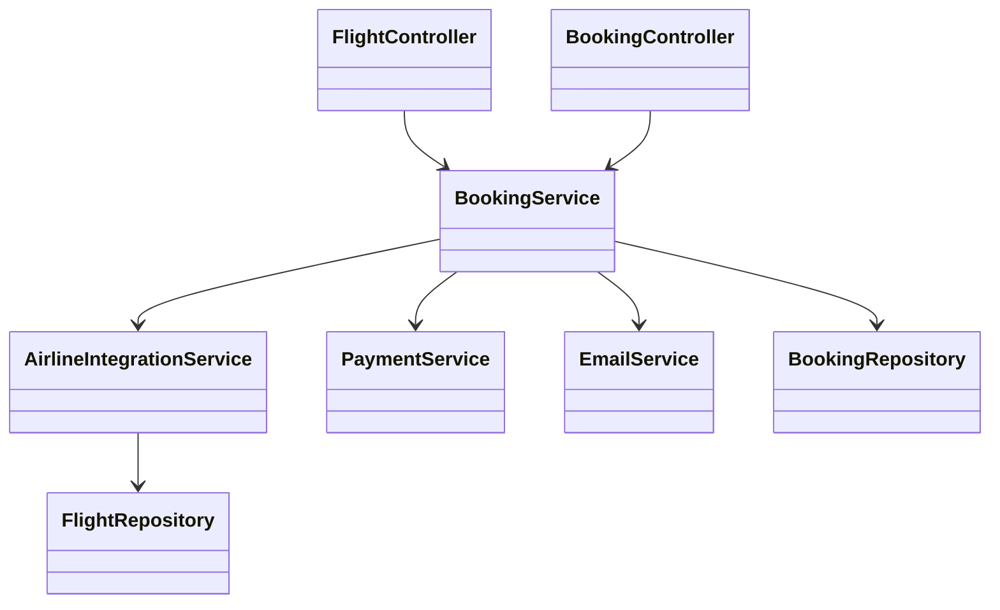
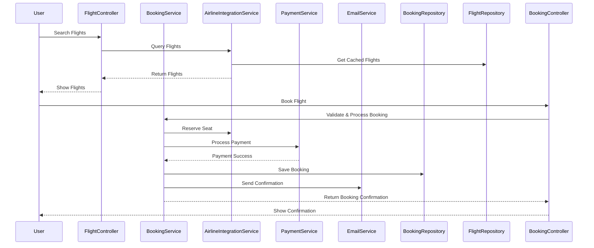

# For User Story Number [1]

1. Objective
This requirement enables travelers to book air transport tickets online, allowing them to search, select, and purchase flights conveniently from anywhere. The system provides real-time flight availability, pricing, and booking confirmation. It supports filtering by date, destination, price, and airline for an optimal user experience.

2. API Model
  2.1 Common Components/Services
  - AuthenticationService (existing)
  - PaymentService (new)
  - EmailService (existing)
  - AirlineIntegrationService (new)
  - BookingService (new)

  2.2 API Details
| Operation | REST Method | Type | URL | Request | Response |
|-----------|-------------|------|-----|---------|----------|
| Search Flights | GET | Success/Failure | /api/flights/search | {"origin": "JFK", "destination": "LAX", "date": "2024-07-01"} | {"flights": [{"flightId": "AA100", "airline": "AA", "price": 350, "seatsAvailable": 5, ...}]} |
| Book Flight | POST | Success/Failure | /api/flights/book | {"flightId": "AA100", "passengerDetails": {...}, "paymentInfo": {...}} | {"bookingId": "BK1234", "status": "CONFIRMED", "confirmationEmailSent": true} |
| Get Booking | GET | Success/Failure | /api/bookings/{bookingId} | N/A | {"bookingId": "BK1234", "status": "CONFIRMED", ...} |

  2.3 Exceptions
  - FlightNotFoundException
  - InvalidAirportException
  - PastDateException
  - PaymentFailedException
  - SeatUnavailableException
  - BookingNotFoundException

3 Functional Design
  3.1 Class Diagram


  3.2 UML Sequence Diagram


  3.3 Components
| Component Name | Description | Existing/New |
|----------------|-------------|--------------|
| FlightController | Handles flight search requests | New |
| BookingController | Handles booking requests | New |
| BookingService | Business logic for booking | New |
| AirlineIntegrationService | Integrates with airline APIs | New |
| PaymentService | Handles payment processing | New |
| EmailService | Sends confirmation emails | Existing |
| BookingRepository | Persists booking data | New |
| FlightRepository | Caches flight data | New |

  3.4 Service Layer Logic and Validations
| FieldName | Validation | Error Message | ClassUsed |
|-----------|-----------|--------------|-----------|
| origin/destination | Must not be empty, must be valid airport | Invalid airport | BookingService |
| date | Must not be in the past | Invalid travel date | BookingService |
| paymentInfo | Valid and authorized | Payment failed | PaymentService |
| seatAvailability | Must have available seat | No seats available | AirlineIntegrationService |

4 Integrations
| SystemToBeIntegrated | IntegratedFor | IntegrationType |
|---------------------|---------------|-----------------|
| Airline APIs | Real-time flight data, seat reservation | API |
| Payment Gateway | Payment processing | API |
| Email Service | Booking confirmation | API |

5 DB Details
  5.1 ER Model
```mermaid
erDiagram
    USER ||--o{ BOOKING : makes
    BOOKING }o--|| FLIGHT : books
    BOOKING }o--|| PAYMENT : includes
    FLIGHT ||--o{ SEAT : has
    USER {
      user_id PK
      name
      email
      password_hash
    }
    BOOKING {
      booking_id PK
      user_id FK
      flight_id FK
      status
      booking_date
    }
    FLIGHT {
      flight_id PK
      airline
      origin
      destination
      departure_time
      arrival_time
      price
    }
    PAYMENT {
      payment_id PK
      booking_id FK
      amount
      payment_status
      payment_date
    }
    SEAT {
      seat_id PK
      flight_id FK
      seat_number
      is_available
    }
```

  5.2 DB Validations
  - Unique constraint on booking_id
  - Foreign key constraints for user_id, flight_id, payment_id
  - Not null constraints on required fields

6 Non-Functional Requirements
  6.1 Performance
    - API response within 5 seconds for booking confirmation
    - Caching of flight data at API layer for faster search
  6.2 Security
    6.2.1 Authentication
      - User authentication required for booking (JWT/session-based)
      - PCI DSS compliance for payments
    6.2.2 Authorization
      - Only authenticated users can book flights
      - Role-based access for admin operations
  6.3 Logging
    6.3.1 Application Logging
      - DEBUG: API requests/responses (excluding sensitive data)
      - INFO: Successful bookings, payments
      - ERROR: Failed bookings, payment errors
      - WARN: API latency issues
    6.3.2 Audit Log
      - Log booking creation, payment, and confirmation events with user and timestamp

7 Dependencies
  - Airline APIs for real-time flight and seat info
  - Payment gateway for transaction processing
  - Email service for confirmation

8 Assumptions
  - All airlines provide real-time API access
  - Payment gateway supports PCI DSS
  - Email delivery is reliable
