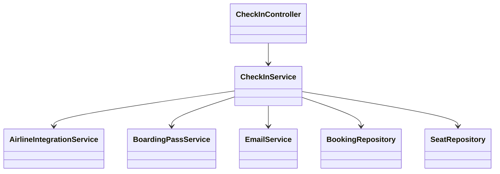
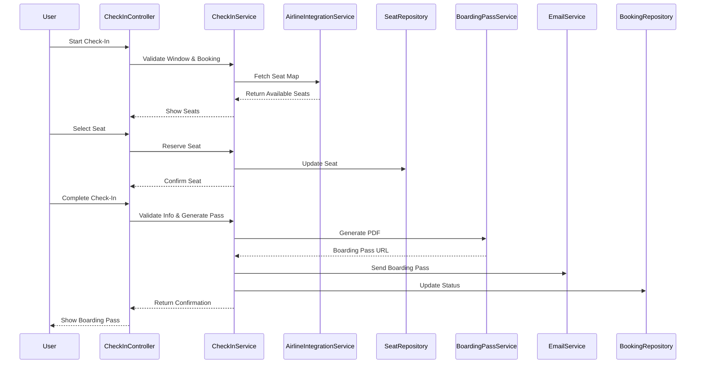

# For User Story Number [2]

1. Objective
This requirement enables passengers to check in for their flights online, allowing them to select or change seats, enter travel information, and receive a digital boarding pass. The system ensures check-in is only available within the allowed time window before departure. It provides a seamless and efficient check-in experience, reducing airport wait times.

2. API Model
  2.1 Common Components/Services
  - AuthenticationService (existing)
  - CheckInService (new)
  - AirlineIntegrationService (existing)
  - BoardingPassService (new)
  - EmailService (existing)

  2.2 API Details
| Operation | REST Method | Type | URL | Request | Response |
|-----------|-------------|------|-----|---------|----------|
| Start Check-In | POST | Success/Failure | /api/checkin/start | {"bookingReference": "BK1234", "passengerId": "PAX001"} | {"status": "IN_PROGRESS", "availableSeats": ["12A", "12B", ...]} |
| Select Seat | POST | Success/Failure | /api/checkin/seat | {"bookingReference": "BK1234", "seatNumber": "12A"} | {"status": "SEAT_CONFIRMED", "seatNumber": "12A"} |
| Complete Check-In | POST | Success/Failure | /api/checkin/complete | {"bookingReference": "BK1234", "passengerInfo": {...}} | {"boardingPassUrl": ".../boardingpass/BK1234.pdf", "status": "CHECKED_IN"} |
| Download Boarding Pass | GET | Success/Failure | /api/checkin/boardingpass/{bookingReference} | N/A | PDF file |

  2.3 Exceptions
  - CheckInWindowException
  - InvalidBookingReferenceException
  - SeatUnavailableException
  - IncompletePassengerInfoException
  - BoardingPassGenerationException

3 Functional Design
  3.1 Class Diagram


  3.2 UML Sequence Diagram


  3.3 Components
| Component Name | Description | Existing/New |
|----------------|-------------|--------------|
| CheckInController | Handles check-in requests | New |
| CheckInService | Business logic for check-in | New |
| AirlineIntegrationService | Fetches seat map, updates status | Existing |
| BoardingPassService | Generates digital boarding pass | New |
| EmailService | Sends boarding pass | Existing |
| BookingRepository | Accesses booking data | Existing |
| SeatRepository | Manages seat assignments | New |

  3.4 Service Layer Logic and Validations
| FieldName | Validation | Error Message | ClassUsed |
|-----------|-----------|--------------|-----------|
| bookingReference | Must be valid and exist | Invalid booking reference | CheckInService |
| checkInWindow | Must be within allowed window | Check-in not allowed | CheckInService |
| seatNumber | Must be available | Seat unavailable | AirlineIntegrationService |
| passengerInfo | Must be complete and valid | Incomplete passenger info | CheckInService |

4 Integrations
| SystemToBeIntegrated | IntegratedFor | IntegrationType |
|---------------------|---------------|-----------------|
| Airline APIs | Seat map, check-in status | API |
| Email Service | Boarding pass delivery | API |

5 DB Details
  5.1 ER Model
```mermaid
erDiagram
    BOOKING ||--o{ CHECKIN : has
    CHECKIN }o--|| SEAT : reserves
    CHECKIN {
      checkin_id PK
      booking_id FK
      passenger_id
      checkin_time
      status
      seat_id FK
    }
    SEAT {
      seat_id PK
      flight_id FK
      seat_number
      is_available
    }
    BOOKING {
      booking_id PK
      user_id FK
      flight_id FK
      status
    }
```

  5.2 DB Validations
  - Unique constraint on checkin_id
  - Foreign key constraints for booking_id, seat_id
  - Not null constraints on required fields

6 Non-Functional Requirements
  6.1 Performance
    - Check-in process must complete within 3 seconds
    - Real-time seat map updates
  6.2 Security
    6.2.1 Authentication
      - User authentication required for check-in (JWT/session-based)
    6.2.2 Authorization
      - Only passengers with valid bookings can check in
  6.3 Logging
    6.3.1 Application Logging
      - DEBUG: API requests/responses (excluding sensitive data)
      - INFO: Successful check-ins, seat selections
      - ERROR: Failed check-ins, seat assignment errors
      - WARN: API latency issues
    6.3.2 Audit Log
      - Log check-in, seat selection, and boarding pass generation events with user and timestamp

7 Dependencies
  - Airline APIs for seat map and check-in status
  - Email service for boarding pass delivery

8 Assumptions
  - Airline APIs provide real-time seat map
  - Boarding pass PDF is accepted at all airports
  - Email delivery is reliable
