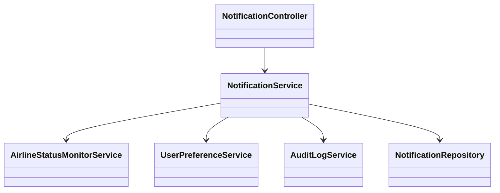
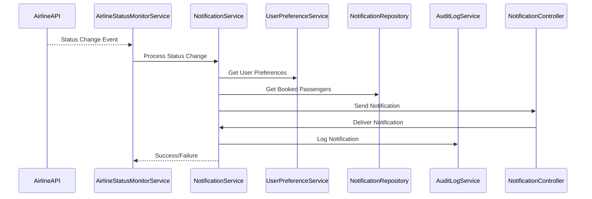

# For User Story Number [3]

1. Objective
This requirement enables passengers to receive real-time notifications about their flight status, such as delays, gate changes, or cancellations. The system integrates with airline data sources to provide timely and accurate updates. Notifications are delivered via email, SMS, or in-app alerts according to user preferences.

2. API Model
  2.1 Common Components/Services
  - NotificationService (new)
  - AirlineStatusMonitorService (new)
  - UserPreferenceService (existing)
  - AuditLogService (new)

  2.2 API Details
| Operation | REST Method | Type | URL | Request | Response |
|-----------|-------------|------|-----|---------|----------|
| Update Notification Preference | POST | Success/Failure | /api/notifications/preferences | {"userId": "U123", "channels": ["email", "sms"]} | {"status": "UPDATED"} |
| Get Notification Preference | GET | Success/Failure | /api/notifications/preferences/{userId} | N/A | {"userId": "U123", "channels": ["email", "sms"]} |
| Send Notification (internal) | POST | Success/Failure | /api/notifications/send | {"userId": "U123", "flightId": "F100", "type": "DELAY", "message": "Flight delayed by 30 mins"} | {"status": "SENT"} |

  2.3 Exceptions
  - NotificationPreferenceNotFoundException
  - NotificationDeliveryException
  - InvalidUserException
  - InvalidFlightException

3 Functional Design
  3.1 Class Diagram


  3.2 UML Sequence Diagram


  3.3 Components
| Component Name | Description | Existing/New |
|----------------|-------------|--------------|
| NotificationController | Handles notification API requests | New |
| NotificationService | Business logic for notifications | New |
| AirlineStatusMonitorService | Monitors airline status feeds | New |
| UserPreferenceService | Manages user notification preferences | Existing |
| AuditLogService | Logs notification events | New |
| NotificationRepository | Stores notification data | New |

  3.4 Service Layer Logic and Validations
| FieldName | Validation | Error Message | ClassUsed |
|-----------|-----------|--------------|-----------|
| userId | Must be valid and have a booking | Invalid user or no booking | NotificationService |
| flightId | Must be valid | Invalid flight | NotificationService |
| notificationContent | Must be accurate and relevant | Invalid notification content | NotificationService |
| preferences | Must respect opt-in/opt-out | Notification preference not set | UserPreferenceService |

4 Integrations
| SystemToBeIntegrated | IntegratedFor | IntegrationType |
|---------------------|---------------|-----------------|
| Airline APIs | Real-time flight status | API |
| Azure Notification Hubs | Email/SMS/in-app notifications | API |

5 DB Details
  5.1 ER Model
```mermaid
erDiagram
    USER ||--o{ BOOKING : has
    BOOKING ||--o{ NOTIFICATION : receives
    NOTIFICATION {
      notification_id PK
      booking_id FK
      user_id FK
      flight_id
      type
      message
      sent_at
      channel
    }
    USER {
      user_id PK
      name
      email
      phone
      notification_preferences
    }
    BOOKING {
      booking_id PK
      user_id FK
      flight_id FK
    }
```

  5.2 DB Validations
  - Unique constraint on notification_id
  - Foreign key constraints for booking_id, user_id
  - Not null constraints on required fields

6 Non-Functional Requirements
  6.1 Performance
    - Notification delivery within 1 minute of event
    - Support for 10,000+ concurrent notifications
  6.2 Security
    6.2.1 Authentication
      - Secure notification channels
    6.2.2 Authorization
      - Only valid booked passengers receive notifications
  6.3 Logging
    6.3.1 Application Logging
      - DEBUG: Notification triggers and responses
      - INFO: Successful notification deliveries
      - ERROR: Failed notifications
      - WARN: Delayed notifications
    6.3.2 Audit Log
      - Log all notifications sent, with event, user, and timestamp

7 Dependencies
  - Airline APIs for real-time status
  - Azure Notification Hubs for delivery

8 Assumptions
  - Airline APIs provide timely status updates
  - Users have valid email/SMS/in-app access
  - Notification channels are reliable
