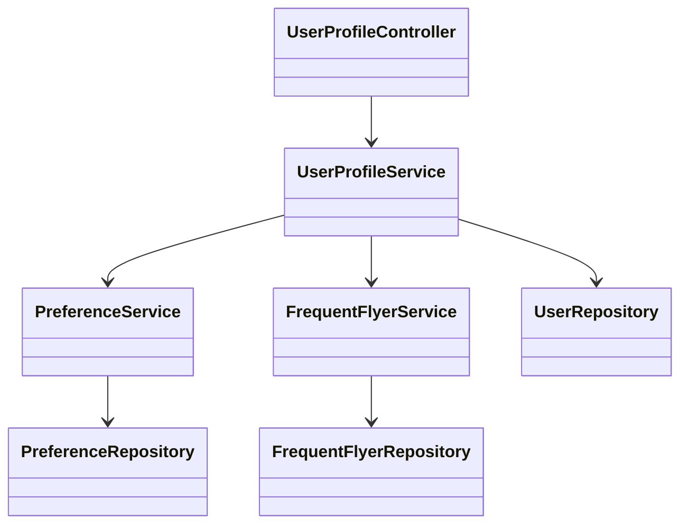
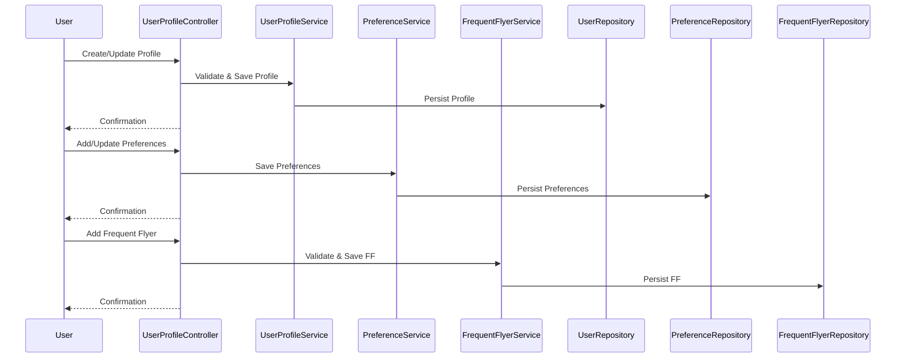

# For User Story Number [4]

1. Objective
This requirement enables frequent flyers to manage their user profile and travel preferences, including personal details, meal and seat preferences, and frequent flyer numbers. The system uses this information to pre-fill booking forms and provide personalized offers or notifications. It streamlines the booking process and enhances user experience through personalization.

2. API Model
  2.1 Common Components/Services
  - AuthenticationService (existing)
  - UserProfileService (new)
  - PreferenceService (new)
  - FrequentFlyerService (new)

  2.2 API Details
| Operation | REST Method | Type | URL | Request | Response |
|-----------|-------------|------|-----|---------|----------|
| Create Profile | POST | Success/Failure | /api/profile | {"name": "John Doe", "email": "john@example.com", ...} | {"userId": "U123", "status": "CREATED"} |
| Get Profile | GET | Success/Failure | /api/profile/{userId} | N/A | {"userId": "U123", "name": "John Doe", ...} |
| Update Profile | PUT | Success/Failure | /api/profile/{userId} | {"name": "John Doe", "email": "john@example.com", ...} | {"userId": "U123", "status": "UPDATED"} |
| Add/Update Preferences | POST | Success/Failure | /api/profile/{userId}/preferences | {"meal": "Vegetarian", "seat": "Aisle"} | {"status": "UPDATED"} |
| Add Frequent Flyer | POST | Success/Failure | /api/profile/{userId}/frequentflyer | {"airline": "AA", "ffNumber": "FF12345"} | {"status": "ADDED"} |

  2.3 Exceptions
  - ProfileNotFoundException
  - InvalidPreferenceException
  - InvalidFrequentFlyerNumberException
  - UnauthorizedAccessException

3 Functional Design
  3.1 Class Diagram


  3.2 UML Sequence Diagram


  3.3 Components
| Component Name | Description | Existing/New |
|----------------|-------------|--------------|
| UserProfileController | Handles profile management requests | New |
| UserProfileService | Business logic for profile management | New |
| PreferenceService | Manages travel preferences | New |
| FrequentFlyerService | Manages frequent flyer numbers | New |
| UserRepository | Persists user profile data | New |
| PreferenceRepository | Persists preferences | New |
| FrequentFlyerRepository | Persists frequent flyer data | New |

  3.4 Service Layer Logic and Validations
| FieldName | Validation | Error Message | ClassUsed |
|-----------|-----------|--------------|-----------|
| name, email | Required, valid format | Invalid name/email | UserProfileService |
| preferences | Must be allowed values | Invalid preference | PreferenceService |
| ffNumber | Validated against airline rules | Invalid frequent flyer number | FrequentFlyerService |

4 Integrations
| SystemToBeIntegrated | IntegratedFor | IntegrationType |
|---------------------|---------------|-----------------|
| Airline APIs | Frequent flyer validation | API |

5 DB Details
  5.1 ER Model
```mermaid
erDiagram
    USER ||--o{ PREFERENCE : has
    USER ||--o{ FREQUENTFLYER : has
    USER {
      user_id PK
      name
      email
      password_hash
      created_at
    }
    PREFERENCE {
      preference_id PK
      user_id FK
      meal_type
      seat_preference
    }
    FREQUENTFLYER {
      ff_id PK
      user_id FK
      airline
      ff_number
    }
```

  5.2 DB Validations
  - Unique constraint on user_id, ff_id, preference_id
  - Foreign key constraints for user_id
  - Not null constraints on required fields

6 Non-Functional Requirements
  6.1 Performance
    - Profile updates must reflect within 2 seconds
    - Support for 100,000+ user profiles
  6.2 Security
    6.2.1 Authentication
      - User authentication required for profile management (JWT/session-based)
    6.2.2 Authorization
      - Only profile owner can update/view
      - GDPR compliance for data privacy
  6.3 Logging
    6.3.1 Application Logging
      - DEBUG: Profile update requests/responses
      - INFO: Profile created/updated
      - ERROR: Validation or persistence errors
      - WARN: Unauthorized access attempts
    6.3.2 Audit Log
      - Log all profile changes with user and timestamp

7 Dependencies
  - Airline APIs for frequent flyer validation

8 Assumptions
  - Airline APIs provide frequent flyer validation
  - User data is encrypted at rest
  - Email is unique per user
