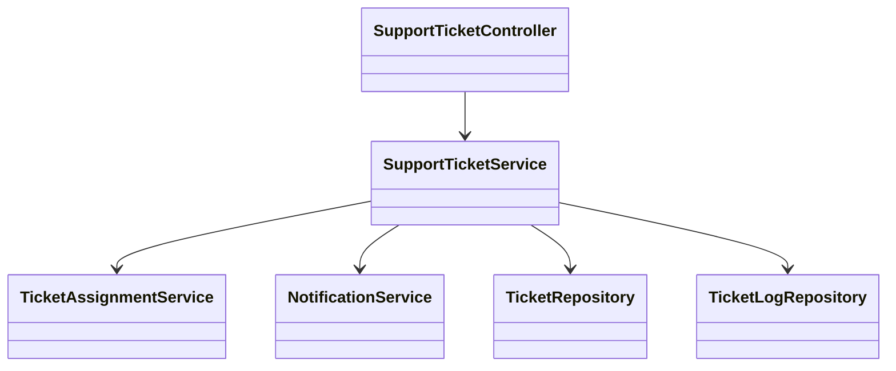
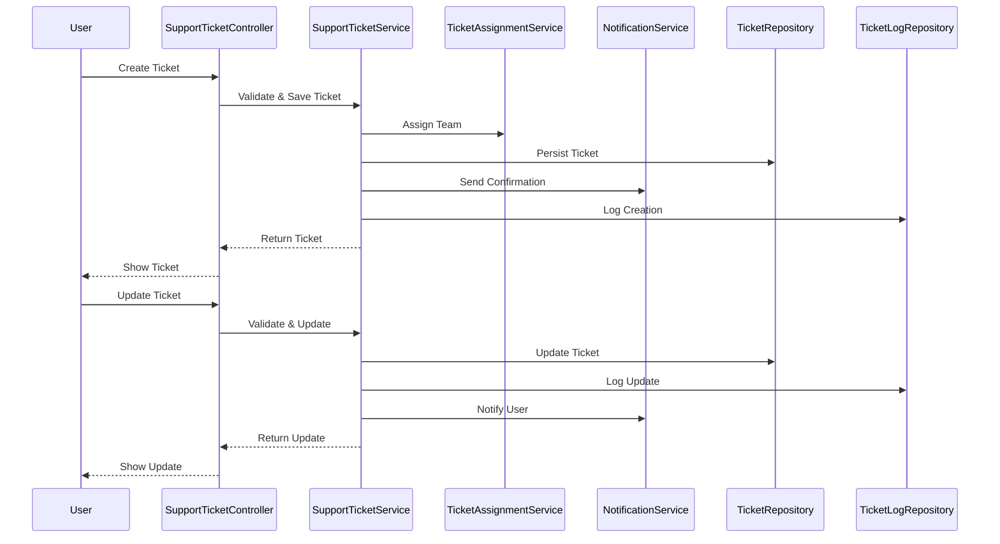

# For User Story Number [5]

1. Objective
This requirement enables passengers to contact customer support and manage their support tickets for efficient resolution of air travel issues. Users can submit, track, and update support requests, while support representatives can respond and update ticket statuses. The system ensures timely notifications and secure access to ticket information.

2. API Model
  2.1 Common Components/Services
  - AuthenticationService (existing)
  - SupportTicketService (new)
  - NotificationService (existing)
  - TicketAssignmentService (new)

  2.2 API Details
| Operation | REST Method | Type | URL | Request | Response |
|-----------|-------------|------|-----|---------|----------|
| Create Ticket | POST | Success/Failure | /api/support/tickets | {"userId": "U123", "issueType": "Baggage", "description": "Lost bag", "contactInfo": "john@example.com"} | {"ticketId": "T1001", "status": "OPEN"} |
| Get Ticket | GET | Success/Failure | /api/support/tickets/{ticketId} | N/A | {"ticketId": "T1001", "status": "OPEN", ...} |
| Update Ticket | PUT | Success/Failure | /api/support/tickets/{ticketId} | {"status": "IN_PROGRESS", "message": "We are investigating"} | {"ticketId": "T1001", "status": "IN_PROGRESS"} |
| List Tickets | GET | Success/Failure | /api/support/tickets?userId=U123 | N/A | [{"ticketId": "T1001", "status": "OPEN", ...}] |

  2.3 Exceptions
  - TicketNotFoundException
  - UnauthorizedTicketAccessException
  - InvalidTicketFieldException
  - TicketUpdateLogException

3 Functional Design
  3.1 Class Diagram


  3.2 UML Sequence Diagram


  3.3 Components
| Component Name | Description | Existing/New |
|----------------|-------------|--------------|
| SupportTicketController | Handles support ticket requests | New |
| SupportTicketService | Business logic for ticket management | New |
| TicketAssignmentService | Assigns tickets to support teams | New |
| NotificationService | Sends ticket notifications | Existing |
| TicketRepository | Persists ticket data | New |
| TicketLogRepository | Logs ticket updates | New |

  3.4 Service Layer Logic and Validations
| FieldName | Validation | Error Message | ClassUsed |
|-----------|-----------|--------------|-----------|
| issueType, description, contactInfo | Required, valid values | Invalid ticket field | SupportTicketService |
| userId | Must be authorized | Unauthorized access | SupportTicketService |
| ticketId | Must exist and belong to user | Ticket not found or unauthorized | SupportTicketService |
| updateLog | Must be logged with timestamp | Ticket update log error | TicketLogRepository |

4 Integrations
| SystemToBeIntegrated | IntegratedFor | IntegrationType |
|---------------------|---------------|-----------------|
| Email/SMS Gateway | Ticket notifications | API |

5 DB Details
  5.1 ER Model
```mermaid
erDiagram
    USER ||--o{ TICKET : creates
    TICKET ||--o{ TICKETLOG : has
    TICKET {
      ticket_id PK
      user_id FK
      issue_type
      description
      status
      assigned_team
      created_at
      updated_at
      contact_info
    }
    TICKETLOG {
      log_id PK
      ticket_id FK
      status
      message
      timestamp
    }
    USER {
      user_id PK
      name
      email
    }
```

  5.2 DB Validations
  - Unique constraint on ticket_id, log_id
  - Foreign key constraints for user_id, ticket_id
  - Not null constraints on required fields

6 Non-Functional Requirements
  6.1 Performance
    - Ticket submission and updates within 2 seconds
    - Support for 1,000+ concurrent tickets
  6.2 Security
    6.2.1 Authentication
      - User authentication required for ticket management (JWT/session-based)
    6.2.2 Authorization
      - Only ticket owner or support staff can view/update
      - Data privacy compliance
  6.3 Logging
    6.3.1 Application Logging
      - DEBUG: Ticket API requests/responses
      - INFO: Ticket creation/update events
      - ERROR: Validation or persistence errors
      - WARN: Unresolved tickets over SLA
    6.3.2 Audit Log
      - Log all ticket updates with user, status, and timestamp

7 Dependencies
  - Email/SMS gateway for notifications

8 Assumptions
  - Support team assignments are rule-based
  - Email/SMS delivery is reliable
  - User is authenticated for all ticket operations
