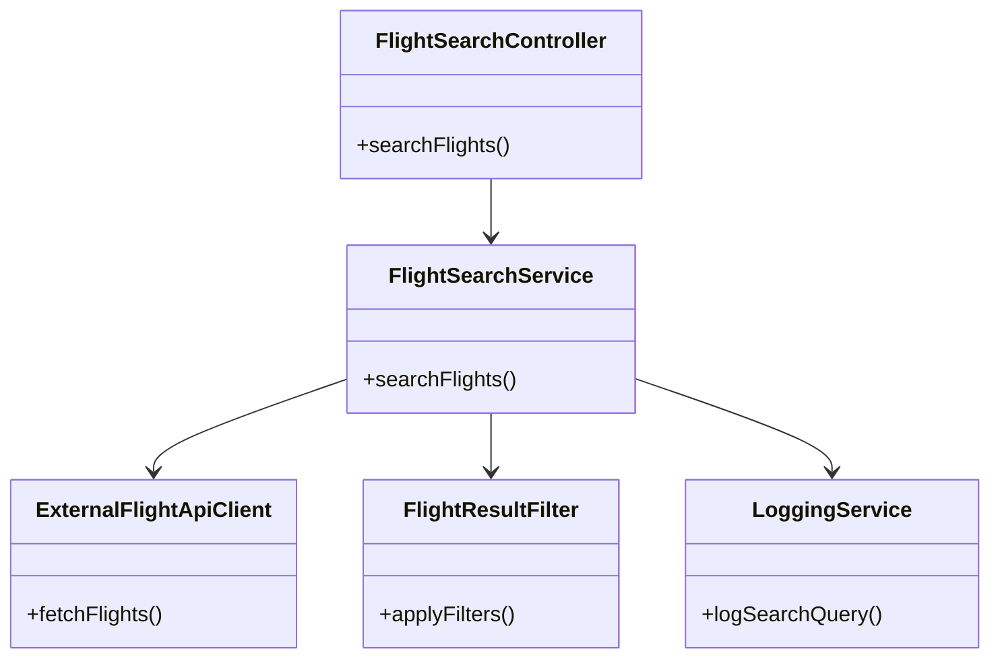
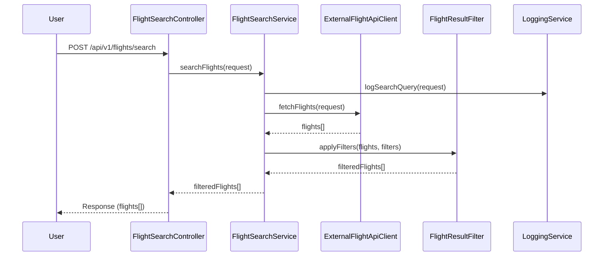
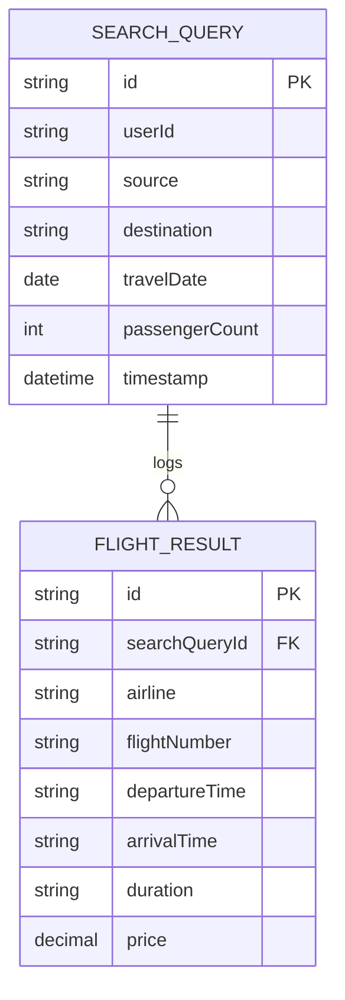

# For User Story Number [1]

1. Objective
This requirement enables travelers to search for available flights by specifying source, destination, travel dates, and passenger count. The system displays matching flights with relevant details and allows filtering by airline, price, or duration. The objective is to provide a fast, user-friendly, and accurate search experience for air transport options.

2. API Model
2.1 Common Components/Services
- FlightSearchService (handles flight search logic)
- ExternalFlightApiClient (integrates with third-party APIs)
- FlightResultFilter (applies user filters)
- LoggingService (logs search queries)

2.2 API Details
| Operation | REST Method | Type    | URL                         | Request (JSON)                                                                 | Response (JSON)                                                                                 |
|-----------|-------------|---------|-----------------------------|--------------------------------------------------------------------------------|-------------------------------------------------------------------------------------------------|
| Search    | POST        | Success | /api/v1/flights/search      | {"source":"JFK","destination":"LAX","date":"2025-10-01","passengerCount":2,"filters":{"airline":"Delta","maxPrice":500}} | {"flights":[{"airline":"Delta","flightNumber":"DL123","departureTime":"10:00","arrivalTime":"13:00","duration":"3h","price":450}]} |
| Search    | POST        | Failure | /api/v1/flights/search      | {"source":"JFK","destination":"JFK","date":"2024-01-01","passengerCount":0}           | {"error":"Invalid search criteria: source and destination cannot be the same."}               |

2.3 Exceptions
| Exception Type                  | Description                                         |
|---------------------------------|-----------------------------------------------------|
| InvalidSearchCriteriaException  | Thrown when source=destination, past date, or invalid passenger count |
| ExternalApiException            | Thrown when third-party API fails or times out       |
| NoFlightsFoundException         | Thrown when no flights match the search criteria     |

3. Functional Design
3.1 Class Diagram

3.2 UML Sequence Diagram

3.3 Components
| Component Name           | Description                                         | Existing/New |
|-------------------------|-----------------------------------------------------|--------------|
| FlightSearchController  | Handles incoming search requests                    | New          |
| FlightSearchService     | Core business logic for searching flights           | New          |
| ExternalFlightApiClient | Integrates with third-party flight data providers   | New          |
| FlightResultFilter      | Applies user filters to search results              | New          |
| LoggingService          | Logs search queries for analytics                   | Existing     |

3.4 Service Layer Logic and Validations
| FieldName       | Validation                                             | Error Message                                 | ClassUsed                |
|-----------------|-------------------------------------------------------|-----------------------------------------------|--------------------------|
| source, dest    | Cannot be the same                                    | Source and destination cannot be the same     | FlightSearchService      |
| date            | Cannot be in the past                                 | Travel date cannot be in the past             | FlightSearchService      |
| passengerCount  | >=1 and <= max allowed per booking                    | Invalid passenger count                       | FlightSearchService      |

4. Integrations
| SystemToBeIntegrated | IntegratedFor            | IntegrationType |
|----------------------|-------------------------|-----------------|
| Amadeus/Sabre APIs   | Flight data retrieval   | API             |
| Analytics Platform   | Search query logging    | API/File        |

5. DB Details
5.1 ER Model

5.2 DB Validations
- Ensure search queries are logged with valid userId and timestamp.

6. Non-Functional Requirements
6.1 Performance
- Search results must be returned within 3 seconds.
- Support for 10,000 concurrent searches (consider caching and async processing).

6.2 Security
6.2.1 Authentication
- API keys for third-party integrations.
- JWT/OAuth2 for user authentication (Spring Security).
6.2.2 Authorization
- Only authenticated users can search flights.

6.3 Logging
6.3.1 Application Logging
- Log all search requests at INFO level.
- Log errors (API failures, validation errors) at ERROR level.
6.3.2 Audit Log
- Log userId, search parameters, and timestamp for each search.

7. Dependencies
- Third-party flight APIs (Amadeus, Sabre)
- Analytics/monitoring platform

8. Assumptions
- Maximum passenger count per booking is defined in configuration.
- Third-party APIs are reliable and provide up-to-date data.
- All users are authenticated before accessing search functionality.