# For User Story Number [2]

1. Objective
This requirement enables travelers to book selected flights by providing passenger details and selecting seats. The system validates all information, processes payment, reserves seats, generates a booking reference, and sends a confirmation email. The objective is to provide a secure, reliable, and seamless booking experience for users.

2. API Model
2.1 Common Components/Services
- BookingService (handles booking logic)
- PaymentService (integrates with payment gateways)
- EmailService (sends confirmation emails)
- SeatManagementService (manages seat selection and availability)
- ValidationService (validates passenger and booking details)

2.2 API Details
| Operation | REST Method | Type    | URL                         | Request (JSON)                                                                 | Response (JSON)                                                                                 |
|-----------|-------------|---------|-----------------------------|--------------------------------------------------------------------------------|-------------------------------------------------------------------------------------------------|
| Book      | POST        | Success | /api/v1/bookings            | {"flightId":"FL123","passengers":[{"name":"John Doe","age":30}],"seats":["12A"],"paymentMethod":"card","email":"john@example.com"} | {"bookingReference":"BK20250101","status":"CONFIRMED"} |
| Book      | POST        | Failure | /api/v1/bookings            | {"flightId":"FL123","passengers":[],"seats":[],"paymentMethod":"card","email":"john@example.com"} | {"error":"Passenger details required."} |

2.3 Exceptions
| Exception Type                  | Description                                         |
|---------------------------------|-----------------------------------------------------|
| InvalidBookingDataException     | Thrown when required fields are missing or invalid   |
| SeatUnavailableException        | Thrown when selected seats are not available         |
| PaymentFailedException          | Thrown when payment processing fails                 |
| EmailSendException              | Thrown when confirmation email fails to send         |

3. Functional Design
3.1 Class Diagram

3.2 UML Sequence Diagram

3.3 Components
| Component Name           | Description                                         | Existing/New |
|-------------------------|-----------------------------------------------------|--------------|
| BookingController       | Handles booking requests                            | New          |
| BookingService          | Core booking logic                                  | New          |
| PaymentService          | Integrates with payment gateways                    | Existing     |
| EmailService            | Sends booking confirmation emails                   | Existing     |
| SeatManagementService   | Manages seat selection and reservation              | New          |
| ValidationService       | Validates booking and passenger details             | New          |

3.4 Service Layer Logic and Validations
| FieldName       | Validation                                             | Error Message                                 | ClassUsed                |
|-----------------|-------------------------------------------------------|-----------------------------------------------|--------------------------|
| passengers      | All details required and valid                        | Passenger details required                    | ValidationService        |
| seats           | Must not exceed available seats                       | Selected seats not available                  | SeatManagementService    |
| payment         | Must be successful                                    | Payment failed                                | PaymentService           |

4. Integrations
| SystemToBeIntegrated | IntegratedFor            | IntegrationType |
|----------------------|-------------------------|-----------------|
| Stripe/PayPal        | Payment processing      | API             |
| SendGrid             | Confirmation email      | API             |

5. DB Details
5.1 ER Model

```mermaid
erDiagram
    BOOKING ||--o{ PASSENGER : contains
    BOOKING ||--o{ SEAT : reserves
    BOOKING {
        string id PK
        string flightId
        string bookingReference
        string status
        string userId
        datetime bookingTime
    }
    PASSENGER {
        string id PK
        string bookingId FK
        string name
        int age
        string email
    }
    SEAT {
        string id PK
        string bookingId FK
        string seatNumber
        boolean reserved
    }
```

5.2 DB Validations
- Ensure booking reference is unique.
- Ensure seat reservation is atomic to prevent double booking.

6. Non-Functional Requirements
6.1 Performance
- Booking process must complete within 5 seconds.
- Support for 1,000 bookings per minute.

6.2 Security
6.2.1 Authentication
- OAuth2 secured endpoints.
6.2.2 Authorization
- Only authenticated users can book flights.
- Sensitive data encrypted at rest and in transit.

6.3 Logging
6.3.1 Application Logging
- Log all booking attempts at INFO level.
- Log booking failures and payment errors at ERROR level.
6.3.2 Audit Log
- Log userId, booking details, and status for each booking.

7. Dependencies
- Payment gateways (Stripe, PayPal)
- Email service (SendGrid)

8. Assumptions
- Seat map and availability are managed in real-time.
- Payment gateway integration is PCI DSS compliant.
- Email delivery is reliable and monitored.