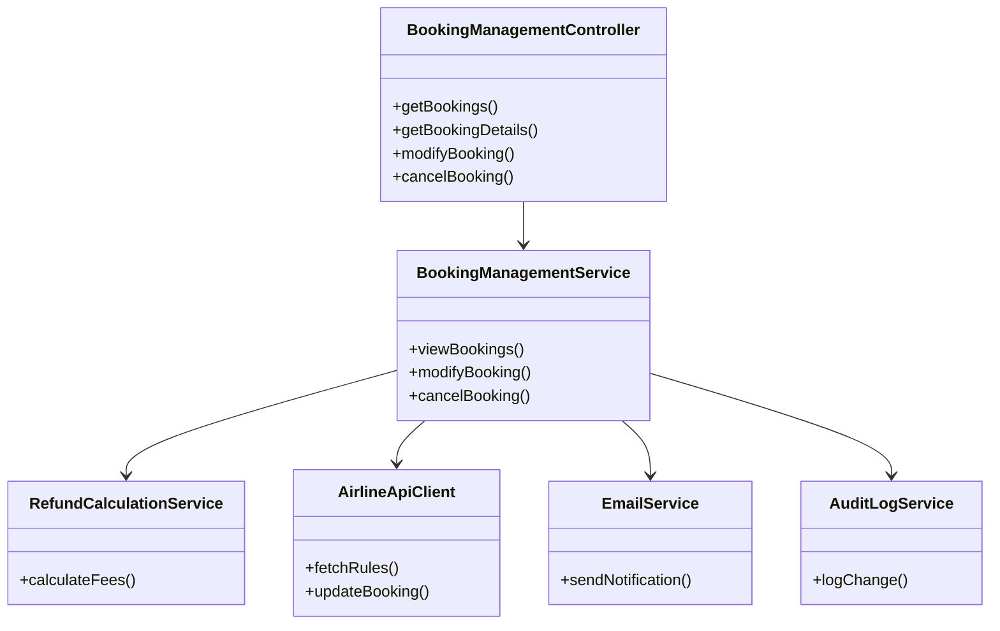
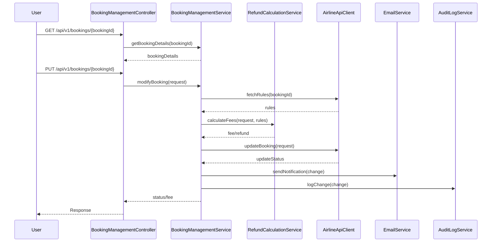
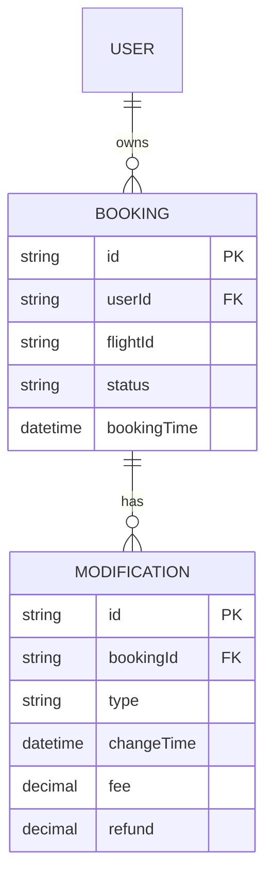

# For User Story Number [3]

1. Objective
This requirement enables travelers to view, modify, or cancel their flight bookings, providing flexibility in managing travel plans. The system ensures only eligible bookings can be changed or cancelled, calculates applicable fees/refunds, and sends notifications for all changes. The objective is to offer a secure, auditable, and user-friendly booking management experience.

2. API Model
2.1 Common Components/Services
- BookingManagementService (handles view, modify, cancel logic)
- RefundCalculationService (calculates fees/refunds)
- EmailService (sends notifications)
- AirlineApiClient (fetches airline rules and updates)
- AuditLogService (logs all changes)

2.2 API Details
| Operation | REST Method | Type    | URL                              | Request (JSON)                                                                 | Response (JSON)                                                                                 |
|-----------|-------------|---------|----------------------------------|--------------------------------------------------------------------------------|-------------------------------------------------------------------------------------------------|
| View      | GET         | Success | /api/v1/bookings                 |                                            | {"bookings":[{"bookingReference":"BK20250101","flightId":"FL123","status":"CONFIRMED"}]} |
| Details   | GET         | Success | /api/v1/bookings/{bookingId}     |                                            | {"bookingReference":"BK20250101","flightId":"FL123","passengers":[...],"status":"CONFIRMED"} |
| Modify    | PUT         | Success | /api/v1/bookings/{bookingId}     | {"date":"2025-10-05","seat":"14C"}                                         | {"status":"MODIFIED","changeFee":50} |
| Cancel    | DELETE      | Success | /api/v1/bookings/{bookingId}     |                                            | {"status":"CANCELLED","refund":100} |
| Modify    | PUT         | Failure | /api/v1/bookings/{bookingId}     | {"date":"2024-01-01"}                                                         | {"error":"Modification window expired."} |

2.3 Exceptions
| Exception Type                  | Description                                         |
|---------------------------------|-----------------------------------------------------|
| BookingNotFoundException        | Thrown when booking ID is invalid                    |
| ModificationNotAllowedException | Thrown when outside allowed window                   |
| RefundCalculationException      | Thrown on fee/refund calculation error               |
| AirlineApiException             | Thrown when airline API fails                        |

3. Functional Design
3.1 Class Diagram

3.2 UML Sequence Diagram

3.3 Components
| Component Name           | Description                                         | Existing/New |
|-------------------------|-----------------------------------------------------|--------------|
| BookingManagementController | Handles booking management endpoints             | New          |
| BookingManagementService    | Core logic for view, modify, cancel              | New          |
| RefundCalculationService    | Calculates change fees and refunds               | New          |
| EmailService                | Sends notifications for changes/cancellations    | Existing     |
| AirlineApiClient            | Integrates with airline APIs for rules/updates   | New          |
| AuditLogService             | Logs all changes for audit                       | Existing     |

3.4 Service Layer Logic and Validations
| FieldName       | Validation                                             | Error Message                                 | ClassUsed                |
|-----------------|-------------------------------------------------------|-----------------------------------------------|--------------------------|
| bookingId       | Must exist and belong to user                         | Booking not found                             | BookingManagementService |
| modification    | Within allowed window                                 | Modification window expired                   | BookingManagementService |
| refund/fee      | Calculated as per airline policy                      | Refund calculation error                      | RefundCalculationService |
| authentication  | User must be authenticated                            | Authentication required                       | BookingManagementService |

4. Integrations
| SystemToBeIntegrated | IntegratedFor            | IntegrationType |
|----------------------|-------------------------|-----------------|
| Airline APIs         | Rules, real-time updates| API             |
| Email Service        | Notifications           | API             |

5. DB Details
5.1 ER Model

5.2 DB Validations
- Ensure only eligible bookings are modified/cancelled.
- Log all modifications and cancellations with timestamp and userId.

6. Non-Functional Requirements
6.1 Performance
- All booking management actions must complete within 4 seconds.
- System must support 99.9% availability.

6.2 Security
6.2.1 Authentication
- JWT-based authentication for all endpoints.
6.2.2 Authorization
- Only booking owner can modify/cancel/view booking.
- Secure RESTful endpoints.

6.3 Logging
6.3.1 Application Logging
- Log all requests and changes at INFO level.
- Log errors at ERROR level.
6.3.2 Audit Log
- Log userId, bookingId, action, and timestamp for all changes.

7. Dependencies
- Airline APIs for rules and updates
- Email service for notifications

8. Assumptions
- Airline rules are available via API and up-to-date.
- Refunds and fees are calculated as per latest airline policy.
- All users are authenticated before accessing booking management.