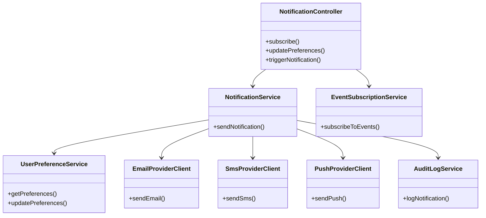
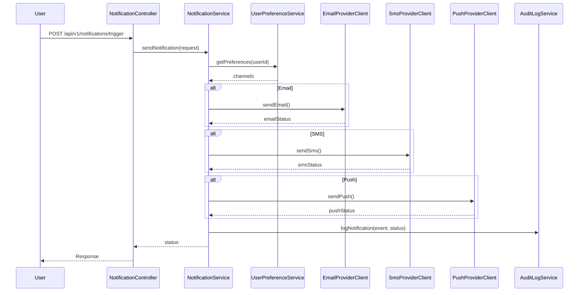
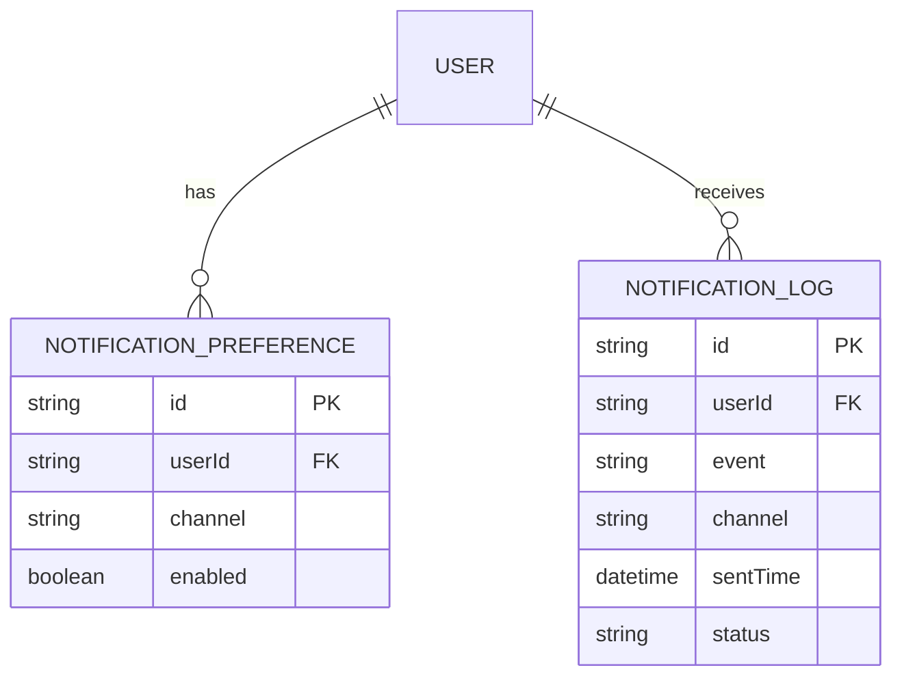

# For User Story Number [4]

1. Objective
This requirement ensures travelers receive timely notifications about booking confirmations, flight status changes, and reminders, using their preferred channels (email, SMS, push). The system must respect user preferences, log all notifications for audit, and deliver messages reliably and quickly. The objective is to keep users informed and engaged throughout their journey.

2. API Model
2.1 Common Components/Services
- NotificationService (core notification logic)
- UserPreferenceService (fetches user notification preferences)
- EventSubscriptionService (subscribes users to relevant events)
- EmailProviderClient (integrates with SendGrid)
- SmsProviderClient (integrates with Twilio)
- PushProviderClient (integrates with Firebase)
- AuditLogService (logs notification delivery)

2.2 API Details
| Operation     | REST Method | Type    | URL                                  | Request (JSON)                                                                 | Response (JSON)                                                                                 |
|--------------|-------------|---------|--------------------------------------|--------------------------------------------------------------------------------|-------------------------------------------------------------------------------------------------|
| Subscribe    | POST        | Success | /api/v1/notifications/subscribe      | {"userId":"U123","bookingId":"BK20250101","channels":["email","sms"]} | {"status":"SUBSCRIBED"} |
| UpdatePrefs  | PUT         | Success | /api/v1/notifications/preferences    | {"userId":"U123","channels":["push"]}                                     | {"status":"UPDATED"} |
| Notify       | POST        | Success | /api/v1/notifications/trigger        | {"userId":"U123","event":"FLIGHT_DELAY","bookingId":"BK20250101"}     | {"status":"SENT"} |
| Notify       | POST        | Failure | /api/v1/notifications/trigger        | {"userId":"U123","event":"FLIGHT_DELAY","bookingId":"BK20250101"}     | {"error":"No active channels for user."} |

2.3 Exceptions
| Exception Type                  | Description                                         |
|---------------------------------|-----------------------------------------------------|
| NotificationDeliveryException   | Thrown when provider fails to deliver notification   |
| InvalidPreferenceException      | Thrown when user preferences are invalid             |
| EventSubscriptionException      | Thrown when event subscription fails                 |

3. Functional Design
3.1 Class Diagram

3.2 UML Sequence Diagram

3.3 Components
| Component Name           | Description                                         | Existing/New |
|-------------------------|-----------------------------------------------------|--------------|
| NotificationController  | Handles notification endpoints                      | New          |
| NotificationService     | Core notification logic                             | New          |
| UserPreferenceService   | Manages user notification preferences               | New          |
| EventSubscriptionService| Subscribes users to notification events             | New          |
| EmailProviderClient     | Integrates with SendGrid for email                  | Existing     |
| SmsProviderClient       | Integrates with Twilio for SMS                      | Existing     |
| PushProviderClient      | Integrates with Firebase for push                   | Existing     |
| AuditLogService         | Logs notification delivery                          | Existing     |

3.4 Service Layer Logic and Validations
| FieldName       | Validation                                             | Error Message                                 | ClassUsed                |
|-----------------|-------------------------------------------------------|-----------------------------------------------|--------------------------|
| userId          | Must exist and be valid                               | Invalid userId                                | NotificationService      |
| channels        | Must be valid and supported                           | Invalid notification channel                  | UserPreferenceService    |
| event           | Must be a supported event type                        | Unsupported event type                        | NotificationService      |
| delivery        | Must be logged and auditable                          | Notification delivery failed                  | AuditLogService          |

4. Integrations
| SystemToBeIntegrated | IntegratedFor            | IntegrationType |
|----------------------|-------------------------|-----------------|
| SendGrid             | Email notifications     | API             |
| Twilio               | SMS notifications       | API             |
| Firebase             | Push notifications      | API             |
| Event Bus (RabbitMQ) | Event-driven triggers   | API             |

5. DB Details
5.1 ER Model

5.2 DB Validations
- Ensure user preferences are unique per channel.
- Log all notification deliveries with status and timestamp.

6. Non-Functional Requirements
6.1 Performance
- Notifications must be delivered within 1 minute of event occurrence.
- Support for 10,000 notifications per minute.

6.2 Security
6.2.1 Authentication
- Only authenticated users can configure preferences.
6.2.2 Authorization
- Only relevant notifications sent to each user.
- All data encrypted at rest and in transit.

6.3 Logging
6.3.1 Application Logging
- Log all notification requests and deliveries at INFO level.
- Log failures at ERROR level.
6.3.2 Audit Log
- Log userId, event, channel, and status for each notification.

7. Dependencies
- Notification providers (SendGrid, Twilio, Firebase)
- Event bus (RabbitMQ, AWS SNS)

8. Assumptions
- Users have valid contact details for chosen channels.
- Notification providers are reliable and monitored.
- Event-driven triggers are configured for all relevant events.