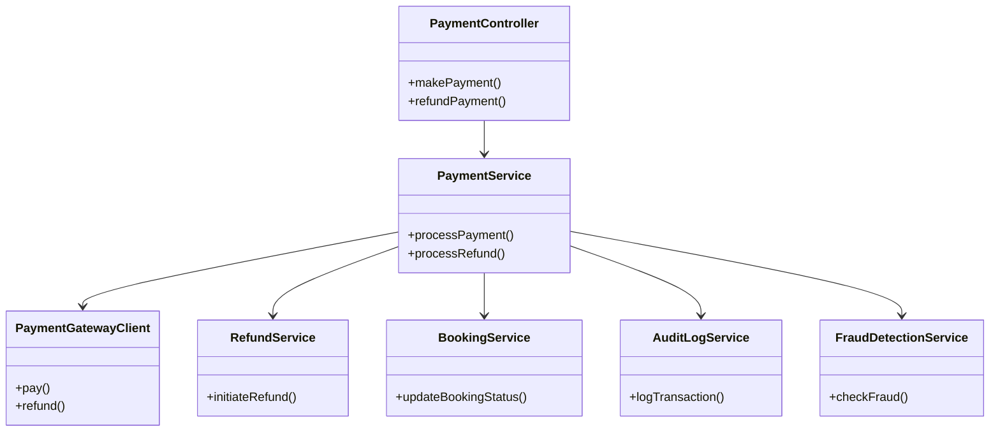
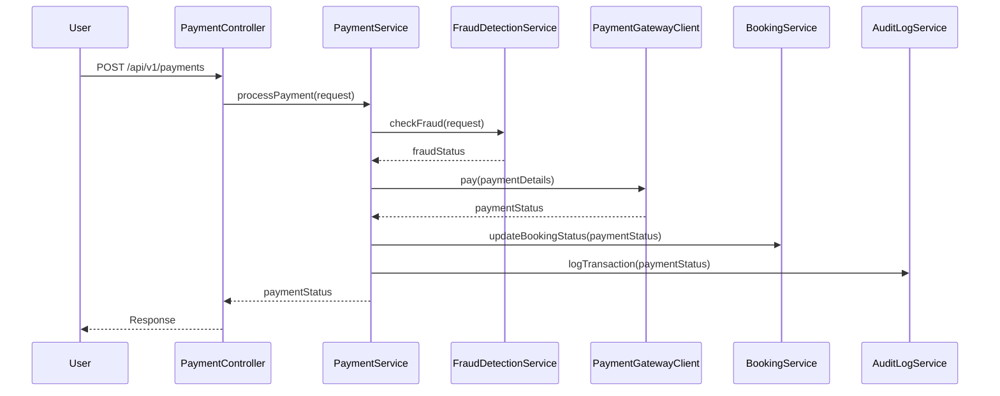
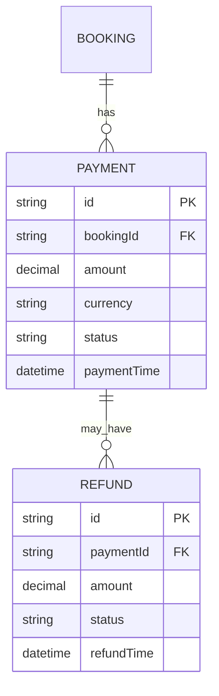

# For User Story Number [5]

1. Objective
This requirement enables travelers to make secure payments for flight bookings using multiple payment methods. The system must validate payment data, process transactions securely, support refunds, and provide clear feedback on payment status. The objective is to ensure a safe, convenient, and reliable payment experience for users.

2. API Model
2.1 Common Components/Services
- PaymentService (core payment logic)
- PaymentGatewayClient (integrates with Stripe/PayPal/Adyen)
- RefundService (handles refunds)
- BookingService (updates booking status)
- AuditLogService (logs all transactions)
- FraudDetectionService (monitors for fraud)

2.2 API Details
| Operation | REST Method | Type    | URL                              | Request (JSON)                                                                 | Response (JSON)                                                                                 |
|-----------|-------------|---------|----------------------------------|--------------------------------------------------------------------------------|-------------------------------------------------------------------------------------------------|
| Pay       | POST        | Success | /api/v1/payments                 | {"bookingId":"BK20250101","method":"card","amount":500,"currency":"USD","cardDetails":{...}} | {"paymentId":"PMT123","status":"SUCCESS","confirmation":"CONF123"} |
| Pay       | POST        | Failure | /api/v1/payments                 | {"bookingId":"BK20250101","method":"card","amount":500,"currency":"USD","cardDetails":{...}} | {"error":"Payment declined: insufficient funds."} |
| Refund    | POST        | Success | /api/v1/payments/refund          | {"paymentId":"PMT123","reason":"cancellation"}                             | {"refundId":"RF123","status":"REFUNDED","amount":500} |

2.3 Exceptions
| Exception Type                  | Description                                         |
|---------------------------------|-----------------------------------------------------|
| PaymentValidationException      | Thrown when payment data is incomplete/invalid       |
| PaymentGatewayException         | Thrown when gateway fails or rejects transaction     |
| RefundProcessingException       | Thrown when refund fails                            |
| FraudDetectedException          | Thrown when fraud is suspected                      |

3. Functional Design
3.1 Class Diagram

3.2 UML Sequence Diagram

3.3 Components
| Component Name           | Description                                         | Existing/New |
|-------------------------|-----------------------------------------------------|--------------|
| PaymentController       | Handles payment and refund endpoints                | New          |
| PaymentService          | Core payment and refund logic                       | New          |
| PaymentGatewayClient    | Integrates with payment gateways                    | New          |
| RefundService           | Handles refund processing                           | New          |
| BookingService          | Updates booking status post-payment                 | Existing     |
| AuditLogService         | Logs all payment and refund transactions            | Existing     |
| FraudDetectionService   | Monitors and detects fraud attempts                 | New          |

3.4 Service Layer Logic and Validations
| FieldName       | Validation                                             | Error Message                                 | ClassUsed                |
|-----------------|-------------------------------------------------------|-----------------------------------------------|--------------------------|
| payment data    | Must be complete and correct                          | Invalid payment data                          | PaymentService           |
| transaction     | Must be logged and auditable                          | Transaction logging failed                    | AuditLogService          |
| refund          | Calculated as per policy, processed promptly          | Refund processing failed                      | RefundService            |

4. Integrations
| SystemToBeIntegrated | IntegratedFor            | IntegrationType |
|----------------------|-------------------------|-----------------|
| Stripe/PayPal/Adyen  | Payment processing      | API             |
| Booking Service      | Booking status update   | API             |
| Audit Platform       | Transaction logging     | API/File        |

5. DB Details
5.1 ER Model

5.2 DB Validations
- Ensure payment and refund records are unique and linked to correct booking/payment.
- Log all payment attempts and outcomes.

6. Non-Functional Requirements
6.1 Performance
- Payment processing must complete within 10 seconds.
- System must support 99.99% uptime for payment services.

6.2 Security
6.2.1 Authentication
- Only authenticated users can initiate payments/refunds.
- PCI DSS compliance for payment data.
6.2.2 Authorization
- Only booking owner can pay/refund for a booking.
- All sensitive data encrypted at rest and in transit.

6.3 Logging
6.3.1 Application Logging
- Log all payment and refund attempts at INFO level.
- Log failures and fraud attempts at ERROR level.
6.3.2 Audit Log
- Log userId, bookingId, paymentId, amount, and status for each transaction.

7. Dependencies
- Payment gateways (Stripe, PayPal, Adyen)
- Audit/logging platform

8. Assumptions
- Payment gateway integration is PCI DSS compliant.
- Refunds are processed as per airline and payment provider policy.
- Fraud detection rules are regularly updated and monitored.