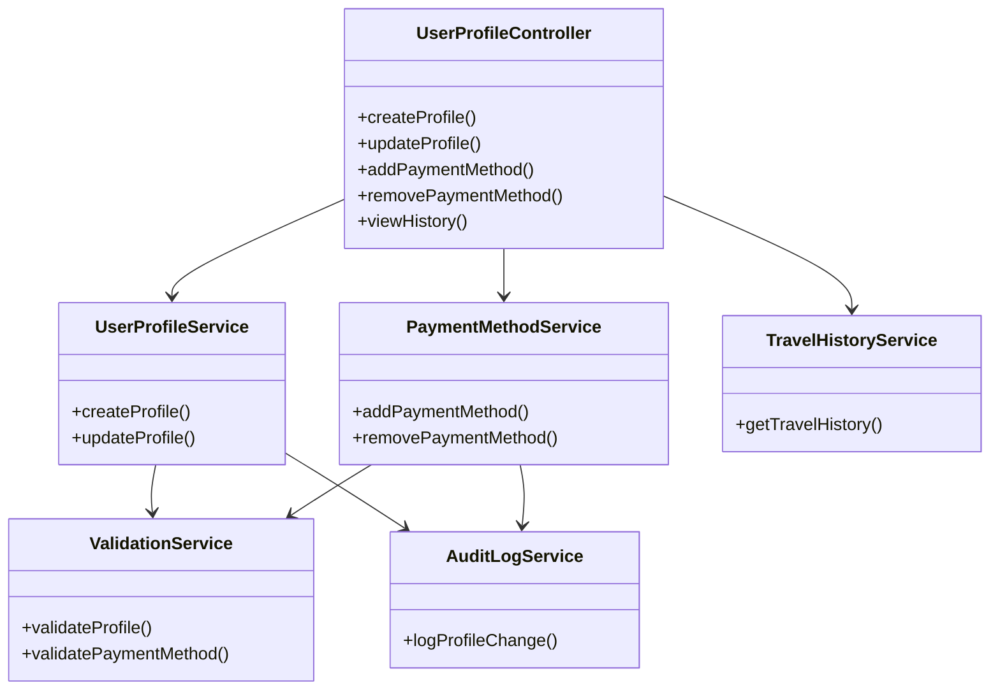
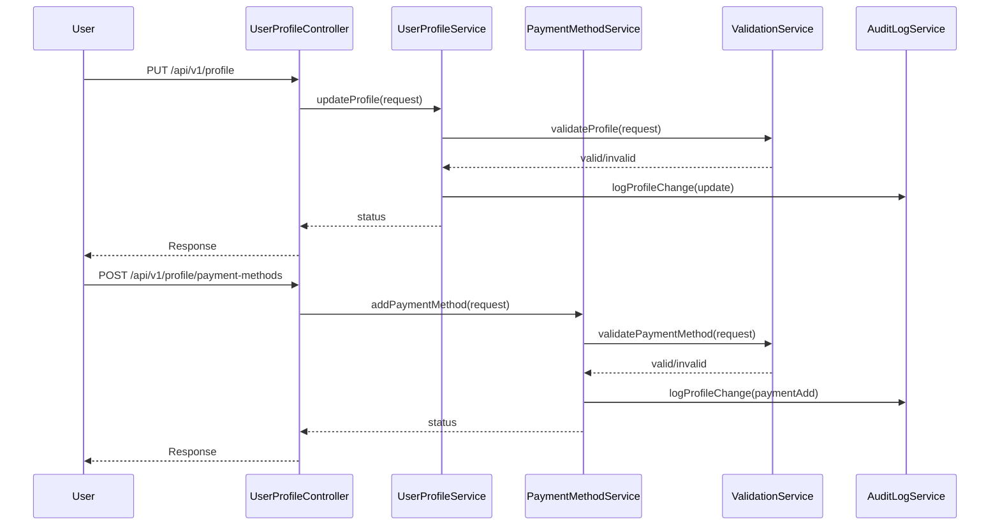
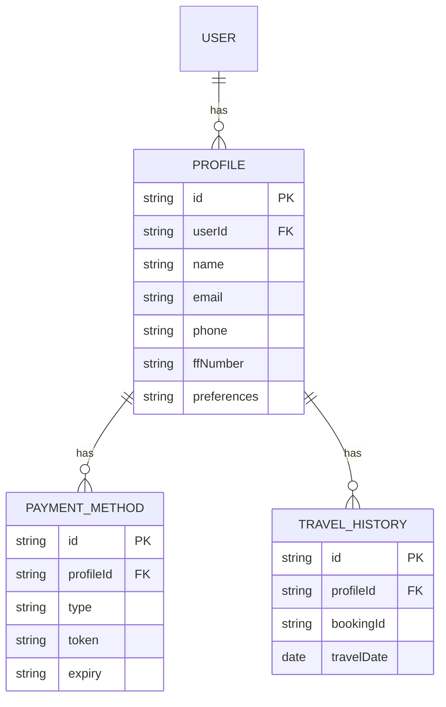

# For User Story Number [6]

1. Objective
This requirement enables travelers to manage their user profiles, including personal details, travel preferences, and saved payment methods. The system ensures data integrity, secure storage, and immediate reflection of updates. The objective is to provide a seamless, secure, and personalized experience for future bookings.

2. API Model
2.1 Common Components/Services
- UserProfileService (core profile logic)
- PaymentMethodService (manages saved payment methods)
- TravelHistoryService (fetches travel history)
- ValidationService (validates profile data)
- AuditLogService (logs all profile changes)

2.2 API Details
| Operation     | REST Method | Type    | URL                                  | Request (JSON)                                                                 | Response (JSON)                                                                                 |
|--------------|-------------|---------|--------------------------------------|--------------------------------------------------------------------------------|-------------------------------------------------------------------------------------------------|
| Create       | POST        | Success | /api/v1/profile                      | {"userId":"U123","name":"John Doe","email":"john@example.com"}         | {"status":"CREATED","profileId":"P123"} |
| Update       | PUT         | Success | /api/v1/profile                      | {"userId":"U123","name":"John Smith"}                                   | {"status":"UPDATED"} |
| AddPayment   | POST        | Success | /api/v1/profile/payment-methods      | {"userId":"U123","cardNumber":"****","expiry":"12/27"}               | {"status":"ADDED"} |
| RemovePayment| DELETE      | Success | /api/v1/profile/payment-methods/{id} |                                            | {"status":"REMOVED"} |
| ViewHistory  | GET         | Success | /api/v1/profile/history              |                                            | {"history":[{"bookingId":"BK20250101","date":"2025-10-01"}]} |
| Update       | PUT         | Failure | /api/v1/profile                      | {"userId":"U123","email":"invalid"}                                     | {"error":"Invalid email address."} |

2.3 Exceptions
| Exception Type                  | Description                                         |
|---------------------------------|-----------------------------------------------------|
| ProfileValidationException      | Thrown when profile data is incomplete/invalid       |
| PaymentMethodException          | Thrown when payment method data is invalid           |
| UnauthorizedAccessException     | Thrown when user is not authenticated               |

3. Functional Design
3.1 Class Diagram

3.2 UML Sequence Diagram

3.3 Components
| Component Name           | Description                                         | Existing/New |
|-------------------------|-----------------------------------------------------|--------------|
| UserProfileController   | Handles profile endpoints                           | New          |
| UserProfileService      | Core profile management logic                       | New          |
| PaymentMethodService    | Manages saved payment methods                       | New          |
| TravelHistoryService    | Fetches user travel history                         | Existing     |
| ValidationService       | Validates profile and payment method data           | New          |
| AuditLogService         | Logs all profile changes                            | Existing     |

3.4 Service Layer Logic and Validations
| FieldName       | Validation                                             | Error Message                                 | ClassUsed                |
|-----------------|-------------------------------------------------------|-----------------------------------------------|--------------------------|
| profile fields  | All required fields must be valid                      | Invalid profile data                          | ValidationService        |
| payment method  | Data must be valid and PCI DSS compliant               | Invalid payment method                        | ValidationService        |
| authentication  | Only authenticated users can modify profile            | Unauthorized access                           | UserProfileService       |

4. Integrations
| SystemToBeIntegrated | IntegratedFor            | IntegrationType |
|----------------------|-------------------------|-----------------|
| Payment Gateway      | Tokenize/store payment  | API             |
| Audit Platform       | Logging profile changes | API/File        |

5. DB Details
5.1 ER Model

5.2 DB Validations
- Ensure unique email per profile.
- PCI DSS compliance for payment data storage.
- Log all profile changes with timestamp and userId.

6. Non-Functional Requirements
6.1 Performance
- Profile updates reflected within 2 seconds.
- System must support 99.9% availability.

6.2 Security
6.2.1 Authentication
- JWT-based authentication for all endpoints.
- PCI DSS compliance for payment data.
6.2.2 Authorization
- Only profile owner can view/modify profile.
- GDPR compliance for user data.

6.3 Logging
6.3.1 Application Logging
- Log all profile changes at INFO level.
- Log validation errors at ERROR level.
6.3.2 Audit Log
- Log userId, profileId, action, and timestamp for all changes.

7. Dependencies
- Payment gateway for tokenization
- Audit/logging platform

8. Assumptions
- Users have unique email addresses.
- Payment gateway integration is PCI DSS compliant.
- GDPR compliance is enforced for all user data.