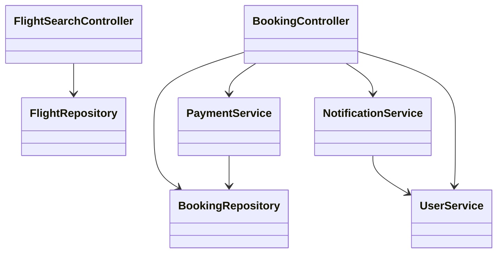
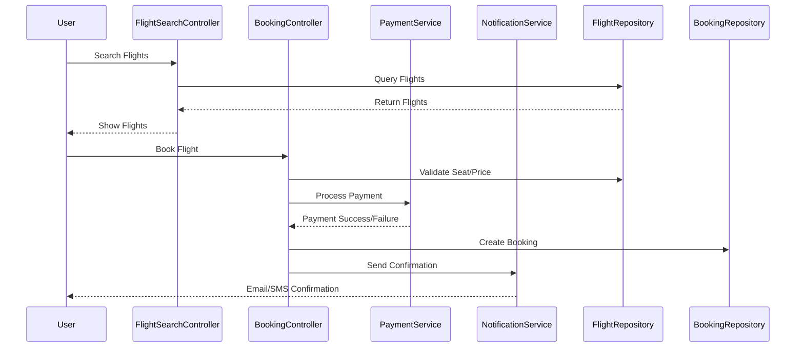
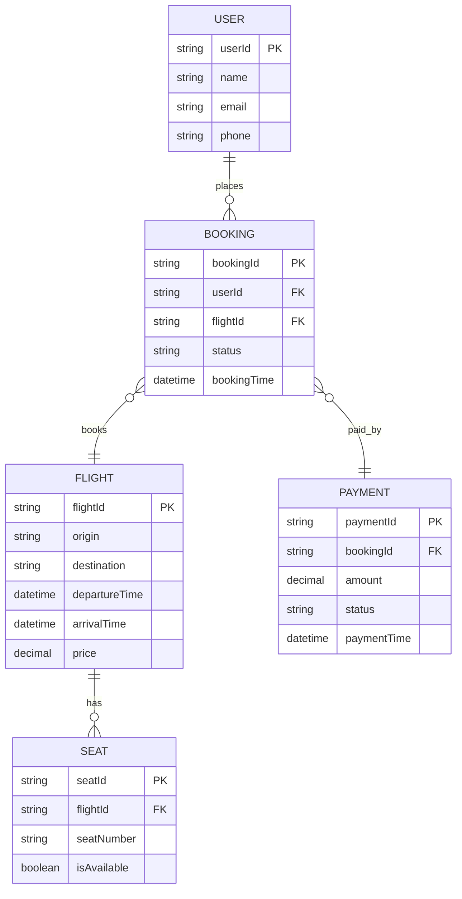

# For User Story Number [1]

1. Objective
This requirement enables travelers to search for flights, compare prices, and book air transport tickets online. The system ensures real-time availability, secure payment processing, and instant booking confirmation. It supports multiple payment methods and sends confirmations via email/SMS for user convenience.

2. API Model
2.1 Common Components/Services
- Authentication Service (OAuth2)
- Payment Gateway Service
- Notification Service (Email/SMS)
- Flight Search Service

2.2 API Details
| Operation   | REST Method | Type     | URL                         | Request (Sample JSON)                                                                 | Response (Sample JSON)                                                              |
|-------------|-------------|----------|-----------------------------|--------------------------------------------------------------------------------------|-------------------------------------------------------------------------------------|
| Search      | GET         | Success  | /api/flights/search         | {"origin": "JFK", "destination": "LAX", "date": "2025-10-01"}               | [{"flightId": "F123", "price": 350, "departureTime": "10:00", "arrivalTime": "13:00"}] |
| Book        | POST        | Success  | /api/flights/book           | {"flightId": "F123", "userId": "U456", "payment": {"cardNo": "****", "expiry": "12/28"}} | {"bookingId": "B789", "status": "CONFIRMED"}                                   |
| Payment     | POST        | Success  | /api/payments/process       | {"bookingId": "B789", "amount": 350, "paymentMethod": "CARD", ...}            | {"paymentStatus": "SUCCESS", "transactionId": "T111"}                          |
| Notify      | POST        | Success  | /api/notifications/send     | {"userId": "U456", "type": "EMAIL", "message": "Booking Confirmed"}           | {"notificationStatus": "SENT"}                                                    |

2.3 Exceptions
| API                   | Exception Condition                  | Exception Type           | Error Message                       |
|-----------------------|--------------------------------------|--------------------------|-------------------------------------|
| /api/flights/search   | Invalid origin/destination/date      | ValidationException      | Invalid search criteria             |
| /api/flights/book     | Flight not available/invalid payment | BookingException         | Booking failed                      |
| /api/payments/process | Payment declined                     | PaymentProcessingException| Payment failed                      |
| /api/notifications/send | Notification failure               | NotificationException    | Notification could not be sent      |

3 Functional Design
3.1 Class Diagram

3.2 UML Sequence Diagram

3.3 Components
| Component Name         | Description                                             | Existing/New |
|-----------------------|---------------------------------------------------------|--------------|
| FlightSearchController| Handles flight search requests                           | New          |
| BookingController     | Handles booking and payment requests                     | New          |
| PaymentService        | Integrates with payment gateway                          | Existing     |
| NotificationService   | Sends email/SMS notifications                           | Existing     |
| FlightRepository      | Data access for flights                                  | Existing     |
| BookingRepository     | Data access for bookings                                 | Existing     |
| UserService           | User-related operations                                  | Existing     |

3.4 Service Layer Logic and Validations
| FieldName     | Validation                             | Error Message                       | ClassUsed              |
|---------------|----------------------------------------|-------------------------------------|------------------------|
| origin        | Must not be empty                      | Origin cannot be empty              | FlightSearchController |
| destination   | Must not be empty                      | Destination cannot be empty         | FlightSearchController |
| date          | Must be in the future                  | Date must be in the future          | FlightSearchController |
| payment       | Must be valid (PCI DSS)                | Invalid payment details             | PaymentService         |
| flightId      | Must exist and be available            | Flight not available                | BookingController      |

4 Integrations
| SystemToBeIntegrated | IntegratedFor         | IntegrationType |
|----------------------|----------------------|-----------------|
| Payment Gateway      | Payment processing   | API             |
| Notification Service | Booking confirmation | API             |
| Flight Data Provider | Real-time flights    | API             |

5 DB Details
5.1 ER Model

5.2 DB Validations
- Booking must reference valid user and flight.
- Payment must reference valid booking.
- Seat availability checked before booking.

6 Non-Functional Requirements
6.1 Performance
- API response time for search < 2 seconds.
- Caching of frequent search queries at API layer if applicable.

6.2 Security
6.2.1 Authentication
- OAuth2 based authentication for all endpoints.
6.2.2 Authorization
- Role-based access for booking and payment APIs.
- PCI DSS compliance for payment data.

6.3 Logging
6.3.1 Application Logging
- DEBUG: API request/response payloads (excluding sensitive data)
- INFO: Successful bookings, payments, notifications
- ERROR: Failed bookings, payments, notification errors
- WARN: Payment retries, partial failures
6.3.2 Audit Log
- Booking creation, payment processing, and notification events logged for audit.

7 Dependencies
- Payment gateway availability
- Notification service uptime
- Flight data provider API reliability

8 Assumptions
- All users are registered and authenticated.
- Payment gateway supports all required payment methods.
- Email/SMS delivery is reliable and timely.
