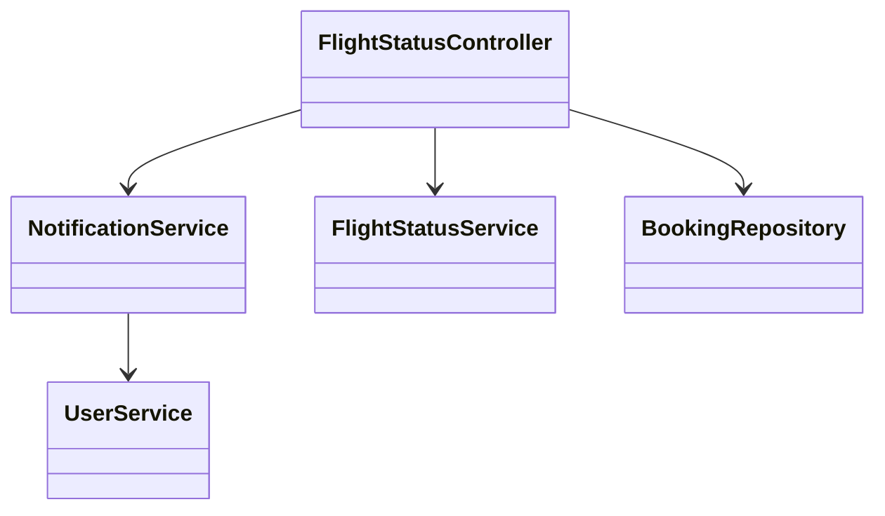
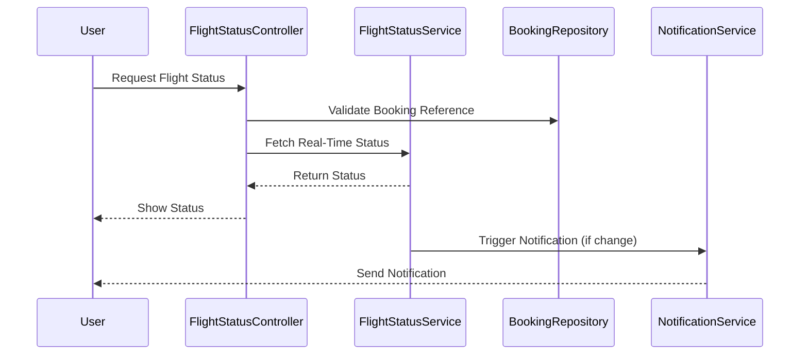
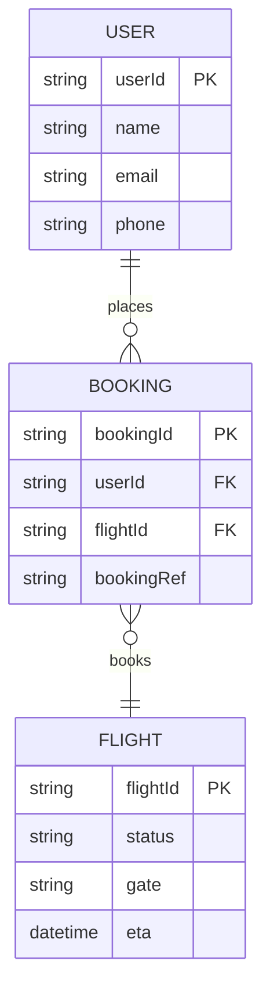

# For User Story Number [2]

1. Objective
This requirement enables travelers to track the real-time status of their booked flights, including delays, cancellations, and gate changes. The system provides up-to-date information and sends notifications for any status changes. This ensures travelers remain informed and can adjust their plans accordingly.

2. API Model
2.1 Common Components/Services
- Authentication Service
- Flight Status Service
- Notification Service

2.2 API Details
| Operation   | REST Method | Type     | URL                                | Request (Sample JSON)                                      | Response (Sample JSON)                                                     |
|-------------|-------------|----------|------------------------------------|------------------------------------------------------------|----------------------------------------------------------------------------|
| Get Status  | GET         | Success  | /api/flights/status                | {"bookingRef": "BR123"}                                  | {"flightId": "F123", "status": "DELAYED", "gate": "A12", "eta": "14:30"} |
| Notify      | POST        | Success  | /api/notifications/send            | {"userId": "U456", "type": "SMS", "message": "Gate changed"} | {"notificationStatus": "SENT"}                                         |

2.3 Exceptions
| API                   | Exception Condition                  | Exception Type           | Error Message                       |
|-----------------------|--------------------------------------|--------------------------|-------------------------------------|
| /api/flights/status   | Invalid booking reference             | ValidationException      | Invalid booking reference           |
| /api/flights/status   | Flight status unavailable             | FlightStatusException    | Flight status not available         |
| /api/notifications/send | Notification failure                | NotificationException    | Notification could not be sent      |

3 Functional Design
3.1 Class Diagram

3.2 UML Sequence Diagram

3.3 Components
| Component Name         | Description                                             | Existing/New |
|-----------------------|---------------------------------------------------------|--------------|
| FlightStatusController| Handles flight status requests                          | New          |
| FlightStatusService   | Integrates with airline status APIs                     | New          |
| NotificationService   | Sends notifications for status changes                  | Existing     |
| BookingRepository     | Data access for bookings                                | Existing     |
| UserService           | User-related operations                                 | Existing     |

3.4 Service Layer Logic and Validations
| FieldName     | Validation                             | Error Message                       | ClassUsed              |
|---------------|----------------------------------------|-------------------------------------|------------------------|
| bookingRef    | Must be valid and exist                | Invalid booking reference           | FlightStatusController |
| flight status | Must be current                        | Flight status not available         | FlightStatusService    |
| notification  | Must be sent promptly                  | Notification could not be sent      | NotificationService    |

4 Integrations
| SystemToBeIntegrated | IntegratedFor         | IntegrationType |
|----------------------|----------------------|-----------------|
| Airline Status API   | Real-time flight info| API             |
| Notification Service | Status notifications | API             |

5 DB Details
5.1 ER Model

5.2 DB Validations
- Booking reference must be unique and valid.
- Booking must reference valid user and flight.

6 Non-Functional Requirements
6.1 Performance
- Real-time update latency < 1 minute.

6.2 Security
6.2.1 Authentication
- User authentication required for status requests.
6.2.2 Authorization
- Only users with valid booking reference can access status.

6.3 Logging
6.3.1 Application Logging
- DEBUG: API request/response payloads (excluding sensitive data)
- INFO: Status requests, notification triggers
- ERROR: Failed status fetches, notification errors
- WARN: Delayed notifications
6.3.2 Audit Log
- Status request and notification events logged for audit.

7 Dependencies
- Airline status API availability
- Notification service uptime

8 Assumptions
- All users are registered and authenticated.
- Airline status API provides real-time data.
- Notification delivery is reliable and timely.
