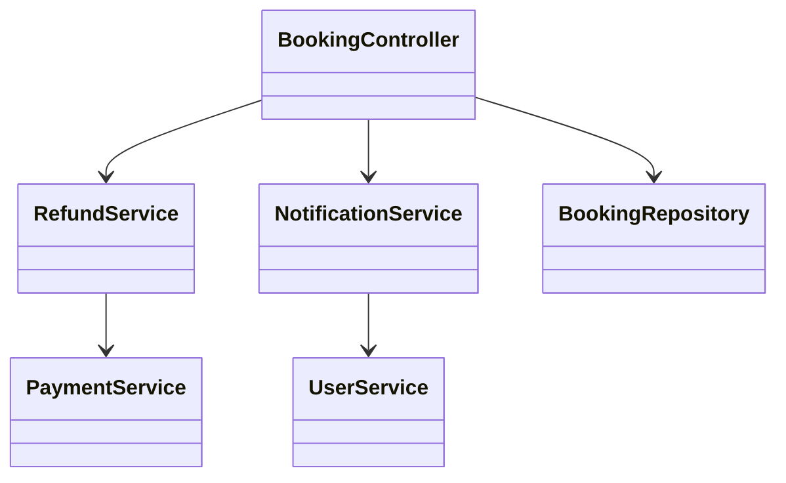
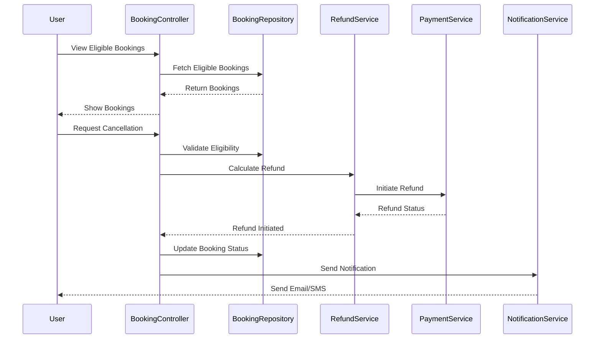
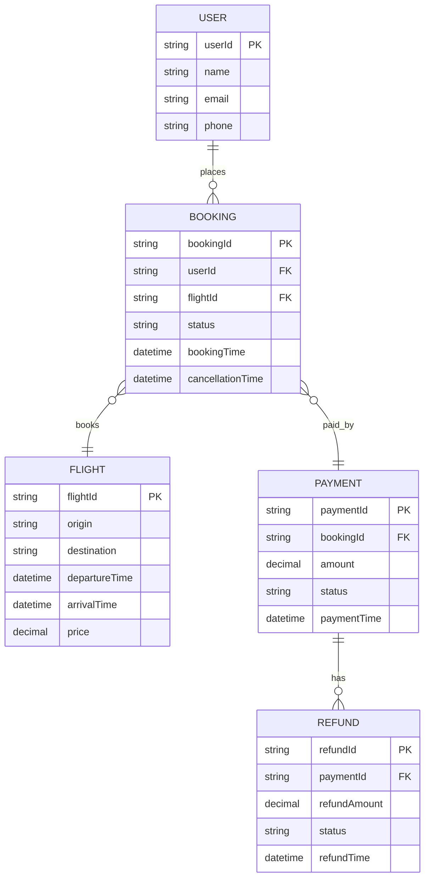

# For User Story Number [3]

1. Objective
This requirement allows travelers to cancel their air transport bookings and request refunds as per airline policy. The system calculates refund amounts, processes cancellations and refunds, and updates booking statuses. Users are notified about cancellation and refund progress for transparency and convenience.

2. API Model
2.1 Common Components/Services
- Authentication Service
- Booking Service
- Refund Service
- Notification Service

2.2 API Details
| Operation   | REST Method | Type     | URL                                | Request (Sample JSON)                                      | Response (Sample JSON)                                                     |
|-------------|-------------|----------|------------------------------------|------------------------------------------------------------|----------------------------------------------------------------------------|
| Get Eligible Bookings | GET  | Success  | /api/bookings/eligible-cancel      | {"userId": "U456"}                                       | [{"bookingId": "B789", "flightId": "F123", "status": "CONFIRMED"}]          |
| Calculate Refund      | POST | Success  | /api/bookings/calculate-refund     | {"bookingId": "B789"}                                    | {"refundAmount": 200.00, "currency": "USD"}                                 |
| Cancel Booking        | POST | Success  | /api/bookings/cancel               | {"bookingId": "B789", "confirm": true}                  | {"status": "CANCELLED", "refundStatus": "INITIATED"}                         |
| Notify                | POST | Success  | /api/notifications/send            | {"userId": "U456", "type": "EMAIL", "message": "Refund initiated"} | {"notificationStatus": "SENT"}                                         |

2.3 Exceptions
| API                   | Exception Condition                  | Exception Type           | Error Message                       |
|-----------------------|--------------------------------------|--------------------------|-------------------------------------|
| /api/bookings/eligible-cancel | No eligible bookings         | BookingException         | No eligible bookings found          |
| /api/bookings/calculate-refund| Invalid booking or policy    | RefundCalculationException| Refund calculation failed           |
| /api/bookings/cancel          | Not eligible/Not confirmed  | CancellationException    | Cancellation not allowed            |
| /api/notifications/send       | Notification failure        | NotificationException    | Notification could not be sent      |

3 Functional Design
3.1 Class Diagram

3.2 UML Sequence Diagram

3.3 Components
| Component Name         | Description                                             | Existing/New |
|-----------------------|---------------------------------------------------------|--------------|
| BookingController     | Handles booking cancellation and refund requests        | New          |
| RefundService         | Calculates refund and initiates refund transactions     | New          |
| NotificationService   | Sends notifications for cancellations/refunds           | Existing     |
| BookingRepository     | Data access for bookings                                | Existing     |
| PaymentService        | Handles payment/refund processing                       | Existing     |
| UserService           | User-related operations                                 | Existing     |

3.4 Service Layer Logic and Validations
| FieldName     | Validation                             | Error Message                       | ClassUsed              |
|---------------|----------------------------------------|-------------------------------------|------------------------|
| bookingId     | Must be eligible for cancellation      | Booking not eligible for cancellation| BookingController      |
| refundAmount  | Must be calculated as per policy       | Refund calculation failed           | RefundService          |
| confirm       | Must be confirmed by user              | Cancellation not confirmed          | BookingController      |

4 Integrations
| SystemToBeIntegrated | IntegratedFor         | IntegrationType |
|----------------------|----------------------|-----------------|
| Airline Booking API  | Booking validation   | API             |
| Payment/Refund API   | Refund processing    | API             |
| Notification Service | Status notifications | API             |

5 DB Details
5.1 ER Model

5.2 DB Validations
- Only eligible bookings can be cancelled.
- Refund amount must match airline policy.
- Refund must reference valid payment.

6 Non-Functional Requirements
6.1 Performance
- Refund processing time < 48 hours.

6.2 Security
6.2.1 Authentication
- User authentication required for cancellations/refunds.
6.2.2 Authorization
- Only booking owners can cancel and request refunds.
- Audit logging for cancellations and refunds.

6.3 Logging
6.3.1 Application Logging
- DEBUG: API request/response payloads (excluding sensitive data)
- INFO: Successful cancellations, refunds, notifications
- ERROR: Failed cancellations, refund errors
- WARN: Delayed refunds
6.3.2 Audit Log
- Cancellation and refund events logged for audit.

7 Dependencies
- Airline booking API availability
- Payment/refund API uptime
- Notification service reliability

8 Assumptions
- All users are registered and authenticated.
- Airline policy data is up-to-date and accurate.
- Refunds are processed via integrated payment gateway.
- Email/SMS delivery is reliable and timely.
