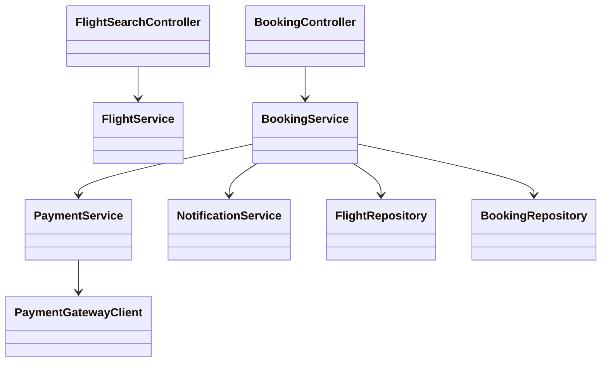
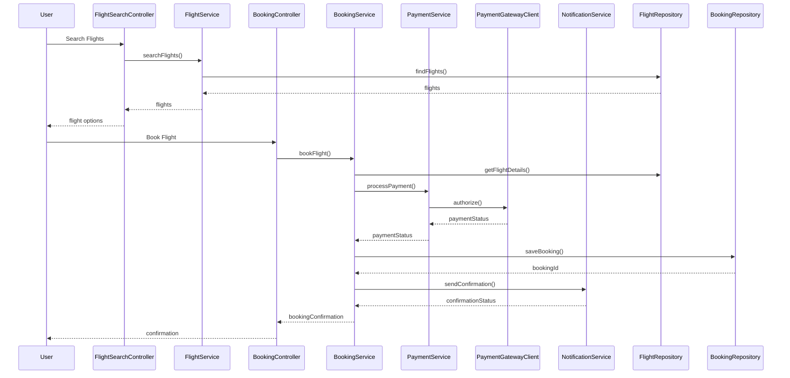
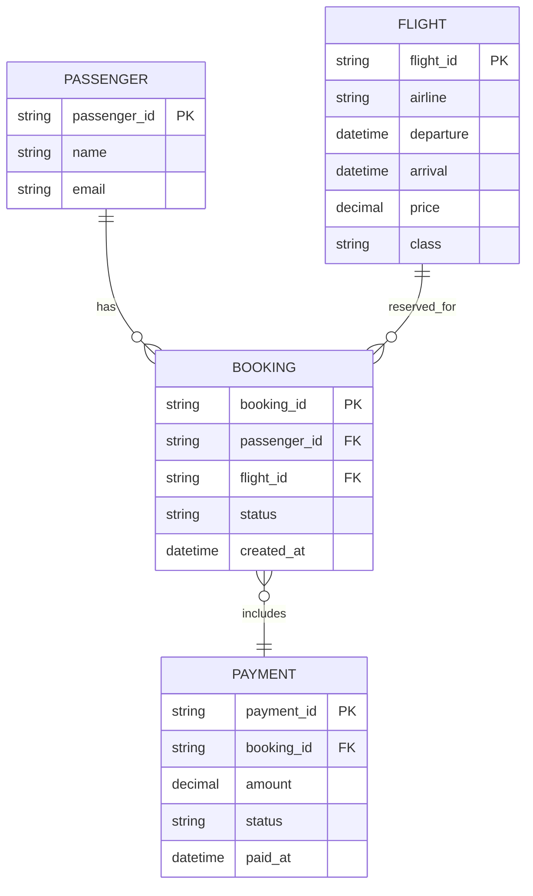

# For User Story Number [1]

1. Objective
The objective is to enable passengers to search for flights, select preferred options, and book air transport tickets online. This functionality should provide a seamless booking experience by supporting search by destination, dates, and class, and by integrating secure payment and confirmation. The goal is to improve convenience and efficiency in travel planning for passengers.

2. API Model
  2.1 Common Components/Services
  - User Authentication Service (existing)
  - Flight Search Service (new)
  - Booking Service (new)
  - Payment Service (existing/third-party integration)
  - Notification Service (existing)

  2.2 API Details
| Operation | REST Method | Type | URL | Request | Response |
|-----------|-------------|------|-----|---------|----------|
| Search Flights | GET | Success/Failure | /api/flights/search?origin={origin}&destination={destination}&date={date}&class={class} | N/A (query params) | {"flights": [{"flightId": "F123", "airline": "AirX", "departure": "2025-10-01T10:00:00Z", "arrival": "2025-10-01T14:00:00Z", "price": 250.00, "class": "Economy"}]} |
| Book Flight | POST | Success/Failure | /api/bookings | {"flightId": "F123", "passenger": {"name": "John Doe", "email": "john@example.com"}, "payment": {"cardNumber": "****", "expiry": "12/27", "cvv": "***"}} | {"bookingId": "B456", "status": "CONFIRMED", "confirmation": {"email": true, "sms": true}} |
| Get Booking | GET | Success/Failure | /api/bookings/{bookingId} | N/A | {"bookingId": "B456", "flight": { ... }, "passenger": { ... }, "status": "CONFIRMED"} |

  2.3 Exceptions
| API | Exception | Description |
|-----|-----------|-------------|
| Search Flights | InvalidInputException | Origin and destination cannot be the same |
| Search Flights | DateInPastException | Dates must be in the future |
| Book Flight | PaymentFailedException | Payment details invalid or not authorized |
| Book Flight | FlightNotAvailableException | Selected flight is no longer available |
| Get Booking | BookingNotFoundException | Booking ID does not exist |

3. Functional Design
  3.1 Class Diagram

  3.2 UML Sequence Diagram

  3.3 Components
| Component Name | Description | Existing/New |
|----------------|-------------|--------------|
| FlightSearchController | Handles flight search requests | New |
| BookingController | Handles booking requests | New |
| FlightService | Business logic for flight search | New |
| BookingService | Business logic for booking and validation | New |
| PaymentService | Handles payment processing | Existing/Integration |
| NotificationService | Sends booking confirmations | Existing |
| FlightRepository | Data access for flights | New |
| BookingRepository | Data access for bookings | New |
| PaymentGatewayClient | Integrates with third-party payment gateway | Existing/Integration |

  3.4 Service Layer Logic and Validations
| FieldName | Validation | Error Message | ClassUsed |
|-----------|-----------|--------------|-----------|
| origin/destination | Cannot be the same | Origin and destination cannot be the same | BookingService |
| date | Must be in the future | Dates must be in the future | BookingService |
| payment | Must be valid and authorized | Payment details invalid or not authorized | PaymentService |

4. Integrations
| SystemToBeIntegrated | IntegratedFor | IntegrationType |
|---------------------|---------------|-----------------|
| Airline Reservation System | Flight search, booking | API |
| Payment Gateway (Stripe) | Payment processing | API |
| Email/SMS Service | Booking confirmation | API |

5. DB Details
  5.1 ER Model

  5.2 DB Validations
- Unique constraint on booking_id
- Foreign key constraints for passenger_id and flight_id in BOOKING
- Payment status must be CONFIRMED before booking is finalized

6. Non-Functional Requirements
  6.1 Performance
    - Must handle at least 1000 concurrent users
    - API response time < 1s for search and booking
    - Caching of frequent flight search queries at API layer

  6.2 Security
    6.2.1 Authentication
      - OAuth2/JWT-based authentication for all APIs
      - HTTPS enforced for all endpoints
    6.2.2 Authorization
      - Role-based access (passenger, admin)
      - Passengers can only access their own bookings

  6.3 Logging
    6.3.1 Application Logging
      - DEBUG: API input/output, service calls
      - INFO: Successful bookings, payments
      - ERROR: Failed payments, booking errors
      - WARN: Suspicious activity or repeated failures
    6.3.2 Audit Log
      - Log all booking and payment events with timestamp, user, and status

7. Dependencies
- Airline reservation system API must be available
- Payment gateway integration (Stripe) must be configured
- Email/SMS provider credentials must be set

8. Assumptions
- All flights and prices are up-to-date in the airline system
- Payment gateway is PCI DSS compliant
- Email/SMS delivery is reliable and monitored
