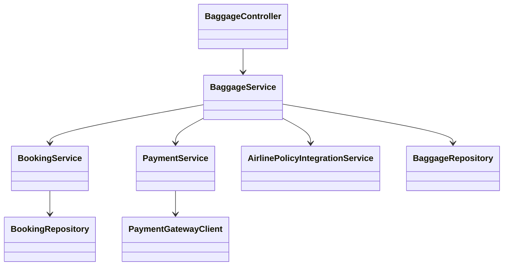
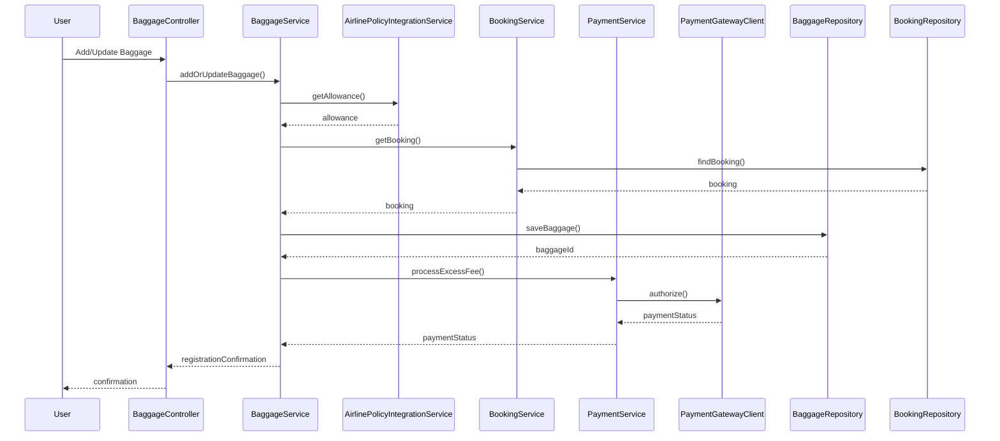

# For User Story Number [2]

1. Objective
The objective is to enable passengers to manage their baggage information online, including adding, modifying, and viewing baggage details during booking or post-booking. The system should ensure baggage allowances, fees, and restrictions are clearly communicated and processed in real-time. This enhances the passenger experience by reducing airport delays and ensuring compliance with airline policies.

2. API Model
  2.1 Common Components/Services
  - User Authentication Service (existing)
  - Baggage Management Service (new)
  - Booking Service (existing)
  - Payment Service (existing/third-party integration)
  - Airline Policy Integration Service (new)

  2.2 API Details
| Operation | REST Method | Type | URL | Request | Response |
|-----------|-------------|------|-----|---------|----------|
| Add/Update Baggage | POST | Success/Failure | /api/bookings/{bookingId}/baggage | {"baggageType": "checked", "weight": 25, "dimensions": "55x40x23"} | {"baggageId": "BG123", "status": "REGISTERED", "fees": 30.00} |
| Get Baggage Info | GET | Success/Failure | /api/bookings/{bookingId}/baggage | N/A | {"baggages": [{"baggageId": "BG123", "type": "checked", "weight": 25, "fees": 30.00}]} |
| Get Allowance | GET | Success/Failure | /api/flights/{flightId}/baggage-allowance | N/A | {"allowance": {"checked": 30, "carryOn": 7}, "fees": {"excess": 20.00}} |

  2.3 Exceptions
| API | Exception | Description |
|-----|-----------|-------------|
| Add/Update Baggage | ExceedsLimitException | Baggage weight or size exceeds airline limits |
| Add/Update Baggage | InvalidTypeException | Invalid baggage type provided |
| Add/Update Baggage | PaymentFailedException | Additional payment for excess baggage failed |
| Get Baggage Info | BookingNotFoundException | Booking ID does not exist |

3. Functional Design
  3.1 Class Diagram


  3.2 UML Sequence Diagram


  3.3 Components
| Component Name | Description | Existing/New |
|----------------|-------------|--------------|
| BaggageController | Handles baggage management requests | New |
| BaggageService | Business logic for baggage validation and processing | New |
| BookingService | Retrieves and updates booking records | Existing |
| PaymentService | Handles payment for excess baggage | Existing/Integration |
| AirlinePolicyIntegrationService | Fetches baggage allowance and rules | New |
| BaggageRepository | Data access for baggage records | New |
| BookingRepository | Data access for bookings | Existing |
| PaymentGatewayClient | Integrates with payment gateway | Existing/Integration |

  3.4 Service Layer Logic and Validations
| FieldName | Validation | Error Message | ClassUsed |
|-----------|-----------|--------------|-----------|
| weight/size | Must not exceed airline limits | Baggage weight or size exceeds airline limits | BaggageService |
| baggageType | Must be checked or carry-on | Invalid baggage type provided | BaggageService |
| payment | Additional fee must be paid if required | Additional payment for excess baggage failed | PaymentService |

4. Integrations
| SystemToBeIntegrated | IntegratedFor | IntegrationType |
|---------------------|---------------|-----------------|
| Airline Reservation System | Baggage allowance, policy | API |
| Payment Gateway | Excess baggage fee processing | API |

5. DB Details
  5.1 ER Model
```mermaid
erDiagram
    BOOKING ||--o{ BAGGAGE : has
    BAGGAGE }o--|| PAYMENT : includes

    BOOKING {
      string booking_id PK
      ...
    }
    BAGGAGE {
      string baggage_id PK
      string booking_id FK
      string type
      decimal weight
      string dimensions
      decimal fees
      datetime registered_at
    }
    PAYMENT {
      string payment_id PK
      string baggage_id FK
      decimal amount
      string status
      datetime paid_at
    }
```

  5.2 DB Validations
- Unique constraint on baggage_id
- Foreign key constraints for booking_id in BAGGAGE
- Baggage type must be checked or carry-on
- Fees must be >= 0

6. Non-Functional Requirements
  6.1 Performance
    - Real-time update of baggage information
    - API response time < 1s

  6.2 Security
    6.2.1 Authentication
      - OAuth2/JWT-based authentication for all APIs
      - HTTPS enforced for all endpoints
    6.2.2 Authorization
      - Passengers can only manage baggage for their own bookings

  6.3 Logging
    6.3.1 Application Logging
      - DEBUG: API input/output, service calls
      - INFO: Baggage registration, updates
      - ERROR: Validation failures, payment errors
      - WARN: Policy violations
    6.3.2 Audit Log
      - Log all baggage changes with timestamp, user, and status

7. Dependencies
- Airline reservation system API for baggage policy
- Payment gateway for excess baggage fee

8. Assumptions
- Airline policies are up-to-date and accessible
- Payment gateway is reliable
- Passengers are authenticated before managing baggage
