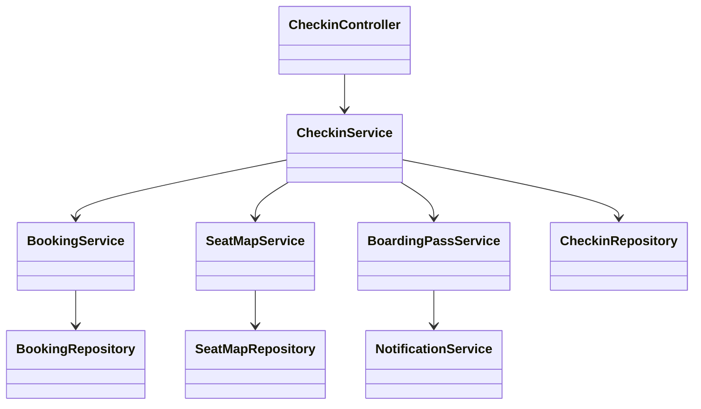
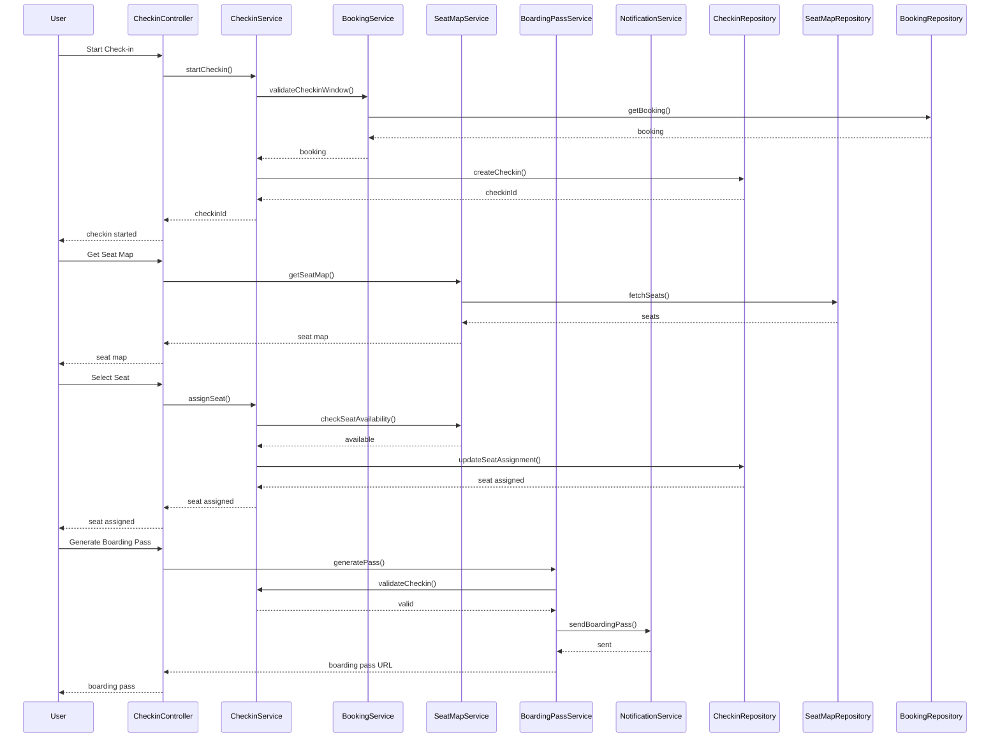

# For User Story Number [3]

1. Objective
The objective is to enable passengers to check in online, select their preferred seat, and obtain a digital boarding pass before arriving at the airport. This feature aims to streamline the check-in process, reduce airport queues, and provide a convenient user experience. The system must ensure seat availability and synchronize updates with airline systems in real-time.

2. API Model
  2.1 Common Components/Services
  - User Authentication Service (existing)
  - Check-in Service (new)
  - Seat Map Service (new)
  - Booking Service (existing)
  - Notification Service (existing)
  - Boarding Pass Generation Service (new)

  2.2 API Details
| Operation | REST Method | Type | URL | Request | Response |
|-----------|-------------|------|-----|---------|----------|
| Start Check-in | POST | Success/Failure | /api/bookings/{bookingId}/checkin | {"passengerId": "P123"} | {"checkinId": "C456", "status": "IN_PROGRESS"} |
| Get Seat Map | GET | Success/Failure | /api/flights/{flightId}/seats | N/A | {"seats": [{"seatNo": "12A", "available": true}]} |
| Select Seat | POST | Success/Failure | /api/checkins/{checkinId}/seat | {"seatNo": "12A"} | {"seatNo": "12A", "status": "ASSIGNED"} |
| Generate Boarding Pass | POST | Success/Failure | /api/checkins/{checkinId}/boarding-pass | N/A | {"boardingPassUrl": "https://.../boardingpass.pdf"} |

  2.3 Exceptions
| API | Exception | Description |
|-----|-----------|-------------|
| Start Check-in | CheckinWindowException | Check-in not allowed outside permitted window |
| Select Seat | SeatUnavailableException | Seat already taken |
| Select Seat | InvalidSeatException | Seat does not exist |
| Generate Boarding Pass | PassengerMismatchException | Passenger details do not match booking |
| Generate Boarding Pass | CheckinIncompleteException | Check-in not completed |

3. Functional Design
  3.1 Class Diagram


  3.2 UML Sequence Diagram


  3.3 Components
| Component Name | Description | Existing/New |
|----------------|-------------|--------------|
| CheckinController | Handles check-in requests | New |
| CheckinService | Business logic for check-in and validations | New |
| SeatMapService | Retrieves and manages seat maps | New |
| BookingService | Retrieves booking and validates check-in window | Existing |
| NotificationService | Sends boarding pass and notifications | Existing |
| BoardingPassService | Generates digital boarding passes | New |
| CheckinRepository | Data access for check-in records | New |
| BookingRepository | Data access for bookings | Existing |
| SeatMapRepository | Data access for seat maps | New |

  3.4 Service Layer Logic and Validations
| FieldName | Validation | Error Message | ClassUsed |
|-----------|-----------|--------------|-----------|
| checkin window | Must be within allowed window | Check-in not allowed outside permitted window | BookingService |
| seatNo | Must be available and valid | Seat already taken / Seat does not exist | SeatMapService |
| passenger | Must match booking record | Passenger details do not match booking | CheckinService |

4. Integrations
| SystemToBeIntegrated | IntegratedFor | IntegrationType |
|---------------------|---------------|-----------------|
| Airline Reservation System | Seat map, check-in sync | API |
| Email/SMS Service | Boarding pass delivery | API |

5. DB Details
  5.1 ER Model
```mermaid
erDiagram
    BOOKING ||--o{ CHECKIN : has
    CHECKIN }o--|| SEAT_ASSIGNMENT : includes
    CHECKIN }o--|| BOARDING_PASS : generates

    BOOKING {
      string booking_id PK
      ...
    }
    CHECKIN {
      string checkin_id PK
      string booking_id FK
      string status
      datetime started_at
    }
    SEAT_ASSIGNMENT {
      string seat_assignment_id PK
      string checkin_id FK
      string seat_no
      boolean assigned
    }
    BOARDING_PASS {
      string boarding_pass_id PK
      string checkin_id FK
      string url
      datetime generated_at
    }
```

  5.2 DB Validations
- Unique constraint on checkin_id
- Foreign key constraints for booking_id in CHECKIN
- Only available seats can be assigned
- Boarding pass generated only after successful check-in

6. Non-Functional Requirements
  6.1 Performance
    - Support high concurrency during peak check-in times
    - API response time < 1s
    - Real-time seat map updates

  6.2 Security
    6.2.1 Authentication
      - OAuth2/JWT-based authentication for all APIs
      - HTTPS enforced for all endpoints
    6.2.2 Authorization
      - Passengers can only check in for their own bookings

  6.3 Logging
    6.3.1 Application Logging
      - DEBUG: API input/output, service calls
      - INFO: Check-in started, seat assigned, boarding pass generated
      - ERROR: Validation failures, sync errors
      - WARN: Multiple failed check-in attempts
    6.3.2 Audit Log
      - Log all check-in and seat assignment events with timestamp, user, and status

7. Dependencies
- Airline reservation system API for seat map and check-in sync
- Email/SMS provider for boarding pass delivery

8. Assumptions
- Airline seat map is up-to-date and accessible
- Passengers are authenticated before check-in
- Boarding pass format is standardized
