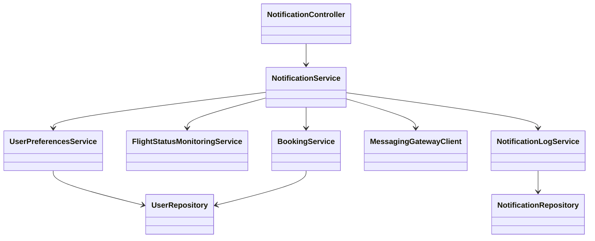
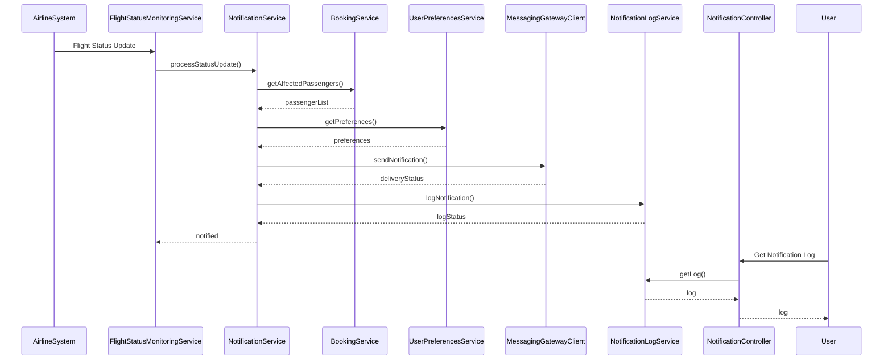

# For User Story Number [4]

1. Objective
The objective is to provide passengers with real-time notifications about their flight status, including delays, gate changes, cancellations, and boarding announcements. Notifications must be timely, actionable, and delivered via the passenger's preferred channels (email, SMS, app). This ensures passengers are always informed and can adjust their travel plans accordingly.

2. API Model
  2.1 Common Components/Services
  - Notification Service (new)
  - User Preferences Service (existing)
  - Flight Status Monitoring Service (new)
  - Booking Service (existing)
  - Messaging Gateway Integration (existing/third-party)
  - Notification Log Service (new)

  2.2 API Details
| Operation | REST Method | Type | URL | Request | Response |
|-----------|-------------|------|-----|---------|----------|
| Update Notification Preferences | POST | Success/Failure | /api/users/{userId}/notification-preferences | {"email": true, "sms": false, "app": true} | {"status": "UPDATED"} |
| Get Notification Preferences | GET | Success/Failure | /api/users/{userId}/notification-preferences | N/A | {"email": true, "sms": false, "app": true} |
| Receive Flight Status Update | POST | Success/Failure | /api/flights/{flightId}/status-update | {"status": "DELAYED", "details": "30 min delay"} | {"status": "NOTIFIED"} |
| Get Notification Log | GET | Success/Failure | /api/users/{userId}/notifications | N/A | {"notifications": [{"type": "DELAYED", "sentAt": "2025-10-01T08:00:00Z", "channel": "email"}]} |

  2.3 Exceptions
| API | Exception | Description |
|-----|-----------|-------------|
| Update Notification Preferences | InvalidPreferenceException | Invalid notification channel specified |
| Receive Flight Status Update | BookingNotFoundException | No passenger found for flight update |
| Receive Flight Status Update | NotificationFailedException | Notification delivery failed |
| Get Notification Log | UserNotFoundException | User does not exist |

3. Functional Design
  3.1 Class Diagram


  3.2 UML Sequence Diagram


  3.3 Components
| Component Name | Description | Existing/New |
|----------------|-------------|--------------|
| NotificationController | Handles notification-related requests | New |
| NotificationService | Business logic for notification delivery | New |
| UserPreferencesService | Manages user notification preferences | Existing |
| FlightStatusMonitoringService | Monitors and processes flight status updates | New |
| BookingService | Retrieves passenger bookings | Existing |
| MessagingGatewayClient | Integrates with SMS, email, and app push providers | Existing/Integration |
| NotificationLogService | Logs notification delivery events | New |
| NotificationRepository | Data access for notification logs | New |
| UserRepository | Data access for user and preferences | Existing |

  3.4 Service Layer Logic and Validations
| FieldName | Validation | Error Message | ClassUsed |
|-----------|-----------|--------------|-----------|
| notification preferences | Must be valid channels | Invalid notification channel specified | UserPreferencesService |
| notification relevance | Only notify affected passengers | No passenger found for flight update | NotificationService |
| delivery | Must be logged for audit | Notification delivery failed | NotificationLogService |

4. Integrations
| SystemToBeIntegrated | IntegratedFor | IntegrationType |
|---------------------|---------------|-----------------|
| Airline Reservation System | Real-time flight status | API |
| Messaging Gateway (Twilio, SendGrid, Push) | Notification delivery | API |

5. DB Details
  5.1 ER Model
```mermaid
erDiagram
    USER ||--o{ NOTIFICATION_PREFERENCE : has
    USER ||--o{ NOTIFICATION_LOG : receives
    FLIGHT ||--o{ NOTIFICATION_LOG : triggers

    USER {
      string user_id PK
      string name
      string email
      string phone
    }
    NOTIFICATION_PREFERENCE {
      string preference_id PK
      string user_id FK
      boolean email
      boolean sms
      boolean app
    }
    FLIGHT {
      string flight_id PK
      ...
    }
    NOTIFICATION_LOG {
      string notification_id PK
      string user_id FK
      string flight_id FK
      string type
      string channel
      datetime sent_at
      string status
    }
```

  5.2 DB Validations
- Unique constraint on notification_id
- Foreign key constraints for user_id and flight_id in NOTIFICATION_LOG
- Only valid channels allowed in NOTIFICATION_PREFERENCE

6. Non-Functional Requirements
  6.1 Performance
    - Notifications delivered within 1 minute of status change
    - High message throughput (burst handling)

  6.2 Security
    6.2.1 Authentication
      - OAuth2/JWT-based authentication for all APIs
      - HTTPS enforced for all endpoints
    6.2.2 Authorization
      - Passengers can only access their own notification logs and preferences

  6.3 Logging
    6.3.1 Application Logging
      - DEBUG: API input/output, service calls
      - INFO: Notification sent, preferences updated
      - ERROR: Delivery failures, invalid preferences
      - WARN: Repeated delivery failures
    6.3.2 Audit Log
      - Log all notification events with timestamp, user, channel, and status

7. Dependencies
- Airline reservation system API for flight status
- Messaging gateway for notification delivery

8. Assumptions
- Messaging gateway is reliable and supports all channels
- Flight status updates are pushed in real-time from airline systems
- User preferences are pre-configured and up-to-date
