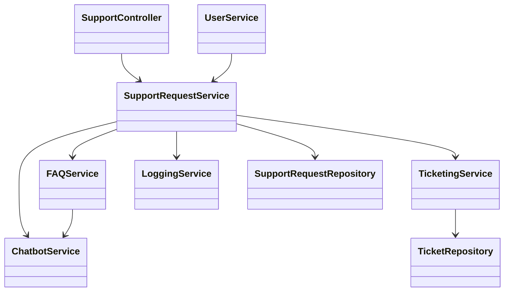
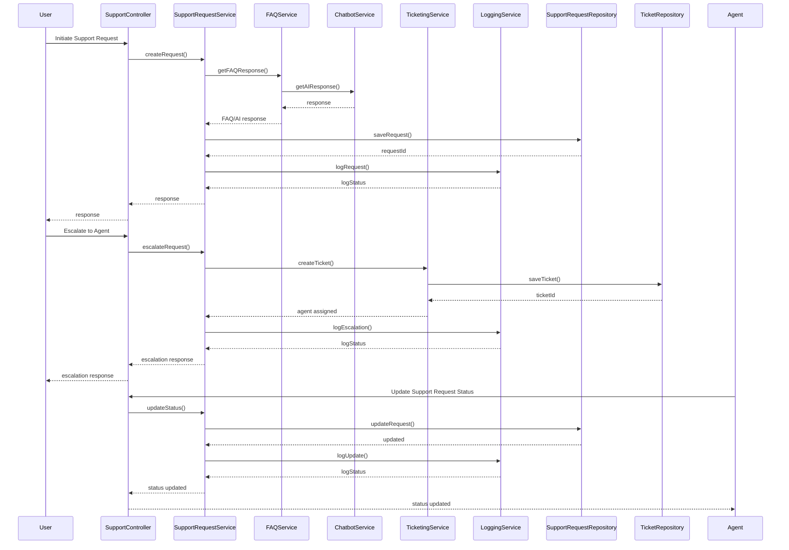
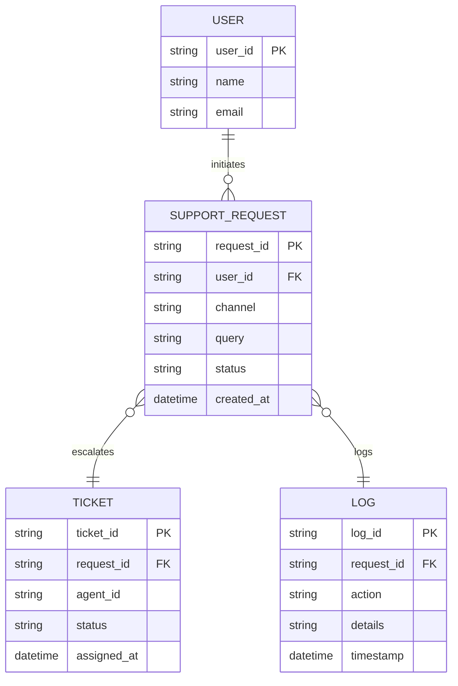

# For User Story Number [5]

1. Objective
The objective is to provide passengers with easy access to customer support through multiple channels (chat, email, phone) for resolving booking, baggage, check-in, or other travel-related issues. The system should offer automated FAQ responses and enable escalation to live agents as needed. All support interactions must be logged and tracked for quality and compliance.

2. API Model
  2.1 Common Components/Services
  - Support Request Service (new)
  - FAQ/Chatbot Service (new)
  - Ticketing Service (existing/third-party)
  - User Authentication Service (existing)
  - Logging/Audit Service (existing)

  2.2 API Details
| Operation | REST Method | Type | URL | Request | Response |
|-----------|-------------|------|-----|---------|----------|
| Initiate Support Request | POST | Success/Failure | /api/support/requests | {"userId": "U123", "channel": "chat", "query": "How do I change my flight?"} | {"requestId": "SR456", "status": "IN_PROGRESS", "response": "Please select the flight you wish to change."} |
| Get FAQ Response | POST | Success/Failure | /api/support/faq | {"query": "What is baggage allowance?"} | {"answer": "Baggage allowance depends on your ticket class and route."} |
| Escalate to Agent | POST | Success/Failure | /api/support/requests/{requestId}/escalate | {"reason": "Not resolved"} | {"requestId": "SR456", "status": "ESCALATED", "agentId": "A789"} |
| Get Support Request Status | GET | Success/Failure | /api/support/requests/{requestId} | N/A | {"requestId": "SR456", "status": "RESOLVED", "resolution": "Flight changed as requested."} |

  2.3 Exceptions
| API | Exception | Description |
|-----|-----------|-------------|
| Initiate Support Request | InvalidChannelException | Unsupported support channel |
| Get FAQ Response | FAQNotFoundException | No FAQ found for query |
| Escalate to Agent | AgentUnavailableException | No live agent available |
| Get Support Request Status | RequestNotFoundException | Support request ID does not exist |

3. Functional Design
  3.1 Class Diagram

  3.2 UML Sequence Diagram

  3.3 Components
| Component Name | Description | Existing/New |
|----------------|-------------|--------------|
| SupportController | Handles support requests and escalation | New |
| SupportRequestService | Manages support request lifecycle | New |
| FAQService | Provides FAQ and AI-powered responses | New |
| TicketingService | Integrates with external ticketing platforms | Existing/Integration |
| ChatbotService | AI/ML-based automated response engine | New |
| LoggingService | Logs all support interactions | Existing |
| UserService | Manages user authentication and profile | Existing |
| SupportRequestRepository | Data access for support requests | New |
| TicketRepository | Data access for tickets | Existing |

  3.4 Service Layer Logic and Validations
| FieldName | Validation | Error Message | ClassUsed |
|-----------|-----------|--------------|-----------|
| channel | Must be chat, email, or phone | Unsupported support channel | SupportRequestService |
| query | Must match available FAQ or escalate | No FAQ found for query | FAQService |
| escalation | Agent must be available | No live agent available | TicketingService |
| requestId | Must exist in system | Support request ID does not exist | SupportRequestService |

4. Integrations
| SystemToBeIntegrated | IntegratedFor | IntegrationType |
|---------------------|---------------|-----------------|
| Ticketing Platform (Zendesk, Freshdesk) | Ticket escalation, tracking | API |
| Chatbot/AI Platform | Automated FAQ responses | API |

5. DB Details
  5.1 ER Model

  5.2 DB Validations
- Unique constraint on request_id and ticket_id
- Foreign key constraints for user_id in SUPPORT_REQUEST and request_id in TICKET
- Channel must be chat, email, or phone

6. Non-Functional Requirements
  6.1 Performance
    - 24/7 support availability
    - Chat response time < 2 minutes
    - 99.9% uptime for support channels

  6.2 Security
    6.2.1 Authentication
      - OAuth2/JWT-based authentication for all APIs
      - HTTPS enforced for all endpoints
    6.2.2 Authorization
      - Passengers can only access their own support requests

  6.3 Logging
    6.3.1 Application Logging
      - DEBUG: API input/output, service calls
      - INFO: Support request initiated, escalated, resolved
      - ERROR: Channel/FAQ/Agent errors
      - WARN: Escalation delays
    6.3.2 Audit Log
      - Log all support interactions with timestamp, user, channel, and status

7. Dependencies
- Ticketing platform API for escalation and tracking
- Chatbot/AI platform for FAQ automation

8. Assumptions
- Ticketing and chatbot platforms are reliable and available
- Support agents are available within defined SLA
- Passengers are authenticated before initiating support requests
