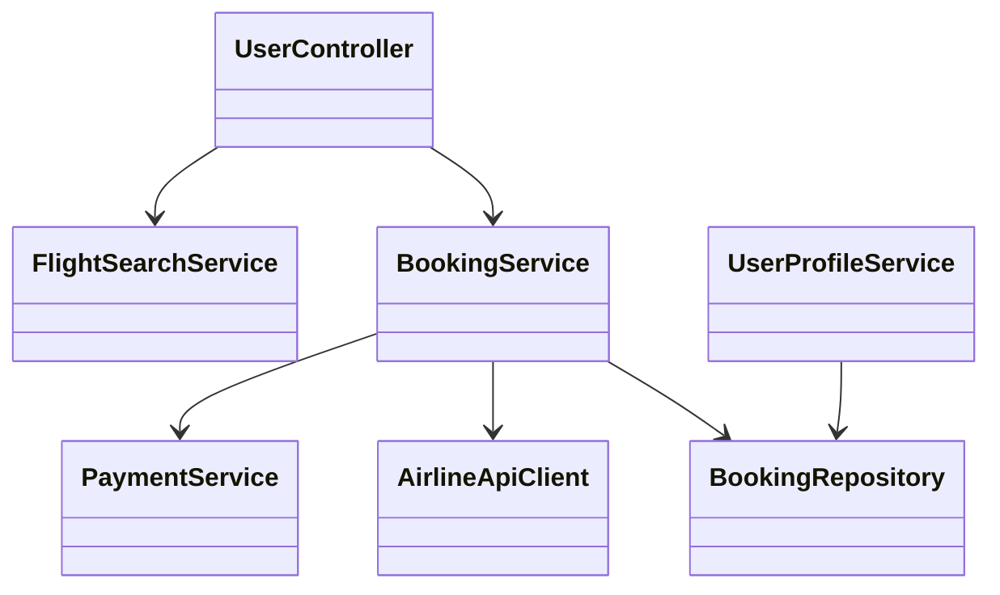
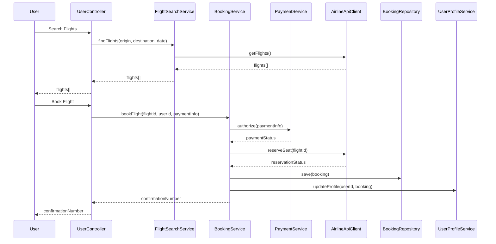

# For User Story Number [1]

1. Objective
This requirement enables travelers to search, compare, and book air transport tickets online, supporting multiple airlines and real-time availability. The goal is to provide a seamless, secure, and efficient booking experience. All bookings must be confirmed and stored in the user profile.

2. API Model
  2.1 Common Components/Services
  - User Authentication Service (OAuth2)
  - Payment Gateway Integration Service
  - Airline API Integration Service
  - Booking Management Service

  2.2 API Details
| Operation   | REST Method | Type    | URL                              | Request (JSON)                                                                 | Response (JSON)                                                               |
|-------------|-------------|---------|-----------------------------------|--------------------------------------------------------------------------------|-------------------------------------------------------------------------------|
| Search      | GET         | Success | /api/flights/search               | { "origin": "JFK", "destination": "LAX", "date": "2025-10-01" }           | { "flights": [{"flightId":123, "airline":"Delta", "price":350, "departure":"10:00", "arrival":"13:00"}] } |
| Book        | POST        | Success | /api/flights/book                 | { "flightId":123, "userId":1, "paymentInfo":{...} }                          | { "confirmationNumber": "ABC123", "status": "CONFIRMED" }                  |
| Book        | POST        | Failure | /api/flights/book                 | { "flightId":123, "userId":1, "paymentInfo":{...} }                          | { "error": "Payment authorization failed" }                                  |
| GetBooking  | GET         | Success | /api/flights/booking/{bookingId}  | N/A                                                                            | { "bookingId":1, "flightId":123, "status":"CONFIRMED", ... }              |

  2.3 Exceptions
| API                | Exception Type           | Description                                 |
|--------------------|-------------------------|---------------------------------------------|
| /api/flights/search| ValidationException     | Invalid or missing origin/destination/date  |
| /api/flights/book  | PaymentException        | Payment details invalid/authorization failed|
| /api/flights/book  | BookingException        | Flight unavailable or already booked        |
| /api/flights/booking/{id}| NotFoundException | Booking ID not found                        |

3. Functional Design
  3.1 Class Diagram


  3.2 UML Sequence Diagram


  3.3 Components
| Component Name        | Description                                             | Existing/New |
|----------------------|---------------------------------------------------------|--------------|
| UserController       | Handles user API requests                               | New          |
| FlightSearchService  | Handles flight search logic and integration             | New          |
| BookingService       | Manages booking workflow and validations                | New          |
| PaymentService       | Integrates with payment gateway for authorization       | New          |
| AirlineApiClient     | Communicates with external airline APIs                 | New          |
| BookingRepository    | Persists booking data                                   | New          |
| UserProfileService   | Updates and retrieves user profile and bookings         | Existing     |

  3.4 Service Layer Logic and Validations
| FieldName         | Validation                                 | Error Message                    | ClassUsed         |
|-------------------|--------------------------------------------|----------------------------------|-------------------|
| origin            | Must not be empty                          | Origin is required               | FlightSearchService|
| destination       | Must not be empty                          | Destination is required          | FlightSearchService|
| date              | Must not be in the past                    | Date cannot be in the past       | FlightSearchService|
| paymentInfo       | Must be valid and authorized               | Payment authorization failed     | PaymentService     |

4. Integrations
| SystemToBeIntegrated | IntegratedFor        | IntegrationType |
|----------------------|---------------------|-----------------|
| Airline APIs         | Real-time flight data| API             |
| Payment Gateway      | Payment processing   | API             |
| User Profile Service | Booking storage      | API             |

5. DB Details
  5.1 ER Model
```mermaid
erDiagram
    USER ||--o{ BOOKING : has
    BOOKING }o--|| FLIGHT : books
    FLIGHT ||--o{ AIRLINE : operated_by
    USER {
      int id
      string email
      string name
      ...
    }
    BOOKING {
      int id
      int user_id
      int flight_id
      string confirmation_number
      string status
      timestamp booked_at
      ...
    }
    FLIGHT {
      int id
      int airline_id
      string origin
      string destination
      date date
      time departure
      time arrival
      decimal price
      ...
    }
    AIRLINE {
      int id
      string name
      ...
    }
```

  5.2 DB Validations
- confirmation_number must be unique in BOOKING
- booked_at must be set on creation
- Foreign key constraints for user_id and flight_id

6. Non-Functional Requirements
  6.1 Performance
  - API response for booking must be < 3 seconds
  - Use caching for frequent flight searches

  6.2 Security
    6.2.1 Authentication
    - OAuth2 authentication for all endpoints
    6.2.2 Authorization
    - Only authenticated users can book flights
    - Role-based access for admin/operations

  6.3 Logging
    6.3.1 Application Logging
    - DEBUG: API request/response payloads (excluding sensitive data)
    - INFO: Successful bookings, search queries
    - ERROR: Failed bookings, payment errors
    - WARN: Suspicious activity or repeated failures
    6.3.2 Audit Log
    - Log booking events with user ID, timestamp, flight ID, and status

7. Dependencies
- External airline APIs must be available and responsive
- Payment gateway integration must be live
- User profile service must be accessible

8. Assumptions
- All airlines provide REST APIs for flight data
- Payment gateway supports required payment methods
- User profile service is already implemented and integrated
