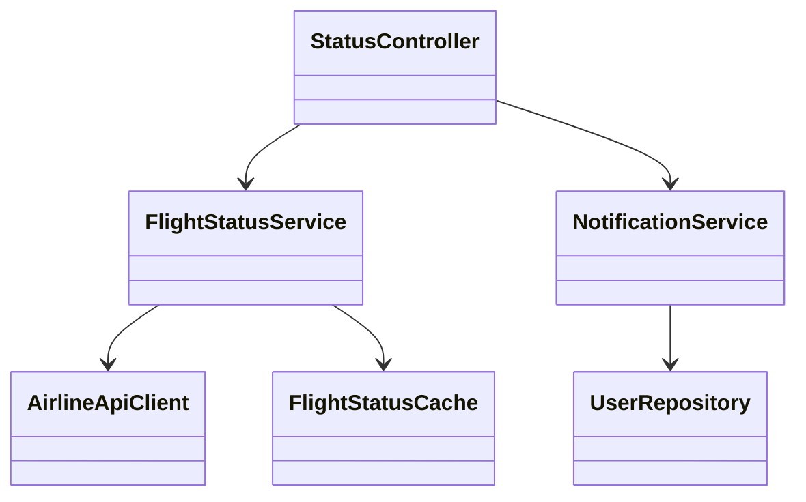
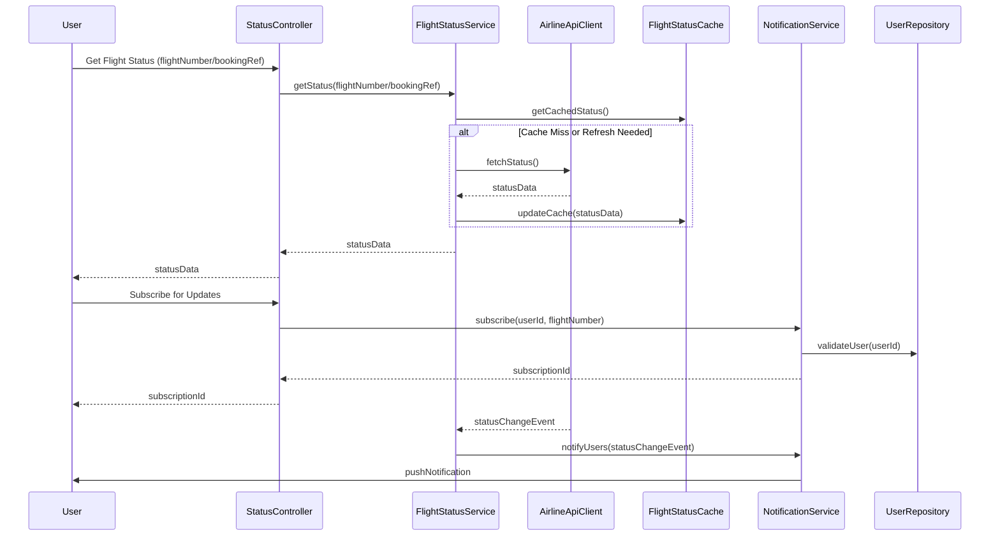

# For User Story Number [2]

1. Objective
This requirement enables travelers to track the real-time status of their flights using a flight number or booking reference. The system must provide up-to-date information on delays, gate changes, or cancellations and notify users of any changes. The goal is to keep travelers reliably informed and reduce uncertainty during travel.

2. API Model
  2.1 Common Components/Services
  - User Authentication Service (OAuth2)
  - Notification Service (e.g., Firebase)
  - Airline/Airport API Integration Service
  - Flight Status Cache Service

  2.2 API Details
| Operation     | REST Method | Type    | URL                                 | Request (JSON)                                         | Response (JSON)                                                      |
|---------------|-------------|---------|--------------------------------------|--------------------------------------------------------|-----------------------------------------------------------------------|
| GetStatus     | GET         | Success | /api/flights/status                  | { "flightNumber": "DL123" }                           | { "status": "DELAYED", "gate": "A12", "eta": "14:30" }            |
| GetStatus     | GET         | Success | /api/flights/status                  | { "bookingReference": "ABC123" }                      | { "status": "ON_TIME", "gate": "B10", "eta": "13:45" }            |
| Subscribe     | POST        | Success | /api/flights/status/subscribe        | { "userId": 1, "flightNumber": "DL123" }             | { "subscriptionId": "SUB123", "status": "SUBSCRIBED" }             |
| Subscribe     | POST        | Failure | /api/flights/status/subscribe        | { "userId": 1, "flightNumber": "DL123" }             | { "error": "User not authenticated" }                                 |

  2.3 Exceptions
| API                          | Exception Type           | Description                                 |
|------------------------------|-------------------------|---------------------------------------------|
| /api/flights/status          | ValidationException     | Invalid or missing flight number/reference  |
| /api/flights/status          | NotFoundException       | Flight or booking not found                 |
| /api/flights/status/subscribe| AuthException           | User not authenticated                      |
| /api/flights/status/subscribe| SubscriptionException   | Subscription failure                        |

3. Functional Design
  3.1 Class Diagram


  3.2 UML Sequence Diagram


  3.3 Components
| Component Name        | Description                                             | Existing/New |
|----------------------|---------------------------------------------------------|--------------|
| StatusController     | Handles flight status API requests                      | New          |
| FlightStatusService  | Handles flight status logic and polling                 | New          |
| NotificationService  | Manages user subscriptions and notifications            | New          |
| AirlineApiClient     | Communicates with external airline/airport APIs         | New          |
| FlightStatusCache    | Caches real-time flight status data                     | New          |
| UserRepository       | Manages user data and authentication                    | Existing     |

  3.4 Service Layer Logic and Validations
| FieldName         | Validation                                 | Error Message                    | ClassUsed             |
|-------------------|--------------------------------------------|----------------------------------|-----------------------|
| flightNumber      | Must be valid and exist                    | Invalid flight number            | FlightStatusService   |
| bookingReference  | Must be valid and exist                    | Invalid booking reference        | FlightStatusService   |
| userId            | Must be authenticated                      | User not authenticated           | NotificationService   |
| statusData        | Refreshed every 2 minutes                  | Data not fresh                   | FlightStatusService   |

4. Integrations
| SystemToBeIntegrated | IntegratedFor        | IntegrationType |
|----------------------|---------------------|-----------------|
| Airline/Airport APIs | Real-time status    | API             |
| Notification Service | Push notifications  | API             |
| User Repository      | User validation     | API             |

5. DB Details
  5.1 ER Model
```mermaid
erDiagram
    USER ||--o{ SUBSCRIPTION : has
    SUBSCRIPTION }o--|| FLIGHT : tracks
    FLIGHT {
      int id
      string flight_number
      string status
      string gate
      time eta
      ...
    }
    USER {
      int id
      string email
      string name
      ...
    }
    SUBSCRIPTION {
      int id
      int user_id
      int flight_id
      timestamp subscribed_at
      ...
    }
```

  5.2 DB Validations
- flight_number must exist in FLIGHT
- user_id must exist in USER
- subscribed_at must be set on creation

6. Non-Functional Requirements
  6.1 Performance
  - Status updates delivered within 1 minute of change
  - Cache status data for 2 minutes for performance
  - Support 10,000+ concurrent users

  6.2 Security
    6.2.1 Authentication
    - OAuth2 authentication for all endpoints
    6.2.2 Authorization
    - Only authenticated users can subscribe for notifications

  6.3 Logging
    6.3.1 Application Logging
    - DEBUG: API request/response payloads (excluding sensitive data)
    - INFO: Subscription events, status updates
    - ERROR: Failed notifications, API errors
    - WARN: Repeated failures or suspicious activity
    6.3.2 Audit Log
    - Log subscription and notification events with user ID, timestamp, and flight ID

7. Dependencies
- Airline/airport APIs must be available and responsive
- Notification service (e.g., Firebase) must be live
- User repository must be accessible

8. Assumptions
- All airlines/airports provide REST APIs for status data
- Notification service supports push notifications for all platforms
- User repository is already implemented and integrated
