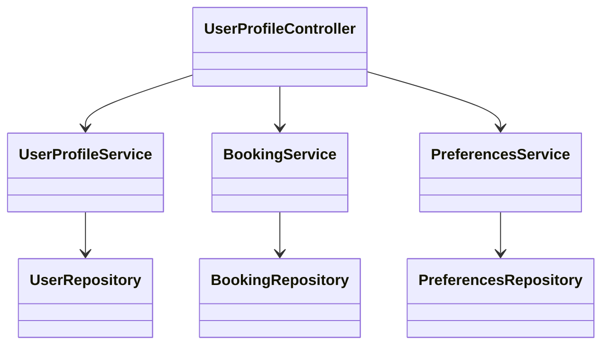
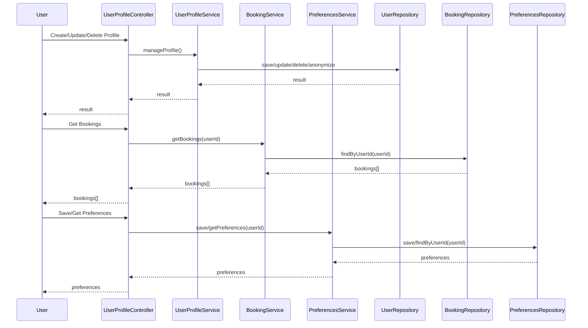

# For User Story Number [3]

1. Objective
This requirement enables frequent flyers to manage their personal profiles and view their travel history. Users can update their information, review past and upcoming bookings, and store preferences for streamlined future reservations. The system must ensure data privacy and compliance with regulations.

2. API Model
  2.1 Common Components/Services
  - User Authentication Service (OAuth2/JWT)
  - Profile Management Service
  - Booking Management Service
  - Preferences Service

  2.2 API Details
| Operation      | REST Method | Type    | URL                               | Request (JSON)                                                              | Response (JSON)                                                      |
|----------------|-------------|---------|------------------------------------|-----------------------------------------------------------------------------|-----------------------------------------------------------------------|
| CreateProfile  | POST        | Success | /api/user/profile                  | { "email": "user@mail.com", "name": "John", ... }                        | { "userId": 1, "status": "CREATED" }                                   |
| UpdateProfile  | PUT         | Success | /api/user/profile/{userId}         | { "name": "John Doe", ... }                                               | { "userId": 1, "status": "UPDATED" }                                   |
| DeleteProfile  | DELETE      | Success | /api/user/profile/{userId}         | N/A                                                                         | { "userId": 1, "status": "ANONYMIZED" }                                |
| GetBookings    | GET         | Success | /api/user/{userId}/bookings        | N/A                                                                         | { "bookings": [{"bookingId":1, "flightId":123, "date": "2025-10-01"}] } |
| SavePreferences| POST        | Success | /api/user/{userId}/preferences     | { "seat": "A1", "meal": "Veg", "ffNumber": "FF123" }                | { "userId": 1, "status": "PREFERENCES_SAVED" }                         |
| GetPreferences | GET         | Success | /api/user/{userId}/preferences     | N/A                                                                         | { "seat": "A1", "meal": "Veg", "ffNumber": "FF123" }                |

  2.3 Exceptions
| API                          | Exception Type           | Description                                 |
|------------------------------|-------------------------|---------------------------------------------|
| /api/user/profile            | ValidationException     | Required fields missing or invalid          |
| /api/user/profile/{userId}   | AuthException           | User not authenticated                      |
| /api/user/profile/{userId}   | NotFoundException       | User not found                              |
| /api/user/{userId}/bookings  | AuthException           | User not authenticated                      |
| /api/user/{userId}/preferences| ValidationException    | Invalid preference data                     |

3. Functional Design
  3.1 Class Diagram


  3.2 UML Sequence Diagram


  3.3 Components
| Component Name        | Description                                             | Existing/New |
|----------------------|---------------------------------------------------------|--------------|
| UserProfileController| Handles user profile, bookings, and preferences APIs    | New          |
| UserProfileService   | Manages profile CRUD and anonymization                  | New          |
| BookingService       | Retrieves user bookings                                 | Existing     |
| PreferencesService   | Manages user preferences                                | New          |
| UserRepository       | Persists user profile data                              | Existing     |
| BookingRepository    | Persists booking data                                   | Existing     |
| PreferencesRepository| Persists user preferences                               | New          |

  3.4 Service Layer Logic and Validations
| FieldName         | Validation                                 | Error Message                    | ClassUsed             |
|-------------------|--------------------------------------------|----------------------------------|-----------------------|
| profile fields    | All required fields must be completed      | Required field missing           | UserProfileService    |
| userId            | Must be authenticated                      | User not authenticated           | UserProfileService    |
| preferences       | Must be valid and applicable               | Invalid preference data          | PreferencesService    |

4. Integrations
| SystemToBeIntegrated | IntegratedFor        | IntegrationType |
|----------------------|---------------------|-----------------|
| Booking Service      | Retrieve bookings   | API             |
| Preferences Service  | Store preferences   | API             |
| User Repository      | Store profile data  | API             |

5. DB Details
  5.1 ER Model
```mermaid
erDiagram
    USER ||--o{ BOOKING : has
    USER ||--o{ PREFERENCE : has
    BOOKING {
      int id
      int user_id
      int flight_id
      string status
      ...
    }
    USER {
      int id
      string email
      string name
      ...
    }
    PREFERENCE {
      int id
      int user_id
      string seat
      string meal
      string ff_number
      ...
    }
```

  5.2 DB Validations
- All required fields must be present in USER
- user_id must exist in USER for BOOKING and PREFERENCE
- Deleting a user anonymizes data but retains audit trail

6. Non-Functional Requirements
  6.1 Performance
  - Profile updates must reflect within 2 seconds
  - Booking and preference retrieval must be performant

  6.2 Security
    6.2.1 Authentication
    - OAuth2/JWT authentication for all endpoints
    6.2.2 Authorization
    - Only authenticated users can access or modify their data
    - GDPR-compliant data access and deletion

  6.3 Logging
    6.3.1 Application Logging
    - DEBUG: API request/response payloads (excluding sensitive data)
    - INFO: Profile updates, booking retrievals, preference changes
    - ERROR: Failed updates, unauthorized access
    - WARN: Suspicious activity or repeated failures
    6.3.2 Audit Log
    - Log profile changes, deletions, and preference updates with user ID and timestamp

7. Dependencies
- Booking service must be available
- Preferences service must be accessible
- User repository must be operational

8. Assumptions
- User repository is GDPR-compliant
- Booking and preferences services are already implemented or will be developed
- All user data is encrypted at rest and in transit
