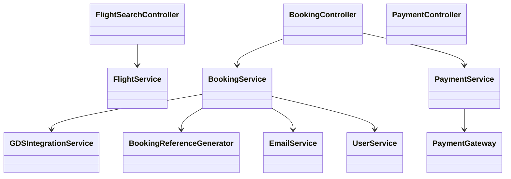
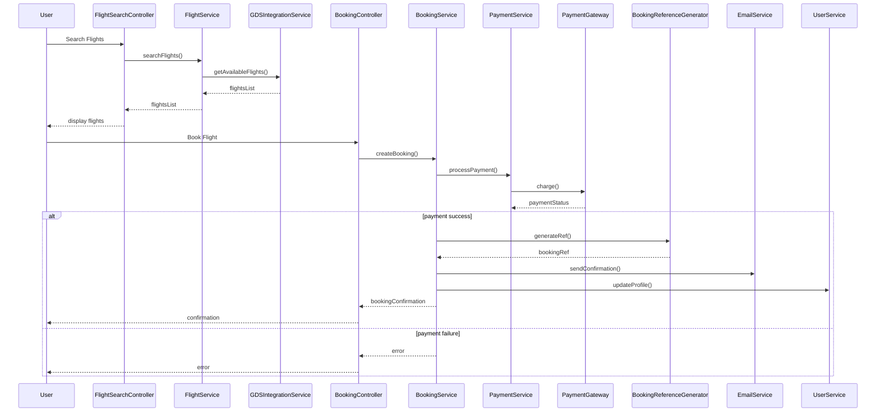
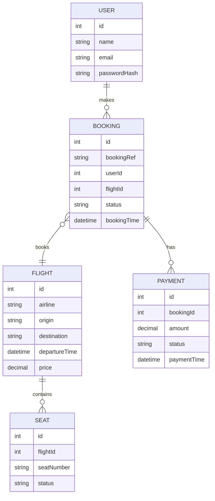

# For User Story Number [1]

1. Objective
This requirement enables travelers to search, compare, and book air transport tickets online. It ensures real-time availability, pricing, and secure payment processing. Booking confirmation and details are provided instantly to the user via email and user profile.

2. API Model
  2.1 Common Components/Services
  - User Authentication Service (OAuth2)
  - Payment Gateway Integration (PCI DSS compliant)
  - Email Notification Service
  - Flight Search Service (GDS Integration)
  - Booking Reference Generator

  2.2 API Details
| Operation    | REST Method | Type     | URL                         | Request (Sample JSON)                                                                                     | Response (Sample JSON)                                                                                 |
|-------------|-------------|----------|-----------------------------|----------------------------------------------------------------------------------------------------------|-------------------------------------------------------------------------------------------------------|
| Search      | GET         | Success  | /api/flights/search         | {"origin":"JFK","destination":"LAX","date":"2025-10-01"}                                            | [{"flightId":1,"airline":"Delta","time":"10:00","price":350.00}]                             |
| Book        | POST        | Success  | /api/flights/book           | {"flightId":1,"userId":123,"paymentInfo":{...}}                                                        | {"bookingRef":"ABC123","status":"CONFIRMED"}                                                    |
| Book        | POST        | Failure  | /api/flights/book           | {"flightId":1,"userId":123,"paymentInfo":{...}}                                                        | {"error":"Payment failed"}                                                                         |
| Payment     | POST        | Success  | /api/payments/process       | {"amount":350.00,"paymentMethod":"VISA","details":{...}}                                              | {"paymentId":"P789","status":"SUCCESS"}                                                        |
| Payment     | POST        | Failure  | /api/payments/process       | {"amount":350.00,"paymentMethod":"VISA","details":{...}}                                              | {"error":"Invalid card details"}                                                                   |
| BookingInfo | GET         | Success  | /api/bookings/{bookingRef}  | N/A                                                                                                      | {"bookingRef":"ABC123","flightId":1,"userId":123,"status":"CONFIRMED","details":{...}}    |

  2.3 Exceptions
| API Endpoint              | Exception Type         | Description                                  |
|--------------------------|-----------------------|----------------------------------------------|
| /api/flights/search      | ValidationException   | Invalid origin/destination/date              |
| /api/flights/book        | PaymentException      | Payment failed, invalid payment info         |
| /api/flights/book        | FlightNotFoundException | Flight not found or unavailable           |
| /api/flights/book        | BookingException      | Booking not confirmed                        |
| /api/payments/process    | PaymentException      | Payment gateway error                        |
| /api/bookings/{ref}      | BookingNotFoundException | Booking reference not found               |

3. Functional Design
  3.1 Class Diagram

  3.2 UML Sequence Diagram

  3.3 Components
| Component Name              | Description                                            | Existing/New |
|----------------------------|--------------------------------------------------------|--------------|
| FlightSearchController      | Handles flight search requests                         | New          |
| BookingController          | Manages booking requests                               | New          |
| PaymentController          | Manages payment processing                             | New          |
| FlightService              | Business logic for flight search                       | New          |
| BookingService             | Business logic for booking creation and management     | New          |
| PaymentService             | Handles payment logic and gateway integration          | New          |
| EmailService               | Sends booking confirmations                           | Existing     |
| UserService                | Manages user profile and authentication                | Existing     |
| GDSIntegrationService      | Integrates with airline GDS APIs                       | New          |
| BookingReferenceGenerator  | Generates unique booking references                    | New          |

  3.4 Service Layer Logic and Validations
| FieldName         | Validation                         | Error Message                    | ClassUsed             |
|-------------------|------------------------------------|----------------------------------|-----------------------|
| origin            | Not empty                          | Origin cannot be empty           | FlightService         |
| destination       | Not empty                          | Destination cannot be empty      | FlightService         |
| date              | Must be a valid future date         | Invalid travel date              | FlightService         |
| paymentInfo       | Valid payment details (PCI DSS)     | Invalid payment information      | PaymentService        |

4. Integrations
| SystemToBeIntegrated | IntegratedFor         | IntegrationType |
|----------------------|----------------------|-----------------|
| Airline GDS APIs     | Flight search, booking| API             |
| Payment Gateway      | Payment processing    | API             |
| Email Service        | Booking confirmation  | API             |

5. DB Details
  5.1 ER Model

  5.2 DB Validations
- Booking reference must be unique.
- Payment status must be validated before confirming booking.
- User email must be unique.

6. Non-Functional Requirements
  6.1 Performance
  - System must handle 1000+ concurrent users.
  - Response time <2 seconds for search and booking.
  - Caching at API layer for frequently searched routes.

  6.2 Security
    6.2.1 Authentication
    - OAuth2 for user authentication.
    - Secure session management.
    6.2.2 Authorization
    - Only authenticated users can book flights.
    - Role-based access for admin operations (if any).

  6.3 Logging
    6.3.1 Application Logging
    - DEBUG: API request/response payloads (excluding sensitive info)
    - INFO: Successful bookings, payments, and searches
    - ERROR: Payment failures, booking errors
    - WARN: Suspicious activity, repeated failures
    6.3.2 Audit Log
    - Booking creation, payment processing, and user profile updates

7. Dependencies
- Airline GDS APIs for real-time flight data
- Payment gateway for secure transactions
- Email service for notifications

8. Assumptions
- All airlines support real-time GDS integration
- Payment gateway is PCI DSS compliant and available
- Users have verified email addresses for notifications
