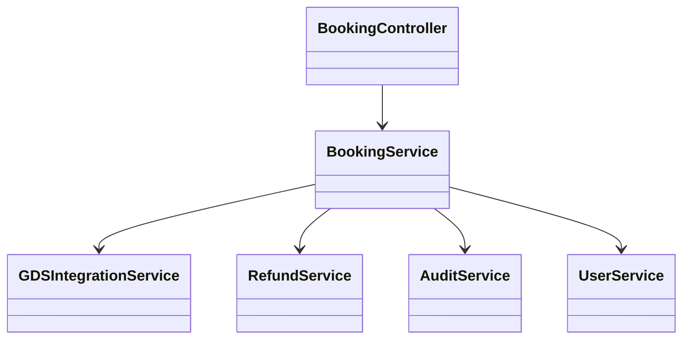
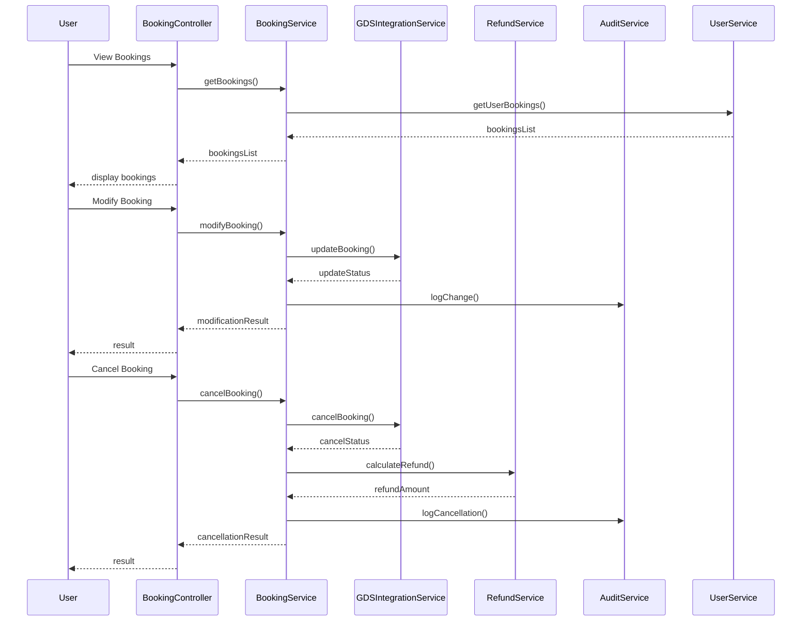
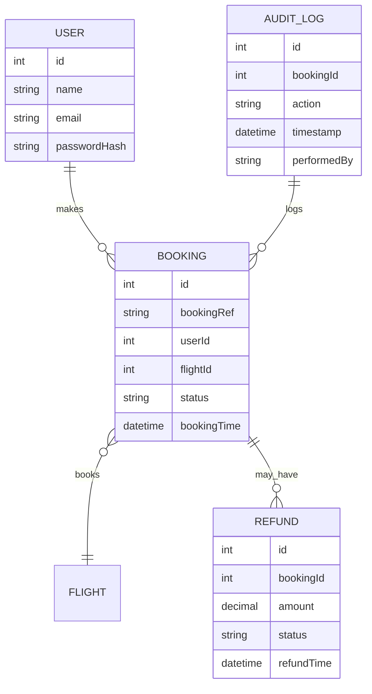

# For User Story Number [2]

1. Objective
This requirement allows travelers to view and manage their air transport bookings online. Users can modify, upgrade, or cancel bookings in accordance with airline policies, with real-time updates and clear feedback. The system ensures secure access, audit trails, and proper handling of refunds and fees.

2. API Model
  2.1 Common Components/Services
  - User Authentication Service (OAuth2)
  - Booking Management Service
  - Refund Calculation Service
  - Audit Logging Service
  - Airline GDS Integration

  2.2 API Details
| Operation    | REST Method | Type     | URL                                 | Request (Sample JSON)                                                                 | Response (Sample JSON)                                                                 |
|-------------|-------------|----------|-------------------------------------|--------------------------------------------------------------------------------------|----------------------------------------------------------------------------------------|
| List        | GET         | Success  | /api/bookings                       | N/A                                                                                  | [{"bookingRef":"ABC123","status":"CONFIRMED","details":{...}}]                 |
| Modify      | PUT         | Success  | /api/bookings/{bookingRef}/modify   | {"newDate":"2025-10-05","upgrade":"Business"}                                   | {"bookingRef":"ABC123","status":"MODIFIED","details":{...}}                   |
| Modify      | PUT         | Failure  | /api/bookings/{bookingRef}/modify   | {"newDate":"2025-10-05","upgrade":"Business"}                                   | {"error":"Modification not allowed"}                                               |
| Cancel      | DELETE      | Success  | /api/bookings/{bookingRef}          | N/A                                                                                  | {"bookingRef":"ABC123","status":"CANCELLED","refund":100.00}                  |
| Cancel      | DELETE      | Failure  | /api/bookings/{bookingRef}          | N/A                                                                                  | {"error":"Cancellation not permitted"}                                             |
| Fees        | GET         | Success  | /api/bookings/{bookingRef}/fees     | N/A                                                                                  | {"changeFee":50.00,"cancellationFee":75.00}                                        |

  2.3 Exceptions
| API Endpoint                      | Exception Type         | Description                                      |
|-----------------------------------|-----------------------|--------------------------------------------------|
| /api/bookings                     | AuthenticationException| User not authenticated                           |
| /api/bookings/{ref}/modify        | ValidationException   | Modification not allowed by policy/timeframe      |
| /api/bookings/{ref}/modify        | BookingNotFoundException | Booking not found                             |
| /api/bookings/{ref} (DELETE)      | ValidationException   | Cancellation not permitted                        |
| /api/bookings/{ref} (DELETE)      | BookingNotFoundException | Booking not found                             |
| /api/bookings/{ref}/fees          | BookingNotFoundException | Booking not found                             |

3. Functional Design
  3.1 Class Diagram

  3.2 UML Sequence Diagram

  3.3 Components
| Component Name         | Description                                        | Existing/New |
|-----------------------|----------------------------------------------------|--------------|
| BookingController     | Handles booking management requests                 | New          |
| BookingService        | Business logic for booking modifications/cancellations| New          |
| RefundService         | Calculates refunds based on policy                  | New          |
| AuditService          | Logs all changes for compliance                     | New          |
| UserService           | Manages user authentication and profile             | Existing     |
| GDSIntegrationService | Integrates with airline GDS APIs                    | Existing     |

  3.4 Service Layer Logic and Validations
| FieldName        | Validation                             | Error Message                       | ClassUsed         |
|------------------|----------------------------------------|-------------------------------------|-------------------|
| user             | Must be authenticated                  | User not authenticated              | UserService       |
| bookingRef       | Must exist and belong to user          | Booking not found                   | BookingService    |
| modification     | Allowed by airline policy/timeframe    | Modification not allowed            | BookingService    |
| cancellation     | Allowed by airline policy/timeframe    | Cancellation not permitted          | BookingService    |

4. Integrations
| SystemToBeIntegrated | IntegratedFor         | IntegrationType |
|----------------------|----------------------|-----------------|
| Airline GDS APIs     | Booking updates      | API             |
| Refund Service       | Refund calculation   | API             |
| Audit Logging        | Change/cancellation  | API             |

5. DB Details
  5.1 ER Model

  5.2 DB Validations
- Booking reference must be unique.
- Only bookings belonging to the user can be modified/cancelled.
- Refund status must be updated after cancellation.

6. Non-Functional Requirements
  6.1 Performance
  - Real-time booking updates.
  - Response time <2 seconds for management actions.

  6.2 Security
    6.2.1 Authentication
    - OAuth2 for user authentication.
    6.2.2 Authorization
    - Only authenticated users can manage their bookings.

  6.3 Logging
    6.3.1 Application Logging
    - DEBUG: API request/response payloads (excluding sensitive info)
    - INFO: Successful modifications, cancellations, refunds
    - ERROR: Policy violations, booking errors
    - WARN: Suspicious activity
    6.3.2 Audit Log
    - All booking changes and cancellations

7. Dependencies
- Airline GDS APIs for booking updates
- Refund service for processing refunds
- Audit logging service for compliance

8. Assumptions
- Airline policies are accessible via GDS APIs
- Refunds are processed electronically and reflected in user account
- All user actions are traceable via audit logs
