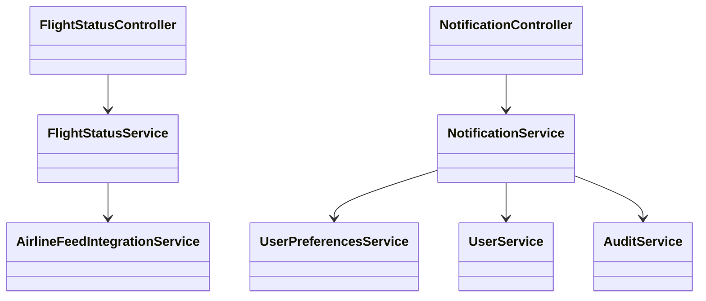
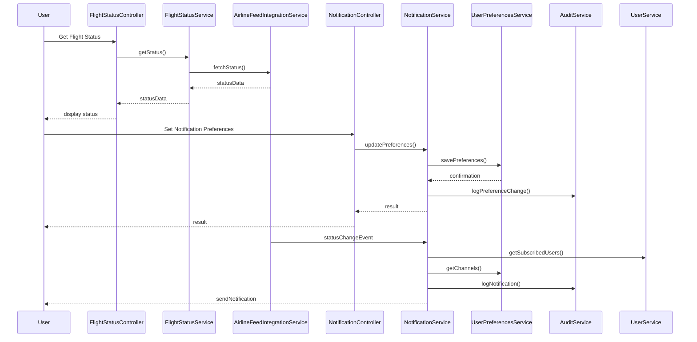
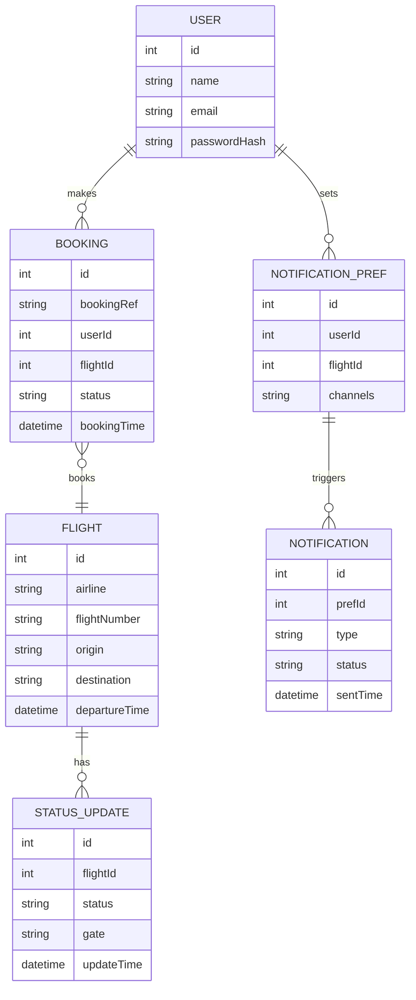

# For User Story Number [3]

1. Objective
This requirement allows travelers to track the real-time status of their flights, including delays, gate changes, and cancellations. Users can search by flight number or booking reference and opt in for notifications via email, SMS, or push. The system ensures timely updates and respects user notification preferences.

2. API Model
  2.1 Common Components/Services
  - User Authentication Service
  - Flight Status Service (Airline Data Feed Integration)
  - Notification Service (Email/SMS/Push)
  - User Preferences Service
  - Audit Logging Service

  2.2 API Details
| Operation    | REST Method | Type     | URL                                     | Request (Sample JSON)                                                    | Response (Sample JSON)                                                                 |
|-------------|-------------|----------|-----------------------------------------|---------------------------------------------------------------------------|----------------------------------------------------------------------------------------|
| Status      | GET         | Success  | /api/flights/status                     | {"flightNumber":"DL123"}                                                | {"flightNumber":"DL123","status":"DELAYED","gate":"A12","eta":"12:30"}   |
| Status      | GET         | Success  | /api/flights/status                     | {"bookingRef":"ABC123"}                                                 | {"flightNumber":"DL123","status":"ON TIME","gate":"A12","eta":"12:30"} |
| NotifyPref  | POST        | Success  | /api/notifications/preferences          | {"userId":123,"flightNumber":"DL123","channels":["email","sms"]}   | {"status":"PREFERENCES_UPDATED"}                                         |
| NotifyPref  | POST        | Failure  | /api/notifications/preferences          | {"userId":123,"flightNumber":"DL123","channels":["email","sms"]}   | {"error":"Invalid preferences"}                                           |
| Subscribe   | POST        | Success  | /api/notifications/subscribe            | {"userId":123,"bookingRef":"ABC123"}                                  | {"status":"SUBSCRIBED"}                                                  |
| Subscribe   | POST        | Failure  | /api/notifications/subscribe            | {"userId":123,"bookingRef":"INVALID"}                                 | {"error":"No such booking"}                                              |

  2.3 Exceptions
| API Endpoint                          | Exception Type         | Description                                      |
|---------------------------------------|-----------------------|--------------------------------------------------|
| /api/flights/status                   | ValidationException   | Invalid flight number/booking reference           |
| /api/notifications/preferences        | ValidationException   | Invalid notification preferences                  |
| /api/notifications/subscribe          | BookingNotFoundException | Booking not found                             |
| /api/notifications/*                  | AuthenticationException| User not authenticated                           |

3. Functional Design
  3.1 Class Diagram

  3.2 UML Sequence Diagram

  3.3 Components
| Component Name                | Description                                            | Existing/New |
|------------------------------|--------------------------------------------------------|--------------|
| FlightStatusController        | Handles flight status requests                         | New          |
| NotificationController        | Manages notification preferences and subscriptions     | New          |
| FlightStatusService           | Business logic for status lookup                       | New          |
| NotificationService           | Sends notifications and manages subscriptions          | New          |
| UserPreferencesService        | Stores user notification preferences                   | New          |
| UserService                   | Manages user authentication and lookup                 | Existing     |
| AirlineFeedIntegrationService | Integrates with airline data feeds                     | New          |
| AuditService                  | Logs notifications and preference changes              | New          |

  3.4 Service Layer Logic and Validations
| FieldName         | Validation                                 | Error Message                    | ClassUsed                 |
|-------------------|--------------------------------------------|----------------------------------|---------------------------|
| flightNumber      | Must be valid and exist                    | Invalid flight number            | FlightStatusService       |
| bookingRef        | Must be valid and belong to user           | Invalid booking reference        | FlightStatusService       |
| notificationPref  | Must be valid (email, sms, push)           | Invalid preferences              | NotificationService       |
| user             | Must be authenticated                      | User not authenticated           | UserService              |
| subscription      | Only for users with valid bookings         | No such booking                  | NotificationService       |

4. Integrations
| SystemToBeIntegrated | IntegratedFor         | IntegrationType |
|----------------------|----------------------|-----------------|
| Airline Data Feeds   | Real-time status     | API             |
| SMS Gateway          | Notifications        | API             |
| Email Gateway        | Notifications        | API             |
| Audit Logging        | Notification/audit   | API             |

5. DB Details
  5.1 ER Model

  5.2 DB Validations
- Flight number must be unique per airline.
- Only users with valid bookings can subscribe to notifications.
- Notification preferences must be confirmed before activation.

6. Non-Functional Requirements
  6.1 Performance
  - Status updates delivered within 1 minute of airline change.
  - System must scale to 10,000+ concurrent notification subscriptions.

  6.2 Security
    6.2.1 Authentication
    - User authentication required for notification management.
    6.2.2 Authorization
    - Only users with valid bookings can subscribe to notifications.

  6.3 Logging
    6.3.1 Application Logging
    - DEBUG: Status poll and notification triggers
    - INFO: Notification deliveries and preference updates
    - ERROR: Failed notifications, invalid lookups
    - WARN: Repeated notification failures
    6.3.2 Audit Log
    - All notifications and preference changes

7. Dependencies
- Airline data feeds for real-time status
- SMS/Email gateway for notifications
- Audit logging service for compliance

8. Assumptions
- Airline data feeds provide timely and accurate updates
- Notification gateways are reliable and available
- Users maintain up-to-date contact information
